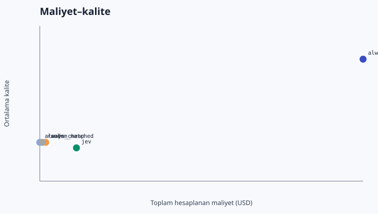
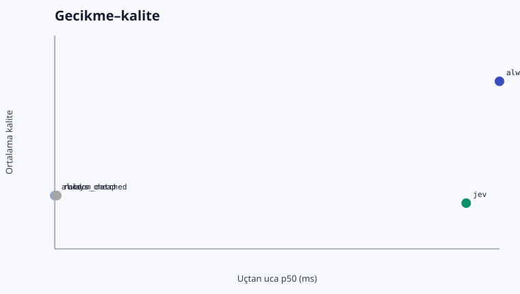

# Jev LLM Router Benchmark — Türkçe Sonuç Raporu

> Kanıt durumu: **canlı OpenRouter usage/cost verisi; sağlayıcı faturasıyla ayrıca mutabakat gerekir**. Bu rapor tasarrufu kanıtlanmış üretim sonucu olarak sunmaz.

## Koşu özeti

- Koşu: `20260919T174448Z`
- Mod: `live`
- Örnek sayısı: 200
- Jev eşiği: 0.580
- Jev güçlü model seçim oranı: %1.0
- Maliyet türü: `provider_reported_when_available_else_calculated_from_usage`
- Gerçek benzersiz çağrı harcaması (ledger): `$0.078012`
- Benzersiz hedef/Jev çağrısı: 400 / 200

## Ana karşılaştırma

| Politika | Kalite | Güçlüye fark | %95 eşleştirilmiş GA | Güçlü kullanım | Toplam USD | Tasarruf | E2E p50 / p95 ms | TTFT p50 / p95 ms |
|---|---:|---:|---:|---:|---:|---:|---:|---:|
| always_strong | 0.910 | +0.00 yp | [+0.00, +0.00] | %100.0 | $0.065218 | %0.0 | 1469.2 / 3426.8 | 1342.2 / 2742.0 |
| always_cheap | 0.835 | -7.50 yp | [-12.50, -3.00] | %0.0 | $0.006770 | %89.6 | 954.0 / 1457.2 | 885.3 / 1407.7 |
| rule | 0.835 | -7.50 yp | [-12.50, -3.00] | %0.5 | $0.007840 | %88.0 | 956.2 / 1457.2 | 889.4 / 1407.7 |
| random_matched | 0.835 | -7.50 yp | [-12.50, -3.00] | %0.5 | $0.007251 | %88.9 | 956.2 / 1457.2 | 889.4 / 1407.7 |
| jev | 0.830 | -8.00 yp | [-13.00, -3.50] | %1.0 | $0.013392 | %79.5 | 1430.7 / 1943.0 | 893.6 / 1407.7 |

## Önceden tanımlı hedef

Hedef, güçlü baseline'a göre toplam başarı/kalite kaybını en fazla 2 yüzde puanında tutarken maliyeti azaltmaktı. Bu koşuda ölçülen kayıp **8.00 yüzde puanı**. Küçük sentetik görev kümesi kalite korumasını kanıtlamak için yeterli değildir; güven aralığı ve alt gruplar kararın parçasıdır.

## Hata analizi

- Jev ucuz modeli seçtiği halde tam başarı sağlanamayan örnek: 33
- Ucuz model aynı kaliteyi sağlayabilecekken güçlü model seçilen örnek: 2
- Fallback oranı: %0.0
- Hata oranı: %0.0
- Bu iş yükünde Jev ek maliyetini karşılamak için gereken asgari ucuz-model oranı: %10.3

## Görev bazında canlı tam matris ve Jev yolu

Her Luna/Sol hücresi bir canlı çağrıdır. Jev politikasının seçtiği hedef yanıt tam matristen yeniden kullanılmıştır; böylece yönlendirilmiş yolun kalite ve hedef gecikmesi aynı canlı yanıta dayanırken gereksiz ikinci ücret oluşmamıştır.

| Görev | Dil / grup | Luna kalite · USD · ms · TTFT | Sol kalite · USD · ms · TTFT | Jev ham seçim · P(strong) · güven → uygulanan yol | Jev ms · USD | Yönlendirilmiş E2E ms |
|---|---|---:|---:|---|---:|---:|
| `arc-challenge-dev-0001` | en / arc_challenge_science | 0.00 · $0.000022 · 1305 · 1219 | 0.00 · $0.000214 · 4632 · 4394 | cheap · 0.00 · 1.00 → cheap | 447 · $0.000028 | 1752 |
| `arc-challenge-dev-0002` | en / arc_challenge_science | 1.00 · $0.000030 · 1170 · 1119 | 1.00 · $0.000290 · 1735 · 1660 | cheap · 0.00 · 1.00 → cheap | 523 · $0.000029 | 1693 |
| `arc-challenge-dev-0003` | en / arc_challenge_science | 1.00 · $0.000023 · 927 · 784 | 1.00 · $0.000216 · 1976 · 1861 | cheap · 0.00 · 1.00 → cheap | 409 · $0.000028 | 1336 |
| `arc-challenge-dev-0004` | en / arc_challenge_science | 1.00 · $0.000032 · 1048 · 885 | 1.00 · $0.000308 · 1187 · 1136 | cheap · 0.00 · 1.00 → cheap | 472 · $0.000030 | 1520 |
| `arc-challenge-dev-0005` | en / arc_challenge_science | 1.00 · $0.000026 · 808 · 758 | 1.00 · $0.000250 · 2464 · 2435 | cheap · 0.00 · 1.00 → cheap | 465 · $0.000028 | 1273 |
| `arc-challenge-dev-0006` | en / arc_challenge_science | 1.00 · $0.000027 · 1055 · 1013 | 1.00 · $0.000260 · 1706 · 1647 | cheap · 0.00 · 1.00 → cheap | 550 · $0.000029 | 1605 |
| `arc-challenge-dev-0007` | en / arc_challenge_science | 1.00 · $0.000035 · 866 · 806 | 1.00 · $0.000338 · 1938 · 1880 | cheap · 0.00 · 1.00 → cheap | 614 · $0.000030 | 1480 |
| `arc-challenge-dev-0008` | en / arc_challenge_science | 1.00 · $0.000032 · 752 · 727 | 1.00 · $0.000308 · 1386 · 1346 | cheap · 0.00 · 1.00 → cheap | 512 · $0.000030 | 1264 |
| `arc-challenge-dev-0009` | en / arc_challenge_science | 1.00 · $0.000020 · 1063 · 1022 | 1.00 · $0.000192 · 1547 · 1510 | cheap · 0.00 · 1.00 → cheap | 502 · $0.000027 | 1565 |
| `arc-challenge-dev-0010` | en / arc_challenge_science | 1.00 · $0.000026 · 1027 · 1026 | 1.00 · $0.000254 · 1106 · 1050 | cheap · 0.00 · 0.99 → cheap | 443 · $0.000029 | 1469 |
| `arc-challenge-dev-0011` | en / arc_challenge_science | 1.00 · $0.000025 · 986 · 933 | 0.00 · $0.000240 · 2778 · 1239 | cheap · 0.01 · 0.99 → cheap | 591 · $0.000028 | 1577 |
| `arc-challenge-dev-0012` | en / arc_challenge_science | 1.00 · $0.000027 · 950 · 920 | 1.00 · $0.000262 · 1680 · 1638 | cheap · 0.00 · 1.00 → cheap | 387 · $0.000029 | 1337 |
| `arc-challenge-dev-0013` | en / arc_challenge_science | 1.00 · $0.000031 · 879 · 878 | 1.00 · $0.000304 · 1495 · 1452 | cheap · 0.00 · 1.00 → cheap | 359 · $0.000030 | 1238 |
| `arc-challenge-dev-0014` | en / arc_challenge_science | 1.00 · $0.000027 · 835 · 794 | 1.00 · $0.000262 · 1553 · 1485 | cheap · 0.00 · 1.00 → cheap | 461 · $0.000029 | 1296 |
| `arc-challenge-dev-0015` | en / arc_challenge_science | 1.00 · $0.000020 · 859 · 800 | 1.00 · $0.000192 · 5564 · 5220 | cheap · 0.00 · 1.00 → cheap | 622 · $0.000027 | 1481 |
| `arc-challenge-dev-0016` | en / arc_challenge_science | 1.00 · $0.000032 · 978 · 946 | 1.00 · $0.000308 · 1193 · 1166 | cheap · 0.00 · 1.00 → cheap | 461 · $0.000030 | 1440 |
| `arc-challenge-dev-0017` | en / arc_challenge_science | 1.00 · $0.000026 · 1053 · 1023 | 1.00 · $0.000248 · 1753 · 1722 | cheap · 0.00 · 1.00 → cheap | 371 · $0.000028 | 1424 |
| `arc-challenge-dev-0018` | en / arc_challenge_science | 1.00 · $0.000037 · 1043 · 993 | 1.00 · $0.000358 · 1195 · 1194 | cheap · 0.00 · 1.00 → cheap | 477 · $0.000031 | 1520 |
| `arc-challenge-dev-0019` | en / arc_challenge_science | 1.00 · $0.000026 · 2837 · 2780 | 1.00 · $0.000246 · 1382 · 1337 | cheap · 0.00 · 1.00 → cheap | 396 · $0.000028 | 3233 |
| `arc-challenge-dev-0020` | en / arc_challenge_science | 1.00 · $0.000031 · 888 · 810 | 1.00 · $0.000304 · 1271 · 1237 | cheap · 0.00 · 1.00 → cheap | 421 · $0.000030 | 1309 |
| `arc-challenge-dev-0021` | en / arc_challenge_science | 1.00 · $0.000025 · 835 · 785 | 1.00 · $0.000244 · 1355 · 1348 | cheap · 0.00 · 1.00 → cheap | 430 · $0.000028 | 1265 |
| `arc-challenge-dev-0022` | en / arc_challenge_science | 1.00 · $0.000033 · 1158 · 1068 | 1.00 · $0.000316 · 1274 · 1230 | cheap · 0.00 · 1.00 → cheap | 492 · $0.000030 | 1651 |
| `arc-challenge-dev-0023` | en / arc_challenge_science | 1.00 · $0.000026 · 1048 · 908 | 1.00 · $0.000254 · 1586 · 1586 | cheap · 0.00 · 0.99 → cheap | 546 · $0.000028 | 1594 |
| `arc-challenge-dev-0024` | en / arc_challenge_science | 1.00 · $0.000034 · 2782 · 2628 | 1.00 · $0.000328 · 1175 · 1129 | cheap · 0.01 · 0.98 → cheap | 381 · $0.000030 | 3164 |
| `arc-challenge-dev-0025` | en / arc_challenge_science | 1.00 · $0.000028 · 966 · 894 | 1.00 · $0.000274 · 1488 · 1487 | cheap · 0.00 · 1.00 → cheap | 539 · $0.000029 | 1505 |
| `arc-challenge-dev-0026` | en / arc_challenge_science | 1.00 · $0.000031 · 1143 · 1060 | 1.00 · $0.000302 · 3702 · 3582 | cheap · 0.00 · 1.00 → cheap | 631 · $0.000029 | 1774 |
| `arc-challenge-dev-0027` | en / arc_challenge_science | 1.00 · $0.000031 · 1146 · 1096 | 1.00 · $0.000300 · 1521 · 1520 | cheap · 0.00 · 1.00 → cheap | 600 · $0.000029 | 1746 |
| `arc-challenge-dev-0028` | en / arc_challenge_science | 1.00 · $0.000032 · 1012 · 1011 | 1.00 · $0.000310 · 2545 · 2449 | cheap · 0.00 · 1.00 → cheap | 446 · $0.000030 | 1457 |
| `arc-challenge-dev-0029` | en / arc_challenge_science | 1.00 · $0.000021 · 814 · 714 | 1.00 · $0.000196 · 1049 · 1048 | cheap · 0.00 · 1.00 → cheap | 577 · $0.000027 | 1391 |
| `arc-challenge-dev-0030` | en / arc_challenge_science | 1.00 · $0.000029 · 1049 · 912 | 1.00 · $0.000282 · 1115 · 1114 | cheap · 0.00 · 1.00 → cheap | 472 · $0.000029 | 1521 |
| `arc-challenge-dev-0031` | en / arc_challenge_science | 1.00 · $0.000025 · 825 · 766 | 1.00 · $0.000238 · 1062 · 1042 | cheap · 0.00 · 1.00 → cheap | 399 · $0.000028 | 1224 |
| `arc-challenge-dev-0032` | en / arc_challenge_science | 1.00 · $0.000022 · 1058 · 1010 | 1.00 · $0.000210 · 1921 · 1848 | cheap · 0.00 · 1.00 → cheap | 530 · $0.000027 | 1588 |
| `arc-challenge-dev-0033` | en / arc_challenge_science | 1.00 · $0.000024 · 878 · 826 | 1.00 · $0.000230 · 1728 · 1727 | cheap · 0.00 · 1.00 → cheap | 501 · $0.000028 | 1379 |
| `arc-challenge-dev-0034` | en / arc_challenge_science | 1.00 · $0.000022 · 908 · 800 | 1.00 · $0.000208 · 1048 · 1026 | cheap · 0.00 · 1.00 → cheap | 383 · $0.000028 | 1292 |
| `arc-challenge-dev-0035` | en / arc_challenge_science | 1.00 · $0.000024 · 840 · 771 | 1.00 · $0.000234 · 4139 · 3884 | cheap · 0.00 · 1.00 → cheap | 382 · $0.000028 | 1222 |
| `arc-challenge-dev-0036` | en / arc_challenge_science | 1.00 · $0.000029 · 892 · 823 | 1.00 · $0.000278 · 1119 · 1096 | cheap · 0.00 · 1.00 → cheap | 509 · $0.000029 | 1401 |
| `arc-challenge-dev-0037` | en / arc_challenge_science | 1.00 · $0.000029 · 1126 · 1070 | 1.00 · $0.000282 · 1536 · 1497 | cheap · 0.01 · 0.98 → cheap | 441 · $0.000029 | 1567 |
| `arc-challenge-dev-0038` | en / arc_challenge_science | 0.00 · $0.000029 · 1065 · 1044 | 0.00 · $0.000278 · 1236 · 1216 | cheap · 0.00 · 1.00 → cheap | 374 · $0.000029 | 1439 |
| `arc-challenge-dev-0039` | en / arc_challenge_science | 1.00 · $0.000022 · 894 · 826 | 1.00 · $0.000214 · 1616 · 1584 | cheap · 0.00 · 1.00 → cheap | 410 · $0.000028 | 1303 |
| `arc-challenge-dev-0040` | en / arc_challenge_science | 1.00 · $0.000021 · 797 · 764 | 1.00 · $0.000202 · 1190 · 1133 | cheap · 0.00 · 1.00 → cheap | 439 · $0.000027 | 1236 |
| `arc-challenge-dev-0041` | en / arc_challenge_science | 1.00 · $0.000040 · 917 · 868 | 1.00 · $0.000394 · 1425 · 1377 | cheap · 0.01 · 0.98 → cheap | 400 · $0.000031 | 1316 |
| `arc-challenge-dev-0042` | en / arc_challenge_science | 1.00 · $0.000028 · 1068 · 1023 | 1.00 · $0.000268 · 1635 · 1581 | cheap · 0.00 · 1.00 → cheap | 474 · $0.000029 | 1543 |
| `arc-challenge-dev-0043` | en / arc_challenge_science | 0.00 · $0.000035 · 972 · 941 | 0.00 · $0.000342 · 2198 · 1288 | cheap · 0.17 · 0.66 → cheap | 425 · $0.000030 | 1397 |
| `arc-challenge-dev-0044` | en / arc_challenge_science | 1.00 · $0.000033 · 1029 · 957 | 1.00 · $0.000324 · 1364 · 1289 | cheap · 0.00 · 1.00 → cheap | 461 · $0.000030 | 1490 |
| `arc-challenge-dev-0045` | en / arc_challenge_science | 1.00 · $0.000027 · 1006 · 955 | 1.00 · $0.000256 · 1205 · 1137 | cheap · 0.00 · 1.00 → cheap | 438 · $0.000028 | 1444 |
| `arc-challenge-dev-0046` | en / arc_challenge_science | 1.00 · $0.000032 · 961 · 961 | 1.00 · $0.000314 · 1575 · 1512 | cheap · 0.00 · 1.00 → cheap | 469 · $0.000030 | 1431 |
| `arc-challenge-dev-0047` | en / arc_challenge_science | 1.00 · $0.000026 · 1014 · 920 | 1.00 · $0.000246 · 1200 · 1108 | cheap · 0.00 · 1.00 → cheap | 420 · $0.000028 | 1434 |
| `arc-challenge-dev-0048` | en / arc_challenge_science | 1.00 · $0.000036 · 1050 · 911 | 1.00 · $0.000354 · 1573 · 1573 | cheap · 0.00 · 0.99 → cheap | 409 · $0.000031 | 1459 |
| `arc-challenge-dev-0049` | en / arc_challenge_science | 1.00 · $0.000026 · 958 · 905 | 1.00 · $0.000246 · 1183 · 1130 | cheap · 0.00 · 1.00 → cheap | 526 · $0.000028 | 1484 |
| `arc-challenge-dev-0050` | en / arc_challenge_science | 1.00 · $0.000031 · 964 · 907 | 1.00 · $0.000304 · 1260 · 1200 | cheap · 0.00 · 1.00 → cheap | 414 · $0.000029 | 1379 |
| `belebele-dev-0001` | en / belebele_reading | 1.00 · $0.000037 · 837 · 762 | 1.00 · $0.000362 · 1216 · 1145 | cheap · 0.00 · 1.00 → cheap | 492 · $0.000031 | 1329 |
| `belebele-dev-0002` | en / belebele_reading | 1.00 · $0.000043 · 896 · 822 | 1.00 · $0.000418 · 1210 · 1061 | cheap · 0.00 · 1.00 → cheap | 402 · $0.000033 | 1298 |
| `belebele-dev-0003` | en / belebele_reading | 1.00 · $0.000045 · 841 · 712 | 1.00 · $0.000440 · 1189 · 1125 | cheap · 0.00 · 1.00 → cheap | 449 · $0.000033 | 1290 |
| `belebele-dev-0004` | en / belebele_reading | 1.00 · $0.000046 · 926 · 874 | 1.00 · $0.000448 · 1319 · 1298 | cheap · 0.00 · 0.99 → cheap | 402 · $0.000033 | 1327 |
| `belebele-dev-0005` | en / belebele_reading | 1.00 · $0.000038 · 1171 · 1051 | 1.00 · $0.000366 · 1207 · 1157 | cheap · 0.00 · 1.00 → cheap | 480 · $0.000031 | 1651 |
| `belebele-dev-0006` | en / belebele_reading | 1.00 · $0.000035 · 760 · 726 | 1.00 · $0.000344 · 1218 · 1157 | cheap · 0.00 · 1.00 → cheap | 410 · $0.000031 | 1170 |
| `belebele-dev-0007` | en / belebele_reading | 1.00 · $0.000048 · 974 · 910 | 1.00 · $0.000466 · 3454 · 3365 | cheap · 0.00 · 1.00 → cheap | 511 · $0.000033 | 1485 |
| `belebele-dev-0008` | en / belebele_reading | 0.00 · $0.000045 · 879 · 753 | 0.00 · $0.000438 · 1365 · 1294 | cheap · 0.00 · 1.00 → cheap | 717 · $0.000033 | 1596 |
| `belebele-dev-0009` | en / belebele_reading | 1.00 · $0.000036 · 915 · 885 | 1.00 · $0.000354 · 1108 · 1019 | cheap · 0.00 · 1.00 → cheap | 346 · $0.000031 | 1261 |
| `belebele-dev-0010` | en / belebele_reading | 1.00 · $0.000048 · 1020 · 944 | 1.00 · $0.000472 · 1855 · 1804 | cheap · 0.00 · 1.00 → cheap | 525 · $0.000033 | 1545 |
| `belebele-dev-0011` | en / belebele_reading | 1.00 · $0.000050 · 846 · 777 | 1.00 · $0.000492 · 1165 · 1107 | cheap · 0.00 · 1.00 → cheap | 471 · $0.000034 | 1317 |
| `belebele-dev-0012` | en / belebele_reading | 1.00 · $0.000050 · 793 · 746 | 1.00 · $0.000492 · 1715 · 1687 | cheap · 0.00 · 1.00 → cheap | 393 · $0.000034 | 1187 |
| `belebele-dev-0013` | en / belebele_reading | 1.00 · $0.000055 · 990 · 955 | 1.00 · $0.000536 · 1202 · 1177 | cheap · 0.00 · 1.00 → cheap | 386 · $0.000035 | 1376 |
| `belebele-dev-0014` | en / belebele_reading | 1.00 · $0.000046 · 1610 · 1483 | 1.00 · $0.000450 · 1548 · 1547 | cheap · 0.00 · 1.00 → cheap | 414 · $0.000033 | 2024 |
| `belebele-dev-0015` | en / belebele_reading | 1.00 · $0.000055 · 1166 · 1062 | 1.00 · $0.000536 · 1344 · 1264 | cheap · 0.00 · 1.00 → cheap | 525 · $0.000034 | 1691 |
| `belebele-dev-0016` | en / belebele_reading | 1.00 · $0.000055 · 823 · 745 | 1.00 · $0.000536 · 1097 · 1037 | cheap · 0.00 · 1.00 → cheap | 374 · $0.000034 | 1197 |
| `belebele-dev-0017` | en / belebele_reading | 1.00 · $0.000046 · 845 · 745 | 1.00 · $0.000446 · 1061 · 977 | cheap · 0.00 · 1.00 → cheap | 422 · $0.000033 | 1268 |
| `belebele-dev-0018` | en / belebele_reading | 1.00 · $0.000051 · 951 · 830 | 1.00 · $0.000504 · 4906 · 4906 | cheap · 0.00 · 1.00 → cheap | 401 · $0.000034 | 1352 |
| `belebele-dev-0019` | en / belebele_reading | 1.00 · $0.000033 · 946 · 884 | 1.00 · $0.000316 · 1343 · 1293 | cheap · 0.00 · 1.00 → cheap | 374 · $0.000030 | 1320 |
| `belebele-dev-0020` | en / belebele_reading | 1.00 · $0.000033 · 929 · 872 | 1.00 · $0.000318 · 1261 · 1259 | cheap · 0.00 · 1.00 → cheap | 397 · $0.000030 | 1326 |
| `belebele-dev-0021` | en / belebele_reading | 0.00 · $0.000046 · 1115 · 1055 | 0.00 · $0.000452 · 3981 · 3745 | cheap · 0.00 · 1.00 → cheap | 460 · $0.000033 | 1576 |
| `belebele-dev-0022` | en / belebele_reading | 1.00 · $0.000047 · 955 · 897 | 0.00 · $0.000456 · 1055 · 1014 | cheap · 0.01 · 0.99 → cheap | 380 · $0.000033 | 1335 |
| `belebele-dev-0023` | en / belebele_reading | 1.00 · $0.000054 · 774 · 675 | 1.00 · $0.000530 · 1355 · 1305 | cheap · 0.00 · 1.00 → cheap | 469 · $0.000034 | 1242 |
| `belebele-dev-0024` | en / belebele_reading | 1.00 · $0.000043 · 910 · 843 | 1.00 · $0.000424 · 1470 · 1220 | cheap · 0.00 · 1.00 → cheap | 520 · $0.000032 | 1431 |
| `belebele-dev-0025` | en / belebele_reading | 1.00 · $0.000039 · 920 · 881 | 1.00 · $0.000380 · 1421 · 1353 | cheap · 0.00 · 1.00 → cheap | 410 · $0.000031 | 1329 |
| `belebele-dev-0026` | en / belebele_reading | 1.00 · $0.000059 · 864 · 825 | 1.00 · $0.000584 · 1209 · 1199 | cheap · 0.00 · 1.00 → cheap | 414 · $0.000036 | 1278 |
| `belebele-dev-0027` | en / belebele_reading | 1.00 · $0.000042 · 1113 · 1086 | 1.00 · $0.000412 · 1469 · 1416 | cheap · 0.00 · 1.00 → cheap | 618 · $0.000032 | 1732 |
| `belebele-dev-0028` | en / belebele_reading | 1.00 · $0.000038 · 3531 · 2886 | 1.00 · $0.000366 · 1763 · 1690 | cheap · 0.00 · 1.00 → cheap | 419 · $0.000031 | 3950 |
| `belebele-dev-0029` | en / belebele_reading | 1.00 · $0.000050 · 1115 · 1080 | 1.00 · $0.000490 · 1190 · 1124 | cheap · 0.00 · 1.00 → cheap | 504 · $0.000034 | 1619 |
| `belebele-dev-0030` | en / belebele_reading | 1.00 · $0.000049 · 985 · 985 | 1.00 · $0.000476 · 1058 · 995 | cheap · 0.00 · 1.00 → cheap | 524 · $0.000034 | 1509 |
| `belebele-dev-0031` | en / belebele_reading | 1.00 · $0.000034 · 1054 · 1042 | 1.00 · $0.000334 · 2761 · 2709 | cheap · 0.00 · 1.00 → cheap | 489 · $0.000030 | 1542 |
| `belebele-dev-0032` | en / belebele_reading | 1.00 · $0.000049 · 1098 · 1098 | 1.00 · $0.000480 · 1188 · 1096 | cheap · 0.00 · 1.00 → cheap | 409 · $0.000034 | 1507 |
| `belebele-dev-0033` | en / belebele_reading | 1.00 · $0.000039 · 792 · 727 | 1.00 · $0.000378 · 1147 · 1112 | cheap · 0.00 · 1.00 → cheap | 376 · $0.000031 | 1169 |
| `belebele-dev-0034` | en / belebele_reading | 1.00 · $0.000059 · 730 · 718 | 1.00 · $0.000578 · 1036 · 1015 | cheap · 0.00 · 1.00 → cheap | 424 · $0.000037 | 1154 |
| `belebele-dev-0035` | en / belebele_reading | 1.00 · $0.000049 · 1041 · 924 | 1.00 · $0.000478 · 1337 · 1274 | cheap · 0.00 · 1.00 → cheap | 531 · $0.000033 | 1572 |
| `belebele-dev-0036` | en / belebele_reading | 0.00 · $0.000041 · 1572 · 1475 | 1.00 · $0.000396 · 1196 · 1075 | cheap · 0.00 · 1.00 → cheap | 516 · $0.000031 | 2088 |
| `belebele-dev-0037` | en / belebele_reading | 1.00 · $0.000041 · 1261 · 939 | 1.00 · $0.000400 · 1575 · 1477 | cheap · 0.00 · 1.00 → cheap | 385 · $0.000032 | 1646 |
| `belebele-dev-0038` | en / belebele_reading | 1.00 · $0.000048 · 925 · 832 | 1.00 · $0.000472 · 1752 · 1723 | cheap · 0.00 · 1.00 → cheap | 662 · $0.000033 | 1587 |
| `belebele-dev-0039` | en / belebele_reading | 1.00 · $0.000050 · 818 · 742 | 1.00 · $0.000488 · 1202 · 1157 | cheap · 0.00 · 1.00 → cheap | 586 · $0.000033 | 1404 |
| `belebele-dev-0040` | en / belebele_reading | 1.00 · $0.000039 · 983 · 945 | 1.00 · $0.000376 · 1501 · 1443 | cheap · 0.00 · 1.00 → cheap | 576 · $0.000031 | 1559 |
| `belebele-dev-0041` | en / belebele_reading | 1.00 · $0.000039 · 996 · 968 | 1.00 · $0.000376 · 1374 · 1339 | cheap · 0.00 · 1.00 → cheap | 445 · $0.000031 | 1441 |
| `belebele-dev-0042` | en / belebele_reading | 1.00 · $0.000043 · 1176 · 1131 | 1.00 · $0.000424 · 1053 · 1052 | cheap · 0.00 · 1.00 → cheap | 543 · $0.000033 | 1719 |
| `belebele-dev-0043` | en / belebele_reading | 0.00 · $0.000049 · 1456 · 1407 | 1.00 · $0.000480 · 2215 · 1523 | cheap · 0.03 · 0.94 → cheap | 483 · $0.000033 | 1939 |
| `belebele-dev-0044` | en / belebele_reading | 1.00 · $0.000042 · 1130 · 1056 | 1.00 · $0.000410 · 1712 · 1166 | cheap · 0.00 · 1.00 → cheap | 614 · $0.000032 | 1744 |
| `belebele-dev-0045` | en / belebele_reading | 1.00 · $0.000055 · 812 · 750 | 1.00 · $0.000540 · 1295 · 1293 | cheap · 0.00 · 1.00 → cheap | 422 · $0.000035 | 1235 |
| `belebele-dev-0046` | en / belebele_reading | 1.00 · $0.000046 · 927 · 926 | 1.00 · $0.000454 · 1348 · 1308 | cheap · 0.00 · 1.00 → cheap | 389 · $0.000033 | 1316 |
| `belebele-dev-0047` | en / belebele_reading | 1.00 · $0.000047 · 1049 · 906 | 1.00 · $0.000460 · 1294 · 1240 | cheap · 0.00 · 1.00 → cheap | 660 · $0.000033 | 1709 |
| `belebele-dev-0048` | en / belebele_reading | 1.00 · $0.000037 · 797 · 744 | 1.00 · $0.000362 · 1165 · 1105 | cheap · 0.00 · 1.00 → cheap | 576 · $0.000031 | 1373 |
| `belebele-dev-0049` | en / belebele_reading | 1.00 · $0.000051 · 1051 · 1004 | 1.00 · $0.000504 · 1004 · 945 | cheap · 0.00 · 1.00 → cheap | 386 · $0.000034 | 1436 |
| `belebele-dev-0050` | en / belebele_reading | 1.00 · $0.000048 · 816 · 771 | 1.00 · $0.000470 · 1188 · 1131 | cheap · 0.00 · 1.00 → cheap | 493 · $0.000033 | 1309 |
| `global-mmlu-dev-0001` | en / global_mmlu_other | 1.00 · $0.000025 · 1227 · 1102 | 1.00 · $0.000238 · 1784 · 1740 | cheap · 0.01 · 0.99 → cheap | 508 · $0.000028 | 1735 |
| `global-mmlu-dev-0002` | en / global_mmlu_business | 1.00 · $0.000034 · 853 · 796 | 1.00 · $0.000326 · 1595 · 1289 | cheap · 0.00 · 1.00 → cheap | 525 · $0.000030 | 1378 |
| `global-mmlu-dev-0003` | en / global_mmlu_stem | 1.00 · $0.000027 · 961 · 884 | 1.00 · $0.000264 · 1316 · 1242 | cheap · 0.00 · 0.99 → cheap | 388 · $0.000029 | 1349 |
| `global-mmlu-dev-0004` | en / global_mmlu_social_sciences | 1.00 · $0.000051 · 807 · 806 | 1.00 · $0.000498 · 1962 · 1417 | cheap · 0.11 · 0.79 → cheap | 707 · $0.000034 | 1514 |
| `global-mmlu-dev-0005` | en / global_mmlu_humanities | 1.00 · $0.000086 · 1047 · 894 | 1.00 · $0.000852 · 1866 · 1471 | cheap · 0.32 · 0.36 → cheap | 476 · $0.000042 | 1523 |
| `global-mmlu-dev-0006` | en / global_mmlu_medical | 0.00 · $0.000024 · 849 · 775 | 0.00 · $0.000232 · 1445 · 1445 | cheap · 0.00 · 0.99 → cheap | 825 · $0.000028 | 1674 |
| `global-mmlu-dev-0007` | en / global_mmlu_other | 1.00 · $0.000020 · 1486 · 1414 | 1.00 · $0.000188 · 1903 · 1841 | cheap · 0.00 · 1.00 → cheap | 424 · $0.000027 | 1910 |
| `global-mmlu-dev-0008` | en / global_mmlu_business | 1.00 · $0.000024 · 1669 · 1582 | 1.00 · $0.000232 · 4185 · 4065 | cheap · 0.00 · 1.00 → cheap | 399 · $0.000028 | 2068 |
| `global-mmlu-dev-0009` | en / global_mmlu_stem | 1.00 · $0.000022 · 796 · 720 | 1.00 · $0.000208 · 2030 · 1973 | cheap · 0.00 · 1.00 → cheap | 537 · $0.000028 | 1333 |
| `global-mmlu-dev-0010` | en / global_mmlu_social_sciences | 1.00 · $0.000025 · 826 · 737 | 1.00 · $0.000240 · 1417 · 1324 | cheap · 0.00 · 1.00 → cheap | 512 · $0.000028 | 1338 |
| `global-mmlu-dev-0011` | en / global_mmlu_humanities | 0.00 · $0.000024 · 3814 · 3531 | 0.00 · $0.000228 · 1573 · 1302 | cheap · 0.00 · 1.00 → cheap | 512 · $0.000028 | 4327 |
| `global-mmlu-dev-0012` | en / global_mmlu_medical | 1.00 · $0.000031 · 776 · 728 | 1.00 · $0.000298 · 2101 · 2101 | cheap · 0.04 · 0.92 → cheap | 478 · $0.000030 | 1254 |
| `global-mmlu-dev-0013` | en / global_mmlu_other | 1.00 · $0.000020 · 841 · 795 | 1.00 · $0.000194 · 1638 · 1638 | cheap · 0.00 · 1.00 → cheap | 383 · $0.000027 | 1223 |
| `global-mmlu-dev-0014` | en / global_mmlu_business | 0.00 · $0.000031 · 842 · 737 | 0.00 · $0.000296 · 1507 · 1499 | cheap · 0.00 · 0.99 → cheap | 474 · $0.000029 | 1316 |
| `global-mmlu-dev-0015` | en / global_mmlu_stem | 1.00 · $0.000034 · 823 · 778 | 1.00 · $0.000332 · 2884 · 1275 | strong · 0.54 · 0.09 → strong | 433 · $0.000031 | 3317 |
| `global-mmlu-dev-0016` | en / global_mmlu_social_sciences | 1.00 · $0.000029 · 911 · 910 | 1.00 · $0.000284 · 1177 · 1121 | cheap · 0.00 · 1.00 → cheap | 472 · $0.000029 | 1383 |
| `global-mmlu-dev-0017` | en / global_mmlu_humanities | 1.00 · $0.000032 · 722 · 686 | 1.00 · $0.000314 · 1234 · 1182 | cheap · 0.02 · 0.96 → cheap | 532 · $0.000030 | 1254 |
| `global-mmlu-dev-0018` | en / global_mmlu_medical | 1.00 · $0.000025 · 852 · 739 | 1.00 · $0.000236 · 1515 · 1515 | cheap · 0.00 · 0.99 → cheap | 391 · $0.000028 | 1243 |
| `global-mmlu-dev-0019` | en / global_mmlu_other | 1.00 · $0.000026 · 805 · 777 | 1.00 · $0.000248 · 1573 · 1428 | cheap · 0.00 · 1.00 → cheap | 442 · $0.000028 | 1248 |
| `global-mmlu-dev-0020` | en / global_mmlu_business | 1.00 · $0.000027 · 765 · 764 | 0.00 · $0.000258 · 1596 · 1570 | cheap · 0.00 · 1.00 → cheap | 408 · $0.000029 | 1173 |
| `global-mmlu-dev-0021` | en / global_mmlu_stem | 1.00 · $0.000022 · 827 · 761 | 1.00 · $0.000206 · 3122 · 1935 | cheap · 0.01 · 0.98 → cheap | 484 · $0.000028 | 1311 |
| `global-mmlu-dev-0022` | en / global_mmlu_social_sciences | 1.00 · $0.000028 · 778 · 746 | 1.00 · $0.000274 · 1306 · 1249 | cheap · 0.00 · 1.00 → cheap | 428 · $0.000029 | 1205 |
| `global-mmlu-dev-0023` | en / global_mmlu_humanities | 1.00 · $0.000062 · 806 · 751 | 1.00 · $0.000608 · 1314 · 1217 | cheap · 0.00 · 0.99 → cheap | 401 · $0.000036 | 1207 |
| `global-mmlu-dev-0024` | en / global_mmlu_medical | 1.00 · $0.000024 · 1008 · 942 | 1.00 · $0.000232 · 1484 · 1452 | cheap · 0.01 · 0.98 → cheap | 481 · $0.000028 | 1489 |
| `global-mmlu-dev-0025` | en / global_mmlu_other | 1.00 · $0.000023 · 914 · 811 | 1.00 · $0.000216 · 1662 · 1544 | cheap · 0.00 · 1.00 → cheap | 491 · $0.000028 | 1405 |
| `global-mmlu-dev-0026` | en / global_mmlu_business | 1.00 · $0.000046 · 787 · 761 | 1.00 · $0.000446 · 1347 · 1293 | cheap · 0.14 · 0.72 → cheap | 453 · $0.000033 | 1240 |
| `global-mmlu-dev-0027` | en / global_mmlu_stem | 1.00 · $0.000049 · 902 · 855 | 1.00 · $0.000484 · 1299 · 1271 | cheap · 0.01 · 0.98 → cheap | 417 · $0.000033 | 1319 |
| `global-mmlu-dev-0028` | en / global_mmlu_social_sciences | 1.00 · $0.000023 · 990 · 883 | 1.00 · $0.000218 · 1548 · 1547 | cheap · 0.00 · 0.99 → cheap | 495 · $0.000028 | 1484 |
| `global-mmlu-dev-0029` | en / global_mmlu_humanities | 1.00 · $0.000025 · 885 · 848 | 1.00 · $0.000240 · 1971 · 1925 | cheap · 0.00 · 1.00 → cheap | 368 · $0.000028 | 1252 |
| `global-mmlu-dev-0030` | en / global_mmlu_medical | 1.00 · $0.000022 · 862 · 790 | 1.00 · $0.000210 · 1812 · 1726 | cheap · 0.00 · 1.00 → cheap | 403 · $0.000028 | 1265 |
| `global-mmlu-dev-0031` | en / global_mmlu_other | 1.00 · $0.000027 · 1332 · 1264 | 1.00 · $0.000262 · 1718 · 1669 | cheap · 0.00 · 1.00 → cheap | 427 · $0.000029 | 1759 |
| `global-mmlu-dev-0032` | en / global_mmlu_business | 0.00 · $0.000045 · 753 · 701 | 0.00 · $0.000444 · 1057 · 1037 | cheap · 0.22 · 0.57 → cheap | 512 · $0.000033 | 1265 |
| `global-mmlu-dev-0033` | en / global_mmlu_stem | 0.00 · $0.000032 · 938 · 881 | 1.00 · $0.000310 · 1323 · 1303 | cheap · 0.13 · 0.73 → cheap | 407 · $0.000030 | 1345 |
| `global-mmlu-dev-0034` | en / global_mmlu_social_sciences | 1.00 · $0.000022 · 842 · 795 | 1.00 · $0.000212 · 1820 · 1408 | cheap · 0.00 · 1.00 → cheap | 488 · $0.000028 | 1330 |
| `global-mmlu-dev-0035` | en / global_mmlu_humanities | 1.00 · $0.000120 · 816 · 750 | 1.00 · $0.001190 · 1192 · 1156 | cheap · 0.03 · 0.94 → cheap | 483 · $0.000049 | 1299 |
| `global-mmlu-dev-0036` | en / global_mmlu_medical | 1.00 · $0.000025 · 764 · 733 | 1.00 · $0.000238 · 2212 · 2055 | cheap · 0.02 · 0.95 → cheap | 512 · $0.000028 | 1276 |
| `global-mmlu-dev-0037` | en / global_mmlu_other | 1.00 · $0.000025 · 846 · 800 | 1.00 · $0.000236 · 1573 · 1474 | cheap · 0.01 · 0.99 → cheap | 465 · $0.000028 | 1311 |
| `global-mmlu-dev-0038` | en / global_mmlu_business | 1.00 · $0.000031 · 776 · 711 | 1.00 · $0.000300 · 1386 · 1350 | cheap · 0.00 · 1.00 → cheap | 376 · $0.000030 | 1153 |
| `global-mmlu-dev-0039` | en / global_mmlu_stem | 1.00 · $0.000034 · 815 · 774 | 1.00 · $0.000332 · 1326 · 1298 | cheap · 0.00 · 1.00 → cheap | 458 · $0.000030 | 1273 |
| `global-mmlu-dev-0040` | en / global_mmlu_social_sciences | 1.00 · $0.000025 · 958 · 907 | 1.00 · $0.000236 · 1177 · 1112 | cheap · 0.00 · 1.00 → cheap | 480 · $0.000028 | 1438 |
| `global-mmlu-dev-0041` | en / global_mmlu_humanities | 0.00 · $0.000034 · 953 · 882 | 1.00 · $0.000332 · 4259 · 2428 | cheap · 0.10 · 0.80 → cheap | 373 · $0.000030 | 1326 |
| `global-mmlu-dev-0042` | en / global_mmlu_medical | 1.00 · $0.000023 · 981 · 939 | 1.00 · $0.000218 · 1529 · 1481 | cheap · 0.00 · 1.00 → cheap | 374 · $0.000028 | 1355 |
| `global-mmlu-dev-0043` | en / global_mmlu_other | 0.00 · $0.000025 · 1209 · 1087 | 1.00 · $0.000240 · 1405 · 1404 | cheap · 0.02 · 0.96 → cheap | 401 · $0.000028 | 1611 |
| `global-mmlu-dev-0044` | en / global_mmlu_business | 1.00 · $0.000036 · 960 · 905 | 1.00 · $0.000352 · 1541 · 1499 | cheap · 0.03 · 0.94 → cheap | 443 · $0.000031 | 1403 |
| `global-mmlu-dev-0045` | en / global_mmlu_stem | 0.00 · $0.000027 · 1009 · 957 | 1.00 · $0.000258 · 1228 · 1149 | cheap · 0.01 · 0.99 → cheap | 418 · $0.000029 | 1427 |
| `global-mmlu-dev-0046` | en / global_mmlu_social_sciences | 1.00 · $0.000027 · 785 · 736 | 1.00 · $0.000262 · 1875 · 1564 | cheap · 0.01 · 0.97 → cheap | 456 · $0.000029 | 1241 |
| `global-mmlu-dev-0047` | en / global_mmlu_humanities | 0.00 · $0.000112 · 1138 · 1013 | 1.00 · $0.001106 · 1755 · 1671 | cheap · 0.01 · 0.99 → cheap | 410 · $0.000047 | 1548 |
| `global-mmlu-dev-0048` | en / global_mmlu_medical | 1.00 · $0.000034 · 835 · 812 | 1.00 · $0.000326 · 1942 · 1942 | cheap · 0.01 · 0.98 → cheap | 422 · $0.000030 | 1258 |
| `global-mmlu-dev-0049` | en / global_mmlu_other | 1.00 · $0.000024 · 764 · 735 | 1.00 · $0.000234 · 1821 · 1777 | cheap · 0.01 · 0.99 → cheap | 406 · $0.000028 | 1170 |
| `global-mmlu-dev-0050` | en / global_mmlu_business | 1.00 · $0.000021 · 1076 · 1019 | 1.00 · $0.000204 · 1493 · 1444 | cheap · 0.00 · 1.00 → cheap | 380 · $0.000027 | 1456 |
| `gsm8k-dev-0001` | en / gsm8k_math | 1.00 · $0.000025 · 3276 · 3100 | 1.00 · $0.000242 · 1431 · 1354 | cheap · 0.00 · 0.99 → cheap | 449 · $0.000028 | 3726 |
| `gsm8k-dev-0002` | en / gsm8k_math | 1.00 · $0.000023 · 943 · 879 | 1.00 · $0.000220 · 1237 · 1196 | cheap · 0.01 · 0.98 → cheap | 376 · $0.000028 | 1319 |
| `gsm8k-dev-0003` | en / gsm8k_math | 1.00 · $0.000031 · 979 · 731 | 1.00 · $0.000260 · 1497 · 1472 | cheap · 0.02 · 0.96 → cheap | 395 · $0.000029 | 1374 |
| `gsm8k-dev-0004` | en / gsm8k_math | 0.00 · $0.000026 · 1048 · 943 | 0.00 · $0.000254 · 1088 · 1038 | cheap · 0.04 · 0.91 → cheap | 469 · $0.000029 | 1517 |
| `gsm8k-dev-0005` | en / gsm8k_math | 0.00 · $0.000028 · 809 · 634 | 1.00 · $0.000242 · 1534 · 1511 | cheap · 0.01 · 0.97 → cheap | 523 · $0.000028 | 1332 |
| `gsm8k-dev-0006` | en / gsm8k_math | 1.00 · $0.000020 · 1111 · 1087 | 1.00 · $0.000190 · 1119 · 1058 | cheap · 0.01 · 0.99 → cheap | 593 · $0.000027 | 1704 |
| `gsm8k-dev-0007` | en / gsm8k_math | 1.00 · $0.000021 · 776 · 730 | 1.00 · $0.000202 · 1472 · 1396 | cheap · 0.00 · 0.99 → cheap | 512 · $0.000027 | 1288 |
| `gsm8k-dev-0008` | en / gsm8k_math | 1.00 · $0.000024 · 1025 · 809 | 1.00 · $0.000230 · 1351 · 1211 | cheap · 0.01 · 0.99 → cheap | 511 · $0.000028 | 1536 |
| `gsm8k-dev-0009` | en / gsm8k_math | 0.00 · $0.000031 · 827 · 768 | 1.00 · $0.000300 · 1874 · 1813 | cheap · 0.03 · 0.94 → cheap | 516 · $0.000030 | 1343 |
| `gsm8k-dev-0010` | en / gsm8k_math | 0.00 · $0.000024 · 851 · 693 | 1.00 · $0.000230 · 1271 · 946 | cheap · 0.04 · 0.92 → cheap | 488 · $0.000028 | 1339 |
| `gsm8k-dev-0011` | en / gsm8k_math | 1.00 · $0.000025 · 1001 · 944 | 1.00 · $0.000238 · 1573 · 1433 | cheap · 0.02 · 0.96 → cheap | 522 · $0.000028 | 1523 |
| `gsm8k-dev-0012` | en / gsm8k_math | 1.00 · $0.000023 · 1057 · 1003 | 1.00 · $0.000216 · 1571 · 1468 | cheap · 0.01 · 0.99 → cheap | 526 · $0.000028 | 1582 |
| `gsm8k-dev-0013` | en / gsm8k_math | 0.00 · $0.000029 · 1039 · 929 | 1.00 · $0.000224 · 1219 · 1170 | cheap · 0.01 · 0.99 → cheap | 405 · $0.000028 | 1444 |
| `gsm8k-dev-0014` | en / gsm8k_math | 1.00 · $0.000023 · 940 · 853 | 1.00 · $0.000220 · 1080 · 1023 | cheap · 0.00 · 0.99 → cheap | 716 · $0.000028 | 1656 |
| `gsm8k-dev-0015` | en / gsm8k_math | 1.00 · $0.000027 · 1049 · 957 | 1.00 · $0.000248 · 1259 · 1231 | cheap · 0.01 · 0.99 → cheap | 513 · $0.000029 | 1562 |
| `gsm8k-dev-0016` | en / gsm8k_math | 0.00 · $0.000043 · 780 · 725 | 1.00 · $0.000416 · 2034 · 1945 | cheap · 0.12 · 0.77 → cheap | 463 · $0.000032 | 1243 |
| `gsm8k-dev-0017` | en / gsm8k_math | 1.00 · $0.000030 · 906 · 676 | 1.00 · $0.000264 · 1380 · 1328 | cheap · 0.01 · 0.98 → cheap | 560 · $0.000029 | 1466 |
| `gsm8k-dev-0018` | en / gsm8k_math | 0.00 · $0.000027 · 1154 · 1109 | 1.00 · $0.000256 · 1563 · 1025 | cheap · 0.11 · 0.78 → cheap | 527 · $0.000029 | 1681 |
| `gsm8k-dev-0019` | en / gsm8k_math | 1.00 · $0.000022 · 943 · 826 | 1.00 · $0.000208 · 1112 · 1061 | cheap · 0.00 · 0.99 → cheap | 484 · $0.000028 | 1427 |
| `gsm8k-dev-0020` | en / gsm8k_math | 1.00 · $0.000028 · 1023 · 931 | 1.00 · $0.000256 · 1176 · 1116 | cheap · 0.01 · 0.98 → cheap | 420 · $0.000029 | 1443 |
| `gsm8k-dev-0021` | en / gsm8k_math | 1.00 · $0.000040 · 974 · 958 | 0.00 · $0.000386 · 1346 · 1316 | cheap · 0.02 · 0.95 → cheap | 501 · $0.000031 | 1474 |
| `gsm8k-dev-0022` | en / gsm8k_math | 0.00 · $0.000033 · 1074 · 1033 | 1.00 · $0.000300 · 1190 · 1135 | cheap · 0.02 · 0.97 → cheap | 460 · $0.000030 | 1535 |
| `gsm8k-dev-0023` | en / gsm8k_math | 1.00 · $0.000029 · 1125 · 1006 | 1.00 · $0.000266 · 2104 · 2026 | cheap · 0.04 · 0.93 → cheap | 431 · $0.000029 | 1556 |
| `gsm8k-dev-0024` | en / gsm8k_math | 1.00 · $0.000020 · 823 · 776 | 1.00 · $0.000188 · 1527 · 1327 | cheap · 0.00 · 0.99 → cheap | 441 · $0.000027 | 1264 |
| `gsm8k-dev-0025` | en / gsm8k_math | 1.00 · $0.000027 · 1184 · 1184 | 1.00 · $0.000256 · 1619 · 1550 | cheap · 0.00 · 1.00 → cheap | 418 · $0.000029 | 1603 |
| `gsm8k-dev-0026` | en / gsm8k_math | 1.00 · $0.000021 · 1020 · 905 | 1.00 · $0.000196 · 1734 · 1632 | cheap · 0.00 · 1.00 → cheap | 472 · $0.000027 | 1493 |
| `gsm8k-dev-0027` | en / gsm8k_math | 1.00 · $0.000029 · 830 · 753 | 1.00 · $0.000266 · 1674 · 1586 | cheap · 0.08 · 0.83 → cheap | 525 · $0.000029 | 1355 |
| `gsm8k-dev-0028` | en / gsm8k_math | 1.00 · $0.000040 · 947 · 916 | 1.00 · $0.000388 · 3998 · 3846 | cheap · 0.02 · 0.96 → cheap | 540 · $0.000031 | 1487 |
| `gsm8k-dev-0029` | en / gsm8k_math | 0.00 · $0.000030 · 1059 · 1021 | 1.00 · $0.000288 · 1141 · 1095 | cheap · 0.05 · 0.91 → cheap | 514 · $0.000029 | 1573 |
| `gsm8k-dev-0030` | en / gsm8k_math | 0.00 · $0.000025 · 1596 · 1520 | 0.00 · $0.000240 · 1730 · 1544 | cheap · 0.10 · 0.80 → cheap | 518 · $0.000028 | 2114 |
| `gsm8k-dev-0031` | en / gsm8k_math | 0.00 · $0.000040 · 830 · 636 | 1.00 · $0.000258 · 1519 · 1410 | cheap · 0.01 · 0.97 → cheap | 525 · $0.000029 | 1355 |
| `gsm8k-dev-0032` | en / gsm8k_math | 1.00 · $0.000025 · 925 · 783 | 1.00 · $0.000208 · 1159 · 1127 | cheap · 0.01 · 0.99 → cheap | 363 · $0.000028 | 1288 |
| `gsm8k-dev-0033` | en / gsm8k_math | 0.00 · $0.000026 · 1032 · 980 | 1.00 · $0.000254 · 3425 · 3380 | cheap · 0.03 · 0.94 → cheap | 414 · $0.000029 | 1446 |
| `gsm8k-dev-0034` | en / gsm8k_math | 1.00 · $0.000028 · 1168 · 949 | 1.00 · $0.000268 · 1545 · 1484 | cheap · 0.02 · 0.96 → cheap | 606 · $0.000029 | 1774 |
| `gsm8k-dev-0035` | en / gsm8k_math | 1.00 · $0.000029 · 903 · 846 | 1.00 · $0.000264 · 1397 · 1365 | cheap · 0.04 · 0.93 → cheap | 453 · $0.000029 | 1356 |
| `gsm8k-dev-0036` | en / gsm8k_math | 0.00 · $0.000037 · 946 · 900 | 0.00 · $0.000358 · 1130 · 1085 | cheap · 0.08 · 0.83 → cheap | 410 · $0.000031 | 1356 |
| `gsm8k-dev-0037` | en / gsm8k_math | 1.00 · $0.000031 · 815 · 652 | 1.00 · $0.000300 · 1540 · 1482 | cheap · 0.11 · 0.78 → cheap | 472 · $0.000030 | 1287 |
| `gsm8k-dev-0038` | en / gsm8k_math | 1.00 · $0.000025 · 1190 · 1088 | 1.00 · $0.000238 · 1337 · 1237 | cheap · 0.00 · 0.99 → cheap | 428 · $0.000028 | 1617 |
| `gsm8k-dev-0039` | en / gsm8k_math | 1.00 · $0.000034 · 952 · 899 | 1.00 · $0.000324 · 1572 · 1429 | cheap · 0.02 · 0.96 → cheap | 389 · $0.000030 | 1341 |
| `gsm8k-dev-0040` | en / gsm8k_math | 0.00 · $0.000033 · 1041 · 1040 | 1.00 · $0.000320 · 1120 · 1062 | cheap · 0.04 · 0.92 → cheap | 467 · $0.000030 | 1508 |
| `gsm8k-dev-0041` | en / gsm8k_math | 0.00 · $0.000028 · 830 · 672 | 1.00 · $0.000260 · 1501 · 1300 | cheap · 0.02 · 0.97 → cheap | 538 · $0.000029 | 1368 |
| `gsm8k-dev-0042` | en / gsm8k_math | 1.00 · $0.000023 · 1017 · 930 | 1.00 · $0.000222 · 1293 · 1292 | cheap · 0.06 · 0.87 → cheap | 440 · $0.000028 | 1458 |
| `gsm8k-dev-0043` | en / gsm8k_math | 0.00 · $0.000032 · 1016 · 862 | 0.00 · $0.000286 · 1565 · 1480 | cheap · 0.19 · 0.63 → cheap | 450 · $0.000029 | 1466 |
| `gsm8k-dev-0044` | en / gsm8k_math | 1.00 · $0.000023 · 1079 · 1023 | 1.00 · $0.000224 · 1335 · 1188 | cheap · 0.00 · 0.99 → cheap | 531 · $0.000028 | 1610 |
| `gsm8k-dev-0045` | en / gsm8k_math | 1.00 · $0.000028 · 803 · 747 | 1.00 · $0.000270 · 1650 · 1568 | cheap · 0.01 · 0.97 → cheap | 506 · $0.000029 | 1308 |
| `gsm8k-dev-0046` | en / gsm8k_math | 1.00 · $0.000035 · 1005 · 777 | 0.00 · $0.000336 · 1367 · 1196 | strong · 0.51 · 0.03 → strong | 386 · $0.000030 | 1753 |
| `gsm8k-dev-0047` | en / gsm8k_math | 1.00 · $0.000026 · 1414 · 1360 | 1.00 · $0.000236 · 1760 · 1760 | cheap · 0.00 · 0.99 → cheap | 485 · $0.000028 | 1899 |
| `gsm8k-dev-0048` | en / gsm8k_math | 0.00 · $0.000031 · 1142 · 1054 | 1.00 · $0.000300 · 1537 · 1536 | cheap · 0.03 · 0.94 → cheap | 421 · $0.000030 | 1562 |
| `gsm8k-dev-0049` | en / gsm8k_math | 1.00 · $0.000030 · 1096 · 1047 | 1.00 · $0.000274 · 1638 · 1637 | cheap · 0.22 · 0.56 → cheap | 627 · $0.000029 | 1723 |
| `gsm8k-dev-0050` | en / gsm8k_math | 1.00 · $0.000020 · 744 · 730 | 1.00 · $0.000190 · 1297 · 1240 | cheap · 0.00 · 1.00 → cheap | 601 · $0.000027 | 1345 |

### Ucuz modelde başarısız seçilmiş örnekler

- `global-mmlu-dev-0006` — global_mmlu_medical / en, kalite 0.00, kural `strong_probability_lt_0.580`
- `global-mmlu-dev-0011` — global_mmlu_humanities / en, kalite 0.00, kural `strong_probability_lt_0.580`
- `global-mmlu-dev-0014` — global_mmlu_business / en, kalite 0.00, kural `strong_probability_lt_0.580`
- `global-mmlu-dev-0032` — global_mmlu_business / en, kalite 0.00, kural `strong_probability_lt_0.580`
- `global-mmlu-dev-0033` — global_mmlu_stem / en, kalite 0.00, kural `strong_probability_lt_0.580`
- `global-mmlu-dev-0041` — global_mmlu_humanities / en, kalite 0.00, kural `strong_probability_lt_0.580`
- `global-mmlu-dev-0043` — global_mmlu_other / en, kalite 0.00, kural `strong_probability_lt_0.580`
- `global-mmlu-dev-0045` — global_mmlu_stem / en, kalite 0.00, kural `strong_probability_lt_0.580`
- `global-mmlu-dev-0047` — global_mmlu_humanities / en, kalite 0.00, kural `strong_probability_lt_0.580`
- `belebele-dev-0008` — belebele_reading / en, kalite 0.00, kural `strong_probability_lt_0.580`

## Alt gruplar

### Dil

| Grup | always_strong | always_cheap | rule | random_matched | jev |
|---|---:|---:|---:|---:|---:|
| en | 0.910 | 0.835 | 0.835 | 0.835 | 0.830 |

### Görev grubu

| Grup | always_strong | always_cheap | rule | random_matched | jev |
|---|---:|---:|---:|---:|---:|
| arc_challenge_science | 0.920 | 0.940 | 0.940 | 0.940 | 0.940 |
| belebele_reading | 0.940 | 0.920 | 0.920 | 0.920 | 0.920 |
| global_mmlu_business | 0.667 | 0.778 | 0.778 | 0.778 | 0.778 |
| global_mmlu_humanities | 0.875 | 0.625 | 0.625 | 0.625 | 0.625 |
| global_mmlu_medical | 0.875 | 0.875 | 0.875 | 0.875 | 0.875 |
| global_mmlu_other | 1.000 | 0.889 | 0.889 | 0.889 | 0.889 |
| global_mmlu_social_sciences | 1.000 | 1.000 | 1.000 | 1.000 | 1.000 |
| global_mmlu_stem | 1.000 | 0.750 | 0.750 | 0.750 | 0.750 |
| gsm8k_math | 0.880 | 0.660 | 0.660 | 0.660 | 0.640 |

## Grafikler

## Yorum sınırları

Bu 200 görevlik canlı koşu ölçülen veri karmasıyla sınırlıdır ve üretim garantisi değildir. OpenRouter tarafından usage.cost döndürülen çağrılarda bu değer, aksi halde doğrulanmış katalog fiyatı ile token hesabı kullanılmıştır. TTFT ilk boş olmayan streaming metin parçasına kadar istemci duvar saatidir.
