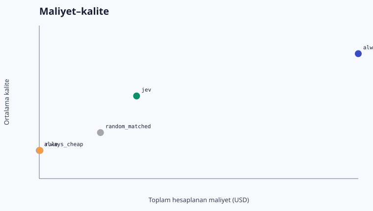
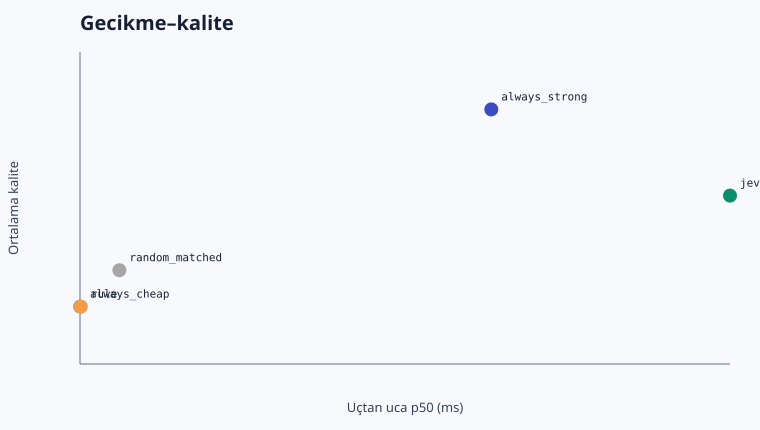

# Jev LLM Router Benchmark — Türkçe Sonuç Raporu

> Kanıt durumu: **canlı OpenRouter usage/cost verisi; sağlayıcı faturasıyla ayrıca mutabakat gerekir**. Bu rapor tasarrufu kanıtlanmış üretim sonucu olarak sunmaz.

## Koşu özeti

- Koşu: `20260919T175530Z`
- Mod: `live`
- Örnek sayısı: 1000
- Jev eşiği: 0.020
- Jev güçlü model seçim oranı: %19.2
- Maliyet türü: `provider_reported_when_available_else_calculated_from_usage`
- Gerçek benzersiz çağrı harcaması (ledger): `$0.380064`
- Benzersiz hedef/Jev çağrısı: 2000 / 1000

## Ana karşılaştırma

| Politika | Kalite | Güçlüye fark | %95 eşleştirilmiş GA | Güçlü kullanım | Toplam USD | Tasarruf | E2E p50 / p95 ms | TTFT p50 / p95 ms |
|---|---:|---:|---:|---:|---:|---:|---:|---:|
| always_strong | 0.942 | +0.00 yp | [+0.00, +0.00] | %100.0 | $0.317286 | %0.0 | 1335.9 / 2185.7 | 1266.2 / 2000.8 |
| always_cheap | 0.839 | -10.30 yp | [-12.50, -8.30] | %0.0 | $0.032876 | %89.6 | 1026.1 / 1539.3 | 960.1 / 1412.8 |
| rule | 0.839 | -10.30 yp | [-12.50, -8.30] | %0.2 | $0.033547 | %89.4 | 1026.7 / 1539.3 | 960.6 / 1412.8 |
| random_matched | 0.858 | -8.40 yp | [-10.30, -6.70] | %19.4 | $0.087420 | %72.4 | 1055.8 / 1687.8 | 1006.8 / 1616.5 |
| jev | 0.897 | -4.50 yp | [-5.90, -3.20] | %19.2 | $0.119628 | %62.3 | 1515.7 / 2198.3 | 1006.8 / 1617.9 |

## Önceden tanımlı hedef

Hedef, güçlü baseline'a göre toplam başarı/kalite kaybını en fazla 2 yüzde puanında tutarken maliyeti azaltmaktı. Bu koşuda ölçülen kayıp **4.50 yüzde puanı**. Küçük sentetik görev kümesi kalite korumasını kanıtlamak için yeterli değildir; güven aralığı ve alt gruplar kararın parçasıdır.

## Hata analizi

- Jev ucuz modeli seçtiği halde tam başarı sağlanamayan örnek: 65
- Ucuz model aynı kaliteyi sağlayabilecekken güçlü model seçilen örnek: 129
- Fallback oranı: %0.0
- Hata oranı: %0.1
- Bu iş yükünde Jev ek maliyetini karşılamak için gereken asgari ucuz-model oranı: %10.5

## Görev bazında canlı tam matris ve Jev yolu

Her Luna/Sol hücresi bir canlı çağrıdır. Jev politikasının seçtiği hedef yanıt tam matristen yeniden kullanılmıştır; böylece yönlendirilmiş yolun kalite ve hedef gecikmesi aynı canlı yanıta dayanırken gereksiz ikinci ücret oluşmamıştır.

| Görev | Dil / grup | Luna kalite · USD · ms · TTFT | Sol kalite · USD · ms · TTFT | Jev ham seçim · P(strong) · güven → uygulanan yol | Jev ms · USD | Yönlendirilmiş E2E ms |
|---|---|---:|---:|---|---:|---:|
| `arc-challenge-test-0001` | en / arc_challenge_science | 1.00 · $0.000027 · 927 · 926 | 1.00 · $0.000256 · 1488 · 1433 | cheap · 0.00 · 1.00 → cheap | 513 · $0.000028 | 1440 |
| `arc-challenge-test-0002` | en / arc_challenge_science | 1.00 · $0.000026 · 921 · 921 | 1.00 · $0.000250 · 996 · 905 | cheap · 0.00 · 1.00 → cheap | 511 · $0.000028 | 1432 |
| `arc-challenge-test-0003` | en / arc_challenge_science | 1.00 · $0.000020 · 1743 · 1738 | 1.00 · $0.000188 · 1088 · 1011 | cheap · 0.00 · 1.00 → cheap | 559 · $0.000027 | 2302 |
| `arc-challenge-test-0004` | en / arc_challenge_science | 1.00 · $0.000027 · 1023 · 1021 | 1.00 · $0.000258 · 1121 · 1061 | cheap · 0.00 · 1.00 → cheap | 505 · $0.000028 | 1527 |
| `arc-challenge-test-0005` | en / arc_challenge_science | 1.00 · $0.000026 · 1015 · 1014 | 1.00 · $0.000250 · 1217 · 1217 | cheap · 0.00 · 1.00 → cheap | 532 · $0.000028 | 1547 |
| `arc-challenge-test-0006` | en / arc_challenge_science | 1.00 · $0.000023 · 933 · 867 | 1.00 · $0.000218 · 1814 · 1759 | cheap · 0.00 · 1.00 → cheap | 434 · $0.000028 | 1367 |
| `arc-challenge-test-0007` | en / arc_challenge_science | 1.00 · $0.000028 · 1019 · 1019 | 1.00 · $0.000270 · 1279 · 1273 | cheap · 0.00 · 0.99 → cheap | 425 · $0.000029 | 1444 |
| `arc-challenge-test-0008` | en / arc_challenge_science | 1.00 · $0.000031 · 922 · 922 | 1.00 · $0.000302 · 1381 · 1327 | cheap · 0.00 · 0.99 → cheap | 403 · $0.000030 | 1325 |
| `arc-challenge-test-0009` | en / arc_challenge_science | 1.00 · $0.000036 · 1024 · 1023 | 1.00 · $0.000352 · 2425 · 2332 | cheap · 0.00 · 0.99 → cheap | 417 · $0.000031 | 1441 |
| `arc-challenge-test-0010` | en / arc_challenge_science | 0.00 · $0.000020 · 1016 · 937 | 1.00 · $0.000190 · 1141 · 1087 | cheap · 0.00 · 1.00 → cheap | 422 · $0.000027 | 1438 |
| `arc-challenge-test-0011` | en / arc_challenge_science | 1.00 · $0.000022 · 913 · 861 | 1.00 · $0.000214 · 1114 · 1068 | cheap · 0.00 · 1.00 → cheap | 469 · $0.000028 | 1382 |
| `arc-challenge-test-0012` | en / arc_challenge_science | 1.00 · $0.000024 · 1040 · 1040 | 1.00 · $0.000226 · 1480 · 1432 | cheap · 0.00 · 1.00 → cheap | 441 · $0.000028 | 1481 |
| `arc-challenge-test-0013` | en / arc_challenge_science | 1.00 · $0.000024 · 1030 · 1024 | 1.00 · $0.000226 · 1529 · 1476 | cheap · 0.00 · 1.00 → cheap | 471 · $0.000028 | 1501 |
| `arc-challenge-test-0014` | en / arc_challenge_science | 1.00 · $0.000022 · 1012 · 873 | 1.00 · $0.000208 · 1163 · 1126 | cheap · 0.00 · 1.00 → cheap | 390 · $0.000027 | 1402 |
| `arc-challenge-test-0015` | en / arc_challenge_science | 1.00 · $0.000031 · 905 · 829 | 1.00 · $0.000298 · 996 · 946 | cheap · 0.00 · 1.00 → cheap | 479 · $0.000029 | 1384 |
| `arc-challenge-test-0016` | en / arc_challenge_science | 1.00 · $0.000025 · 869 · 824 | 1.00 · $0.000236 · 1871 · 1782 | cheap · 0.00 · 1.00 → cheap | 519 · $0.000028 | 1389 |
| `arc-challenge-test-0017` | en / arc_challenge_science | 1.00 · $0.000027 · 1037 · 994 | 1.00 · $0.000264 · 1167 · 1109 | cheap · 0.01 · 0.98 → cheap | 379 · $0.000029 | 1416 |
| `arc-challenge-test-0018` | en / arc_challenge_science | 1.00 · $0.000029 · 1085 · 1084 | 1.00 · $0.000284 · 1480 · 1480 | cheap · 0.00 · 1.00 → cheap | 478 · $0.000029 | 1564 |
| `arc-challenge-test-0019` | en / arc_challenge_science | 1.00 · $0.000041 · 1039 · 1022 | 1.00 · $0.000404 · 1289 · 1206 | cheap · 0.00 · 0.99 → cheap | 481 · $0.000032 | 1520 |
| `arc-challenge-test-0020` | en / arc_challenge_science | 1.00 · $0.000028 · 911 · 854 | 1.00 · $0.000266 · 1374 · 1314 | cheap · 0.00 · 1.00 → cheap | 383 · $0.000029 | 1294 |
| `arc-challenge-test-0021` | en / arc_challenge_science | 1.00 · $0.000033 · 1135 · 1029 | 1.00 · $0.000318 · 1331 · 1287 | cheap · 0.00 · 1.00 → cheap | 376 · $0.000030 | 1511 |
| `arc-challenge-test-0022` | en / arc_challenge_science | 0.00 · $0.000023 · 962 · 903 | 1.00 · $0.000216 · 1261 · 1221 | cheap · 0.00 · 1.00 → cheap | 476 · $0.000028 | 1439 |
| `arc-challenge-test-0023` | en / arc_challenge_science | 1.00 · $0.000025 · 1155 · 1136 | 1.00 · $0.000238 · 1131 · 1092 | cheap · 0.00 · 1.00 → cheap | 523 · $0.000028 | 1679 |
| `arc-challenge-test-0024` | en / arc_challenge_science | 1.00 · $0.000031 · 1024 · 954 | 1.00 · $0.000298 · 1225 · 1200 | cheap · 0.01 · 0.99 → cheap | 414 · $0.000029 | 1438 |
| `arc-challenge-test-0025` | en / arc_challenge_science | 1.00 · $0.000024 · 1145 · 1144 | 1.00 · $0.000226 · 1390 · 1340 | cheap · 0.00 · 1.00 → cheap | 436 · $0.000028 | 1581 |
| `arc-challenge-test-0026` | en / arc_challenge_science | 1.00 · $0.000029 · 926 · 855 | 1.00 · $0.000282 · 1073 · 1014 | cheap · 0.00 · 1.00 → cheap | 426 · $0.000029 | 1352 |
| `arc-challenge-test-0027` | en / arc_challenge_science | 1.00 · $0.000023 · 910 · 909 | 1.00 · $0.000224 · 1651 · 1600 | cheap · 0.00 · 1.00 → cheap | 399 · $0.000028 | 1309 |
| `arc-challenge-test-0028` | en / arc_challenge_science | 1.00 · $0.000030 · 1061 · 1050 | 1.00 · $0.000288 · 1383 · 1382 | cheap · 0.00 · 0.99 → cheap | 421 · $0.000029 | 1482 |
| `arc-challenge-test-0029` | en / arc_challenge_science | 1.00 · $0.000027 · 1977 · 1440 | 1.00 · $0.000258 · 1172 · 1102 | cheap · 0.00 · 1.00 → cheap | 419 · $0.000029 | 2397 |
| `arc-challenge-test-0030` | en / arc_challenge_science | 1.00 · $0.000025 · 930 · 881 | 1.00 · $0.000244 · 2031 · 2001 | cheap · 0.00 · 1.00 → cheap | 499 · $0.000028 | 1428 |
| `arc-challenge-test-0031` | en / arc_challenge_science | 1.00 · $0.000031 · 1139 · 1071 | 1.00 · $0.000302 · 1511 · 1511 | cheap · 0.00 · 1.00 → cheap | 347 · $0.000030 | 1486 |
| `arc-challenge-test-0032` | en / arc_challenge_science | 1.00 · $0.000023 · 1010 · 936 | 1.00 · $0.000224 · 1679 · 1591 | cheap · 0.00 · 1.00 → cheap | 374 · $0.000028 | 1385 |
| `arc-challenge-test-0033` | en / arc_challenge_science | 1.00 · $0.000029 · 921 · 850 | 1.00 · $0.000280 · 1320 · 1244 | cheap · 0.00 · 1.00 → cheap | 462 · $0.000029 | 1384 |
| `arc-challenge-test-0034` | en / arc_challenge_science | 1.00 · $0.000024 · 925 · 864 | 1.00 · $0.000232 · 1504 · 1503 | cheap · 0.00 · 1.00 → cheap | 403 · $0.000028 | 1329 |
| `arc-challenge-test-0035` | en / arc_challenge_science | 1.00 · $0.000031 · 1115 · 1047 | 1.00 · $0.000302 · 1851 · 1457 | cheap · 0.00 · 1.00 → cheap | 473 · $0.000030 | 1588 |
| `arc-challenge-test-0036` | en / arc_challenge_science | 1.00 · $0.000026 · 909 · 882 | 1.00 · $0.000250 · 2339 · 2263 | cheap · 0.00 · 1.00 → cheap | 418 · $0.000028 | 1328 |
| `arc-challenge-test-0037` | en / arc_challenge_science | 1.00 · $0.000026 · 876 · 872 | 1.00 · $0.000254 · 1467 · 1443 | cheap · 0.00 · 1.00 → cheap | 379 · $0.000028 | 1255 |
| `arc-challenge-test-0038` | en / arc_challenge_science | 1.00 · $0.000022 · 1021 · 1020 | 1.00 · $0.000210 · 1170 · 1114 | cheap · 0.00 · 1.00 → cheap | 416 · $0.000028 | 1437 |
| `arc-challenge-test-0039` | en / arc_challenge_science | 1.00 · $0.000029 · 840 · 783 | 1.00 · $0.000276 · 1233 · 1124 | cheap · 0.00 · 1.00 → cheap | 431 · $0.000029 | 1272 |
| `arc-challenge-test-0040` | en / arc_challenge_science | 1.00 · $0.000021 · 982 · 928 | 1.00 · $0.000200 · 2006 · 1972 | cheap · 0.00 · 1.00 → cheap | 471 · $0.000027 | 1453 |
| `arc-challenge-test-0041` | en / arc_challenge_science | 1.00 · $0.000034 · 1008 · 969 | 1.00 · $0.000332 · 1214 · 1196 | cheap · 0.00 · 0.99 → cheap | 421 · $0.000030 | 1429 |
| `arc-challenge-test-0042` | en / arc_challenge_science | 1.00 · $0.000026 · 1539 · 1403 | 1.00 · $0.000248 · 1129 · 1057 | cheap · 0.00 · 1.00 → cheap | 445 · $0.000028 | 1984 |
| `arc-challenge-test-0043` | en / arc_challenge_science | 1.00 · $0.000029 · 875 · 843 | 1.00 · $0.000278 · 1066 · 982 | cheap · 0.00 · 1.00 → cheap | 601 · $0.000029 | 1477 |
| `arc-challenge-test-0044` | en / arc_challenge_science | 1.00 · $0.000021 · 875 · 828 | 1.00 · $0.000196 · 1611 · 1555 | cheap · 0.00 · 1.00 → cheap | 436 · $0.000027 | 1311 |
| `arc-challenge-test-0045` | en / arc_challenge_science | 1.00 · $0.000032 · 869 · 868 | 1.00 · $0.000306 · 2628 · 1374 | cheap · 0.01 · 0.99 → cheap | 416 · $0.000030 | 1284 |
| `arc-challenge-test-0046` | en / arc_challenge_science | 1.00 · $0.000029 · 1049 · 1048 | 1.00 · $0.000278 · 2472 · 2412 | cheap · 0.00 · 1.00 → cheap | 581 · $0.000029 | 1630 |
| `arc-challenge-test-0047` | en / arc_challenge_science | 1.00 · $0.000026 · 1047 · 925 | 1.00 · $0.000252 · 3262 · 2733 | cheap · 0.00 · 1.00 → cheap | 440 · $0.000028 | 1487 |
| `arc-challenge-test-0048` | en / arc_challenge_science | 0.00 · $0.000033 · 889 · 840 | 1.00 · $0.000324 · 2663 · 2663 | cheap · 0.01 · 0.98 → cheap | 477 · $0.000030 | 1365 |
| `arc-challenge-test-0049` | en / arc_challenge_science | 1.00 · $0.000029 · 1084 · 1083 | 1.00 · $0.000284 · 1261 · 1184 | cheap · 0.00 · 1.00 → cheap | 399 · $0.000029 | 1483 |
| `arc-challenge-test-0050` | en / arc_challenge_science | 0.00 · $0.000024 · 932 · 875 | 1.00 · $0.000230 · 1367 · 1319 | cheap · 0.00 · 1.00 → cheap | 430 · $0.000028 | 1362 |
| `arc-challenge-test-0051` | en / arc_challenge_science | 1.00 · $0.000029 · 1019 · 976 | 1.00 · $0.000284 · 1162 · 1159 | cheap · 0.00 · 1.00 → cheap | 378 · $0.000029 | 1397 |
| `arc-challenge-test-0052` | en / arc_challenge_science | 1.00 · $0.000037 · 939 · 887 | 1.00 · $0.000356 · 1265 · 1226 | cheap · 0.00 · 1.00 → cheap | 389 · $0.000031 | 1329 |
| `arc-challenge-test-0053` | en / arc_challenge_science | 1.00 · $0.000026 · 971 · 931 | 1.00 · $0.000248 · 1532 · 1424 | cheap · 0.00 · 1.00 → cheap | 397 · $0.000028 | 1368 |
| `arc-challenge-test-0054` | en / arc_challenge_science | 1.00 · $0.000036 · 837 · 784 | 1.00 · $0.000354 · 1204 · 1148 | cheap · 0.00 · 1.00 → cheap | 486 · $0.000031 | 1323 |
| `arc-challenge-test-0055` | en / arc_challenge_science | 1.00 · $0.000024 · 950 · 938 | 1.00 · $0.000232 · 1211 · 1140 | cheap · 0.00 · 1.00 → cheap | 417 · $0.000028 | 1367 |
| `arc-challenge-test-0056` | en / arc_challenge_science | 1.00 · $0.000024 · 1291 · 1290 | 1.00 · $0.000230 · 1098 · 1061 | cheap · 0.00 · 1.00 → cheap | 437 · $0.000028 | 1728 |
| `arc-challenge-test-0057` | en / arc_challenge_science | 1.00 · $0.000027 · 1064 · 1047 | 1.00 · $0.000258 · 1248 · 1205 | cheap · 0.00 · 1.00 → cheap | 483 · $0.000029 | 1548 |
| `arc-challenge-test-0058` | en / arc_challenge_science | 1.00 · $0.000025 · 904 · 833 | 1.00 · $0.000236 · 1197 · 1149 | cheap · 0.00 · 1.00 → cheap | 417 · $0.000028 | 1322 |
| `arc-challenge-test-0059` | en / arc_challenge_science | 1.00 · $0.000027 · 1062 · 1007 | 1.00 · $0.000260 · 1723 · 1682 | cheap · 0.00 · 1.00 → cheap | 484 · $0.000029 | 1547 |
| `arc-challenge-test-0060` | en / arc_challenge_science | 1.00 · $0.000028 · 1192 · 1186 | 1.00 · $0.000268 · 1407 · 1346 | cheap · 0.00 · 1.00 → cheap | 431 · $0.000029 | 1623 |
| `arc-challenge-test-0061` | en / arc_challenge_science | 1.00 · $0.000028 · 1027 · 1018 | 1.00 · $0.000274 · 1015 · 1015 | cheap · 0.00 · 1.00 → cheap | 486 · $0.000029 | 1513 |
| `arc-challenge-test-0062` | en / arc_challenge_science | 1.00 · $0.000023 · 1039 · 785 | 1.00 · $0.000220 · 1335 · 1266 | cheap · 0.00 · 1.00 → cheap | 512 · $0.000028 | 1550 |
| `arc-challenge-test-0063` | en / arc_challenge_science | 1.00 · $0.000021 · 1049 · 939 | 1.00 · $0.000198 · 1442 · 1429 | cheap · 0.00 · 1.00 → cheap | 377 · $0.000027 | 1426 |
| `arc-challenge-test-0064` | en / arc_challenge_science | 1.00 · $0.000026 · 932 · 872 | 1.00 · $0.000252 · 1373 · 1298 | cheap · 0.00 · 1.00 → cheap | 399 · $0.000028 | 1331 |
| `arc-challenge-test-0065` | en / arc_challenge_science | 1.00 · $0.000026 · 1165 · 1052 | 1.00 · $0.000250 · 1477 · 1377 | cheap · 0.00 · 1.00 → cheap | 554 · $0.000028 | 1720 |
| `arc-challenge-test-0066` | en / arc_challenge_science | 1.00 · $0.000021 · 928 · 927 | 1.00 · $0.000200 · 1110 · 1067 | cheap · 0.00 · 1.00 → cheap | 413 · $0.000027 | 1341 |
| `arc-challenge-test-0067` | en / arc_challenge_science | 1.00 · $0.000022 · 1167 · 1035 | 1.00 · $0.000212 · 1805 · 1791 | cheap · 0.00 · 1.00 → cheap | 405 · $0.000028 | 1572 |
| `arc-challenge-test-0068` | en / arc_challenge_science | 1.00 · $0.000034 · 884 · 880 | 1.00 · $0.000330 · 1067 · 1015 | cheap · 0.00 · 1.00 → cheap | 462 · $0.000030 | 1346 |
| `arc-challenge-test-0069` | en / arc_challenge_science | 1.00 · $0.000025 · 947 · 882 | 1.00 · $0.000240 · 1260 · 1260 | cheap · 0.00 · 1.00 → cheap | 406 · $0.000028 | 1353 |
| `arc-challenge-test-0070` | en / arc_challenge_science | 1.00 · $0.000022 · 952 · 870 | 1.00 · $0.000214 · 1572 · 1437 | cheap · 0.00 · 1.00 → cheap | 400 · $0.000028 | 1352 |
| `arc-challenge-test-0071` | en / arc_challenge_science | 1.00 · $0.000025 · 1261 · 1215 | 1.00 · $0.000236 · 1279 · 1210 | cheap · 0.00 · 1.00 → cheap | 396 · $0.000028 | 1657 |
| `arc-challenge-test-0072` | en / arc_challenge_science | 1.00 · $0.000029 · 946 · 846 | 1.00 · $0.000284 · 1343 · 1224 | cheap · 0.00 · 1.00 → cheap | 390 · $0.000029 | 1336 |
| `arc-challenge-test-0073` | en / arc_challenge_science | 1.00 · $0.000031 · 910 · 905 | 1.00 · $0.000302 · 1052 · 1052 | cheap · 0.00 · 1.00 → cheap | 551 · $0.000029 | 1461 |
| `arc-challenge-test-0074` | en / arc_challenge_science | 1.00 · $0.000030 · 920 · 919 | 1.00 · $0.000288 · 1415 · 1385 | cheap · 0.00 · 1.00 → cheap | 467 · $0.000029 | 1387 |
| `arc-challenge-test-0075` | en / arc_challenge_science | 1.00 · $0.000039 · 1201 · 1150 | 1.00 · $0.000380 · 1202 · 1109 | cheap · 0.00 · 1.00 → cheap | 478 · $0.000031 | 1680 |
| `arc-challenge-test-0076` | en / arc_challenge_science | 1.00 · $0.000024 · 985 · 945 | 1.00 · $0.000232 · 1328 · 1291 | cheap · 0.00 · 1.00 → cheap | 452 · $0.000028 | 1437 |
| `arc-challenge-test-0077` | en / arc_challenge_science | 1.00 · $0.000032 · 1030 · 961 | 1.00 · $0.000310 · 1196 · 1115 | cheap · 0.00 · 1.00 → cheap | 386 · $0.000030 | 1417 |
| `arc-challenge-test-0078` | en / arc_challenge_science | 1.00 · $0.000029 · 860 · 820 | 1.00 · $0.000282 · 1472 · 1395 | cheap · 0.00 · 1.00 → cheap | 425 · $0.000029 | 1285 |
| `arc-challenge-test-0079` | en / arc_challenge_science | 1.00 · $0.000025 · 1161 · 1058 | 1.00 · $0.000240 · 1246 · 1153 | cheap · 0.00 · 1.00 → cheap | 614 · $0.000028 | 1775 |
| `arc-challenge-test-0080` | en / arc_challenge_science | 1.00 · $0.000029 · 905 · 904 | 1.00 · $0.000276 · 1111 · 1111 | cheap · 0.00 · 1.00 → cheap | 430 · $0.000029 | 1335 |
| `arc-challenge-test-0081` | en / arc_challenge_science | 1.00 · $0.000024 · 996 · 917 | 1.00 · $0.000230 · 1509 · 1374 | cheap · 0.00 · 1.00 → cheap | 436 · $0.000028 | 1432 |
| `arc-challenge-test-0082` | en / arc_challenge_science | 1.00 · $0.000024 · 994 · 907 | 1.00 · $0.000226 · 1197 · 1151 | cheap · 0.00 · 1.00 → cheap | 670 · $0.000028 | 1664 |
| `arc-challenge-test-0083` | en / arc_challenge_science | 1.00 · $0.000023 · 1135 · 1079 | 1.00 · $0.000224 · 1098 · 1036 | cheap · 0.00 · 1.00 → cheap | 512 · $0.000028 | 1647 |
| `arc-challenge-test-0084` | en / arc_challenge_science | 1.00 · $0.000020 · 921 · 865 | 1.00 · $0.000194 · 1506 · 1460 | cheap · 0.00 · 1.00 → cheap | 479 · $0.000027 | 1400 |
| `arc-challenge-test-0085` | en / arc_challenge_science | 1.00 · $0.000031 · 956 · 892 | 1.00 · $0.000304 · 1126 · 1066 | cheap · 0.00 · 1.00 → cheap | 544 · $0.000030 | 1500 |
| `arc-challenge-test-0086` | en / arc_challenge_science | 1.00 · $0.000025 · 1135 · 1067 | 1.00 · $0.000240 · 1072 · 1025 | cheap · 0.00 · 1.00 → cheap | 413 · $0.000028 | 1548 |
| `arc-challenge-test-0087` | en / arc_challenge_science | 1.00 · $0.000031 · 965 · 907 | 1.00 · $0.000298 · 1057 · 1026 | cheap · 0.00 · 1.00 → cheap | 476 · $0.000029 | 1441 |
| `arc-challenge-test-0088` | en / arc_challenge_science | 1.00 · $0.000024 · 1248 · 1204 | 1.00 · $0.000234 · 1333 · 1231 | cheap · 0.00 · 1.00 → cheap | 503 · $0.000028 | 1751 |
| `arc-challenge-test-0089` | en / arc_challenge_science | 1.00 · $0.000022 · 1227 · 1065 | 1.00 · $0.000214 · 1425 · 1373 | cheap · 0.00 · 1.00 → cheap | 451 · $0.000028 | 1677 |
| `arc-challenge-test-0090` | en / arc_challenge_science | 1.00 · $0.000033 · 836 · 775 | 1.00 · $0.000318 · 1242 · 1225 | cheap · 0.00 · 1.00 → cheap | 410 · $0.000030 | 1246 |
| `arc-challenge-test-0091` | en / arc_challenge_science | 1.00 · $0.000028 · 1048 · 981 | 1.00 · $0.000268 · 1393 · 1362 | cheap · 0.00 · 0.99 → cheap | 391 · $0.000029 | 1440 |
| `arc-challenge-test-0092` | en / arc_challenge_science | 1.00 · $0.000032 · 1422 · 1365 | 1.00 · $0.000314 · 1222 · 1181 | cheap · 0.01 · 0.99 → cheap | 480 · $0.000030 | 1902 |
| `arc-challenge-test-0093` | en / arc_challenge_science | 1.00 · $0.000021 · 892 · 890 | 1.00 · $0.000198 · 1757 · 1712 | cheap · 0.00 · 1.00 → cheap | 561 · $0.000027 | 1453 |
| `arc-challenge-test-0094` | en / arc_challenge_science | 1.00 · $0.000029 · 958 · 893 | 1.00 · $0.000278 · 1989 · 1871 | cheap · 0.00 · 1.00 → cheap | 384 · $0.000029 | 1342 |
| `arc-challenge-test-0095` | en / arc_challenge_science | 1.00 · $0.000022 · 4104 · 3783 | 1.00 · $0.000210 · 1270 · 1059 | cheap · 0.00 · 1.00 → cheap | 537 · $0.000028 | 4641 |
| `arc-challenge-test-0096` | en / arc_challenge_science | 1.00 · $0.000023 · 1024 · 1023 | 1.00 · $0.000222 · 1342 · 1263 | cheap · 0.00 · 1.00 → cheap | 490 · $0.000028 | 1514 |
| `arc-challenge-test-0097` | en / arc_challenge_science | 1.00 · $0.000032 · 946 · 919 | 1.00 · $0.000310 · 1283 · 1227 | cheap · 0.00 · 1.00 → cheap | 533 · $0.000030 | 1479 |
| `arc-challenge-test-0098` | en / arc_challenge_science | 1.00 · $0.000027 · 829 · 828 | 1.00 · $0.000262 · 1068 · 975 | cheap · 0.00 · 1.00 → cheap | 470 · $0.000029 | 1298 |
| `arc-challenge-test-0099` | en / arc_challenge_science | 1.00 · $0.000025 · 1093 · 1092 | 1.00 · $0.000238 · 1404 · 1400 | cheap · 0.00 · 1.00 → cheap | 438 · $0.000028 | 1531 |
| `arc-challenge-test-0100` | en / arc_challenge_science | 1.00 · $0.000024 · 1200 · 1120 | 1.00 · $0.000232 · 1258 · 1236 | cheap · 0.00 · 1.00 → cheap | 392 · $0.000028 | 1592 |
| `arc-challenge-test-0101` | en / arc_challenge_science | 1.00 · $0.000034 · 1015 · 850 | 1.00 · $0.000332 · 1349 · 1274 | cheap · 0.02 · 0.97 → strong | 390 · $0.000030 | 1738 |
| `arc-challenge-test-0102` | en / arc_challenge_science | 1.00 · $0.000023 · 1016 · 952 | 1.00 · $0.000218 · 1397 · 1271 | cheap · 0.00 · 1.00 → cheap | 563 · $0.000028 | 1579 |
| `arc-challenge-test-0103` | en / arc_challenge_science | 1.00 · $0.000033 · 1077 · 1008 | 1.00 · $0.000316 · 1422 · 1421 | cheap · 0.00 · 1.00 → cheap | 364 · $0.000030 | 1440 |
| `arc-challenge-test-0104` | en / arc_challenge_science | 1.00 · $0.000024 · 957 · 885 | 1.00 · $0.000230 · 1527 · 1434 | cheap · 0.00 · 1.00 → cheap | 558 · $0.000028 | 1514 |
| `arc-challenge-test-0105` | en / arc_challenge_science | 1.00 · $0.000019 · 1305 · 1216 | 1.00 · $0.000184 · 1090 · 1032 | cheap · 0.00 · 1.00 → cheap | 609 · $0.000027 | 1914 |
| `arc-challenge-test-0106` | en / arc_challenge_science | 1.00 · $0.000024 · 1050 · 957 | 1.00 · $0.000234 · 1227 · 1213 | cheap · 0.00 · 1.00 → cheap | 525 · $0.000028 | 1575 |
| `arc-challenge-test-0107` | en / arc_challenge_science | 1.00 · $0.000032 · 1017 · 948 | 1.00 · $0.000306 · 1363 · 1315 | cheap · 0.00 · 1.00 → cheap | 396 · $0.000030 | 1413 |
| `arc-challenge-test-0108` | en / arc_challenge_science | 1.00 · $0.000032 · 1277 · 1188 | 1.00 · $0.000314 · 1518 · 1463 | cheap · 0.00 · 1.00 → cheap | 446 · $0.000030 | 1723 |
| `arc-challenge-test-0109` | en / arc_challenge_science | 1.00 · $0.000028 · 937 · 936 | 1.00 · $0.000266 · 1669 · 1606 | cheap · 0.00 · 1.00 → cheap | 425 · $0.000029 | 1362 |
| `arc-challenge-test-0110` | en / arc_challenge_science | 1.00 · $0.000027 · 929 · 879 | 1.00 · $0.000256 · 1194 · 1074 | cheap · 0.00 · 1.00 → cheap | 395 · $0.000028 | 1324 |
| `arc-challenge-test-0111` | en / arc_challenge_science | 1.00 · $0.000039 · 1004 · 954 | 1.00 · $0.000384 · 1258 · 1194 | cheap · 0.00 · 1.00 → cheap | 435 · $0.000031 | 1439 |
| `arc-challenge-test-0112` | en / arc_challenge_science | 1.00 · $0.000022 · 1138 · 1096 | 1.00 · $0.000206 · 1591 · 1549 | cheap · 0.00 · 1.00 → cheap | 367 · $0.000027 | 1505 |
| `arc-challenge-test-0113` | en / arc_challenge_science | 1.00 · $0.000023 · 968 · 956 | 1.00 · $0.000218 · 1387 · 1387 | cheap · 0.00 · 1.00 → cheap | 458 · $0.000028 | 1426 |
| `arc-challenge-test-0114` | en / arc_challenge_science | 1.00 · $0.000026 · 1655 · 1585 | 1.00 · $0.000252 · 1138 · 1109 | cheap · 0.00 · 1.00 → cheap | 376 · $0.000028 | 2031 |
| `arc-challenge-test-0115` | en / arc_challenge_science | 1.00 · $0.000033 · 1004 · 911 | 1.00 · $0.000320 · 1254 · 1177 | cheap · 0.00 · 1.00 → cheap | 450 · $0.000030 | 1454 |
| `arc-challenge-test-0116` | en / arc_challenge_science | 1.00 · $0.000028 · 925 · 874 | 1.00 · $0.000272 · 1760 · 1760 | cheap · 0.00 · 1.00 → cheap | 445 · $0.000029 | 1370 |
| `arc-challenge-test-0117` | en / arc_challenge_science | 0.00 · $0.000031 · 1136 · 1101 | 1.00 · $0.000298 · 1229 · 1166 | cheap · 0.00 · 1.00 → cheap | 552 · $0.000030 | 1687 |
| `arc-challenge-test-0118` | en / arc_challenge_science | 1.00 · $0.000031 · 1140 · 1094 | 1.00 · $0.000304 · 1210 · 1108 | cheap · 0.00 · 1.00 → cheap | 383 · $0.000030 | 1523 |
| `arc-challenge-test-0119` | en / arc_challenge_science | 1.00 · $0.000029 · 937 · 925 | 1.00 · $0.000282 · 1117 · 1059 | cheap · 0.01 · 0.98 → cheap | 473 · $0.000029 | 1409 |
| `arc-challenge-test-0120` | en / arc_challenge_science | 1.00 · $0.000023 · 972 · 910 | 1.00 · $0.000216 · 1383 · 1359 | cheap · 0.00 · 1.00 → cheap | 379 · $0.000028 | 1351 |
| `arc-challenge-test-0121` | en / arc_challenge_science | 1.00 · $0.000022 · 1159 · 1052 | 1.00 · $0.000210 · 2400 · 2400 | cheap · 0.00 · 1.00 → cheap | 418 · $0.000028 | 1577 |
| `arc-challenge-test-0122` | en / arc_challenge_science | 1.00 · $0.000028 · 946 · 882 | 1.00 · $0.000266 · 1173 · 1140 | cheap · 0.00 · 1.00 → cheap | 461 · $0.000029 | 1407 |
| `arc-challenge-test-0123` | en / arc_challenge_science | 1.00 · $0.000028 · 1076 · 1045 | 1.00 · $0.000274 · 1466 · 1466 | cheap · 0.00 · 0.99 → cheap | 480 · $0.000029 | 1556 |
| `arc-challenge-test-0124` | en / arc_challenge_science | 1.00 · $0.000022 · 994 · 923 | 1.00 · $0.000206 · 1086 · 1029 | cheap · 0.00 · 1.00 → cheap | 396 · $0.000028 | 1390 |
| `arc-challenge-test-0125` | en / arc_challenge_science | 1.00 · $0.000028 · 963 · 908 | 1.00 · $0.000274 · 1054 · 992 | cheap · 0.01 · 0.98 → cheap | 748 · $0.000029 | 1711 |
| `arc-challenge-test-0126` | en / arc_challenge_science | 1.00 · $0.000026 · 1003 · 986 | 1.00 · $0.000250 · 1547 · 1547 | cheap · 0.00 · 1.00 → cheap | 466 · $0.000028 | 1469 |
| `arc-challenge-test-0127` | en / arc_challenge_science | 1.00 · $0.000031 · 1591 · 1554 | 1.00 · $0.000298 · 1279 · 1227 | cheap · 0.00 · 1.00 → cheap | 487 · $0.000030 | 2078 |
| `arc-challenge-test-0128` | en / arc_challenge_science | 1.00 · $0.000024 · 1038 · 1037 | 1.00 · $0.000228 · 1168 · 1111 | cheap · 0.00 · 1.00 → cheap | 439 · $0.000028 | 1477 |
| `arc-challenge-test-0129` | en / arc_challenge_science | 1.00 · $0.000034 · 1026 · 1024 | 1.00 · $0.000332 · 1440 · 1361 | cheap · 0.00 · 0.99 → cheap | 433 · $0.000030 | 1459 |
| `arc-challenge-test-0130` | en / arc_challenge_science | 1.00 · $0.000029 · 1051 · 905 | 1.00 · $0.000278 · 1148 · 1089 | cheap · 0.00 · 1.00 → cheap | 353 · $0.000029 | 1404 |
| `arc-challenge-test-0131` | en / arc_challenge_science | 1.00 · $0.000028 · 899 · 813 | 1.00 · $0.000272 · 1106 · 1041 | cheap · 0.00 · 1.00 → cheap | 401 · $0.000029 | 1300 |
| `arc-challenge-test-0132` | en / arc_challenge_science | 1.00 · $0.000036 · 975 · 914 | 1.00 · $0.000348 · 2256 · 1435 | cheap · 0.01 · 0.98 → cheap | 366 · $0.000030 | 1341 |
| `arc-challenge-test-0133` | en / arc_challenge_science | 1.00 · $0.000022 · 1391 · 838 | 1.00 · $0.000214 · 2142 · 1221 | cheap · 0.00 · 0.99 → cheap | 528 · $0.000028 | 1920 |
| `arc-challenge-test-0134` | en / arc_challenge_science | 1.00 · $0.000028 · 1005 · 1004 | 1.00 · $0.000266 · 1340 · 1338 | cheap · 0.00 · 0.99 → cheap | 487 · $0.000029 | 1492 |
| `arc-challenge-test-0135` | en / arc_challenge_science | 1.00 · $0.000028 · 1025 · 1024 | 1.00 · $0.000268 · 1433 · 1433 | cheap · 0.00 · 1.00 → cheap | 470 · $0.000029 | 1494 |
| `arc-challenge-test-0136` | en / arc_challenge_science | 1.00 · $0.000028 · 1165 · 1101 | 1.00 · $0.000274 · 1077 · 1018 | cheap · 0.00 · 1.00 → cheap | 408 · $0.000029 | 1574 |
| `arc-challenge-test-0137` | en / arc_challenge_science | 1.00 · $0.000029 · 1824 · 1493 | 1.00 · $0.000280 · 1586 · 1304 | cheap · 0.00 · 1.00 → cheap | 418 · $0.000029 | 2242 |
| `arc-challenge-test-0138` | en / arc_challenge_science | 1.00 · $0.000033 · 1148 · 1027 | 1.00 · $0.000322 · 1531 · 1507 | cheap · 0.00 · 1.00 → cheap | 436 · $0.000030 | 1584 |
| `arc-challenge-test-0139` | en / arc_challenge_science | 1.00 · $0.000023 · 891 · 846 | 1.00 · $0.000222 · 1680 · 1645 | cheap · 0.00 · 1.00 → cheap | 503 · $0.000028 | 1393 |
| `arc-challenge-test-0140` | en / arc_challenge_science | 1.00 · $0.000024 · 1047 · 1000 | 1.00 · $0.000228 · 1267 · 1247 | cheap · 0.00 · 1.00 → cheap | 524 · $0.000028 | 1570 |
| `arc-challenge-test-0141` | en / arc_challenge_science | 1.00 · $0.000027 · 956 · 889 | 1.00 · $0.000256 · 1138 · 1119 | cheap · 0.00 · 1.00 → cheap | 524 · $0.000029 | 1480 |
| `arc-challenge-test-0142` | en / arc_challenge_science | 1.00 · $0.000025 · 951 · 890 | 1.00 · $0.000238 · 1448 · 1346 | cheap · 0.00 · 1.00 → cheap | 524 · $0.000028 | 1475 |
| `arc-challenge-test-0143` | en / arc_challenge_science | 1.00 · $0.000029 · 919 · 871 | 1.00 · $0.000282 · 1608 · 1567 | cheap · 0.00 · 1.00 → cheap | 430 · $0.000029 | 1349 |
| `arc-challenge-test-0144` | en / arc_challenge_science | 1.00 · $0.000023 · 1060 · 1003 | 1.00 · $0.000220 · 1240 · 1208 | cheap · 0.00 · 1.00 → cheap | 459 · $0.000028 | 1519 |
| `arc-challenge-test-0145` | en / arc_challenge_science | 1.00 · $0.000029 · 991 · 898 | 1.00 · $0.000278 · 1344 · 1344 | cheap · 0.00 · 1.00 → cheap | 441 · $0.000029 | 1432 |
| `arc-challenge-test-0146` | en / arc_challenge_science | 0.00 · $0.000037 · 933 · 923 | 1.00 · $0.000358 · 1134 · 1134 | cheap · 0.00 · 1.00 → cheap | 393 · $0.000031 | 1326 |
| `arc-challenge-test-0147` | en / arc_challenge_science | 1.00 · $0.000037 · 1687 · 1504 | 1.00 · $0.000358 · 2148 · 2122 | cheap · 0.02 · 0.96 → strong | 386 · $0.000031 | 2534 |
| `arc-challenge-test-0148` | en / arc_challenge_science | 1.00 · $0.000030 · 1050 · 1049 | 1.00 · $0.000292 · 1170 · 1090 | cheap · 0.00 · 1.00 → cheap | 525 · $0.000029 | 1575 |
| `arc-challenge-test-0149` | en / arc_challenge_science | 1.00 · $0.000028 · 932 · 871 | 1.00 · $0.000266 · 3014 · 1640 | cheap · 0.00 · 0.99 → cheap | 511 · $0.000029 | 1443 |
| `arc-challenge-test-0150` | en / arc_challenge_science | 1.00 · $0.000026 · 992 · 945 | 1.00 · $0.000248 · 1068 · 973 | cheap · 0.00 · 1.00 → cheap | 561 · $0.000029 | 1553 |
| `arc-challenge-test-0151` | en / arc_challenge_science | 1.00 · $0.000025 · 876 · 858 | 1.00 · $0.000236 · 1095 · 1024 | cheap · 0.00 · 1.00 → cheap | 487 · $0.000028 | 1363 |
| `arc-challenge-test-0152` | en / arc_challenge_science | 1.00 · $0.000026 · 1000 · 933 | 1.00 · $0.000250 · 1495 · 1435 | cheap · 0.00 · 1.00 → cheap | 524 · $0.000028 | 1523 |
| `arc-challenge-test-0153` | en / arc_challenge_science | 1.00 · $0.000034 · 1004 · 951 | 1.00 · $0.000326 · 2562 · 1453 | cheap · 0.00 · 1.00 → cheap | 398 · $0.000030 | 1402 |
| `arc-challenge-test-0154` | en / arc_challenge_science | 1.00 · $0.000040 · 983 · 979 | 1.00 · $0.000394 · 1516 · 1388 | cheap · 0.00 · 1.00 → cheap | 552 · $0.000032 | 1534 |
| `arc-challenge-test-0155` | en / arc_challenge_science | 1.00 · $0.000025 · 914 · 887 | 1.00 · $0.000244 · 1123 · 1078 | cheap · 0.00 · 1.00 → cheap | 483 · $0.000028 | 1396 |
| `arc-challenge-test-0156` | en / arc_challenge_science | 1.00 · $0.000022 · 1164 · 1014 | 1.00 · $0.000208 · 1053 · 1020 | cheap · 0.00 · 1.00 → cheap | 383 · $0.000028 | 1548 |
| `arc-challenge-test-0157` | en / arc_challenge_science | 1.00 · $0.000027 · 929 · 884 | 1.00 · $0.000264 · 1157 · 1092 | cheap · 0.00 · 1.00 → cheap | 432 · $0.000029 | 1360 |
| `arc-challenge-test-0158` | en / arc_challenge_science | 1.00 · $0.000021 · 1028 · 969 | 1.00 · $0.000202 · 1501 · 1443 | cheap · 0.00 · 1.00 → cheap | 385 · $0.000027 | 1414 |
| `arc-challenge-test-0159` | en / arc_challenge_science | 1.00 · $0.000022 · 1063 · 1008 | 1.00 · $0.000208 · 1468 · 1457 | cheap · 0.00 · 1.00 → cheap | 404 · $0.000028 | 1466 |
| `arc-challenge-test-0160` | en / arc_challenge_science | 1.00 · $0.000024 · 1438 · 1411 | 1.00 · $0.000226 · 1110 · 1054 | cheap · 0.00 · 1.00 → cheap | 460 · $0.000028 | 1898 |
| `arc-challenge-test-0161` | en / arc_challenge_science | 1.00 · $0.000021 · 1041 · 981 | 1.00 · $0.000202 · 1262 · 1200 | cheap · 0.00 · 1.00 → cheap | 461 · $0.000027 | 1502 |
| `arc-challenge-test-0162` | en / arc_challenge_science | 1.00 · $0.000022 · 985 · 934 | 1.00 · $0.000214 · 1118 · 1061 | cheap · 0.00 · 1.00 → cheap | 469 · $0.000028 | 1454 |
| `arc-challenge-test-0163` | en / arc_challenge_science | 1.00 · $0.000036 · 1046 · 974 | 1.00 · $0.000354 · 1260 · 1220 | cheap · 0.00 · 0.99 → cheap | 423 · $0.000031 | 1469 |
| `arc-challenge-test-0164` | en / arc_challenge_science | 1.00 · $0.000027 · 939 · 882 | 1.00 · $0.000262 · 1406 · 1334 | cheap · 0.00 · 1.00 → cheap | 511 · $0.000029 | 1450 |
| `arc-challenge-test-0165` | en / arc_challenge_science | 1.00 · $0.000028 · 1347 · 1274 | 1.00 · $0.000274 · 1215 · 1171 | cheap · 0.00 · 1.00 → cheap | 421 · $0.000029 | 1768 |
| `arc-challenge-test-0166` | en / arc_challenge_science | 1.00 · $0.000025 · 1366 · 1264 | 1.00 · $0.000240 · 1215 · 1164 | cheap · 0.00 · 1.00 → cheap | 413 · $0.000028 | 1780 |
| `arc-challenge-test-0167` | en / arc_challenge_science | 1.00 · $0.000029 · 874 · 874 | 1.00 · $0.000276 · 1415 · 1359 | cheap · 0.00 · 1.00 → cheap | 415 · $0.000029 | 1290 |
| `arc-challenge-test-0168` | en / arc_challenge_science | 1.00 · $0.000025 · 1961 · 1870 | 1.00 · $0.000244 · 1386 · 1370 | cheap · 0.00 · 1.00 → cheap | 374 · $0.000028 | 2335 |
| `arc-challenge-test-0169` | en / arc_challenge_science | 1.00 · $0.000025 · 1004 · 943 | 1.00 · $0.000240 · 1322 · 1272 | cheap · 0.00 · 1.00 → cheap | 382 · $0.000028 | 1386 |
| `arc-challenge-test-0170` | en / arc_challenge_science | 1.00 · $0.000024 · 911 · 848 | 1.00 · $0.000234 · 1133 · 1107 | cheap · 0.00 · 1.00 → cheap | 374 · $0.000028 | 1285 |
| `arc-challenge-test-0171` | en / arc_challenge_science | 1.00 · $0.000025 · 1048 · 989 | 1.00 · $0.000244 · 1157 · 1062 | cheap · 0.00 · 1.00 → cheap | 458 · $0.000028 | 1506 |
| `arc-challenge-test-0172` | en / arc_challenge_science | 1.00 · $0.000030 · 1072 · 1003 | 1.00 · $0.000290 · 2442 · 2417 | cheap · 0.01 · 0.99 → cheap | 376 · $0.000029 | 1448 |
| `arc-challenge-test-0173` | en / arc_challenge_science | 1.00 · $0.000022 · 957 · 900 | 1.00 · $0.000212 · 1459 · 1421 | cheap · 0.00 · 1.00 → cheap | 378 · $0.000028 | 1335 |
| `arc-challenge-test-0174` | en / arc_challenge_science | 1.00 · $0.000025 · 1032 · 954 | 1.00 · $0.000240 · 1554 · 1535 | cheap · 0.00 · 1.00 → cheap | 580 · $0.000028 | 1613 |
| `arc-challenge-test-0175` | en / arc_challenge_science | 1.00 · $0.000025 · 982 · 939 | 1.00 · $0.000244 · 1278 · 1241 | cheap · 0.00 · 1.00 → cheap | 447 · $0.000028 | 1429 |
| `arc-challenge-test-0176` | en / arc_challenge_science | 1.00 · $0.000033 · 1116 · 1070 | 1.00 · $0.000320 · 1189 · 1150 | cheap · 0.00 · 1.00 → cheap | 375 · $0.000030 | 1491 |
| `arc-challenge-test-0177` | en / arc_challenge_science | 1.00 · $0.000033 · 974 · 923 | 1.00 · $0.000316 · 1384 · 1323 | cheap · 0.00 · 1.00 → cheap | 509 · $0.000030 | 1484 |
| `arc-challenge-test-0178` | en / arc_challenge_science | 1.00 · $0.000025 · 998 · 997 | 1.00 · $0.000242 · 1011 · 946 | cheap · 0.00 · 1.00 → cheap | 431 · $0.000028 | 1430 |
| `arc-challenge-test-0179` | en / arc_challenge_science | 1.00 · $0.000031 · 1475 · 1090 | 1.00 · $0.000304 · 1436 · 1411 | cheap · 0.00 · 1.00 → cheap | 489 · $0.000030 | 1964 |
| `arc-challenge-test-0180` | en / arc_challenge_science | 1.00 · $0.000032 · 1278 · 1277 | 1.00 · $0.000306 · 1800 · 1408 | cheap · 0.00 · 1.00 → cheap | 418 · $0.000030 | 1696 |
| `arc-challenge-test-0181` | en / arc_challenge_science | 1.00 · $0.000031 · 944 · 912 | 1.00 · $0.000302 · 1067 · 1015 | cheap · 0.00 · 1.00 → cheap | 376 · $0.000030 | 1320 |
| `arc-challenge-test-0182` | en / arc_challenge_science | 1.00 · $0.000027 · 914 · 872 | 1.00 · $0.000258 · 1057 · 997 | cheap · 0.00 · 0.99 → cheap | 414 · $0.000029 | 1328 |
| `arc-challenge-test-0183` | en / arc_challenge_science | 1.00 · $0.000028 · 1010 · 1003 | 1.00 · $0.000274 · 1190 · 1132 | cheap · 0.00 · 1.00 → cheap | 455 · $0.000029 | 1465 |
| `arc-challenge-test-0184` | en / arc_challenge_science | 1.00 · $0.000028 · 1033 · 963 | 1.00 · $0.000268 · 1677 · 1518 | cheap · 0.00 · 1.00 → cheap | 393 · $0.000029 | 1426 |
| `arc-challenge-test-0185` | en / arc_challenge_science | 1.00 · $0.000028 · 1208 · 1057 | 1.00 · $0.000270 · 1263 · 1186 | cheap · 0.00 · 1.00 → cheap | 405 · $0.000029 | 1613 |
| `arc-challenge-test-0186` | en / arc_challenge_science | 1.00 · $0.000040 · 1149 · 1078 | 1.00 · $0.000386 · 1204 · 1043 | cheap · 0.03 · 0.94 → strong | 458 · $0.000031 | 1662 |
| `arc-challenge-test-0187` | en / arc_challenge_science | 1.00 · $0.000026 · 860 · 800 | 1.00 · $0.000254 · 1200 · 1089 | cheap · 0.00 · 1.00 → cheap | 398 · $0.000029 | 1258 |
| `arc-challenge-test-0188` | en / arc_challenge_science | 1.00 · $0.000024 · 1135 · 1026 | 1.00 · $0.000232 · 1360 · 1306 | cheap · 0.00 · 1.00 → cheap | 476 · $0.000028 | 1611 |
| `arc-challenge-test-0189` | en / arc_challenge_science | 1.00 · $0.000026 · 1206 · 1170 | 1.00 · $0.000254 · 1679 · 1593 | cheap · 0.00 · 1.00 → cheap | 419 · $0.000029 | 1625 |
| `arc-challenge-test-0190` | en / arc_challenge_science | 1.00 · $0.000025 · 934 · 888 | 1.00 · $0.000244 · 1154 · 1154 | cheap · 0.00 · 1.00 → cheap | 499 · $0.000028 | 1433 |
| `arc-challenge-test-0191` | en / arc_challenge_science | 1.00 · $0.000031 · 1004 · 892 | 1.00 · $0.000296 · 1403 · 1402 | cheap · 0.00 · 0.99 → cheap | 515 · $0.000029 | 1518 |
| `arc-challenge-test-0192` | en / arc_challenge_science | 1.00 · $0.000028 · 958 · 888 | 1.00 · $0.000272 · 3174 · 1615 | cheap · 0.00 · 0.99 → cheap | 413 · $0.000029 | 1370 |
| `arc-challenge-test-0193` | en / arc_challenge_science | 1.00 · $0.000025 · 1156 · 1156 | 1.00 · $0.000242 · 1252 · 1224 | cheap · 0.00 · 0.99 → cheap | 398 · $0.000028 | 1554 |
| `arc-challenge-test-0194` | en / arc_challenge_science | 1.00 · $0.000027 · 1145 · 1061 | 1.00 · $0.000264 · 1218 · 1203 | cheap · 0.00 · 1.00 → cheap | 381 · $0.000029 | 1526 |
| `arc-challenge-test-0195` | en / arc_challenge_science | 1.00 · $0.000021 · 1326 · 1232 | 1.00 · $0.000198 · 1357 · 1338 | cheap · 0.00 · 1.00 → cheap | 494 · $0.000027 | 1821 |
| `arc-challenge-test-0196` | en / arc_challenge_science | 1.00 · $0.000026 · 1071 · 1036 | 1.00 · $0.000252 · 1219 · 1153 | cheap · 0.00 · 1.00 → cheap | 401 · $0.000028 | 1472 |
| `arc-challenge-test-0197` | en / arc_challenge_science | 1.00 · $0.000026 · 1159 · 1062 | 1.00 · $0.000248 · 2527 · 2434 | cheap · 0.00 · 1.00 → cheap | 435 · $0.000028 | 1594 |
| `arc-challenge-test-0198` | en / arc_challenge_science | 1.00 · $0.000023 · 1128 · 1084 | 1.00 · $0.000218 · 1336 · 1336 | cheap · 0.00 · 1.00 → cheap | 419 · $0.000028 | 1547 |
| `arc-challenge-test-0199` | en / arc_challenge_science | 1.00 · $0.000027 · 969 · 968 | 1.00 · $0.000258 · 2560 · 1251 | cheap · 0.00 · 1.00 → cheap | 385 · $0.000029 | 1354 |
| `arc-challenge-test-0200` | en / arc_challenge_science | 1.00 · $0.000036 · 1092 · 1045 | 1.00 · $0.000348 · 1395 · 1342 | cheap · 0.00 · 0.99 → cheap | 467 · $0.000030 | 1560 |
| `arc-challenge-test-0201` | en / arc_challenge_science | 1.00 · $0.000026 · 1003 · 897 | 1.00 · $0.000252 · 2350 · 2286 | cheap · 0.00 · 1.00 → cheap | 602 · $0.000028 | 1605 |
| `arc-challenge-test-0202` | en / arc_challenge_science | 1.00 · $0.000034 · 1049 · 957 | 1.00 · $0.000326 · 1410 · 1181 | cheap · 0.00 · 1.00 → cheap | 509 · $0.000030 | 1558 |
| `arc-challenge-test-0203` | en / arc_challenge_science | 1.00 · $0.000026 · 1274 · 1210 | 1.00 · $0.000250 · 1502 · 1444 | cheap · 0.00 · 1.00 → cheap | 448 · $0.000028 | 1722 |
| `arc-challenge-test-0204` | en / arc_challenge_science | 1.00 · $0.000026 · 1552 · 1527 | 1.00 · $0.000252 · 1132 · 1063 | cheap · 0.00 · 1.00 → cheap | 422 · $0.000028 | 1974 |
| `arc-challenge-test-0205` | en / arc_challenge_science | 1.00 · $0.000024 · 985 · 921 | 1.00 · $0.000232 · 1034 · 1009 | cheap · 0.00 · 1.00 → cheap | 344 · $0.000028 | 1329 |
| `arc-challenge-test-0206` | en / arc_challenge_science | 1.00 · $0.000024 · 965 · 905 | 1.00 · $0.000228 · 1522 · 1466 | cheap · 0.00 · 1.00 → cheap | 460 · $0.000028 | 1425 |
| `arc-challenge-test-0207` | en / arc_challenge_science | 1.00 · $0.000027 · 995 · 987 | 1.00 · $0.000264 · 1075 · 997 | cheap · 0.00 · 1.00 → cheap | 377 · $0.000029 | 1372 |
| `arc-challenge-test-0208` | en / arc_challenge_science | 1.00 · $0.000030 · 1044 · 904 | 1.00 · $0.000292 · 1424 · 1374 | cheap · 0.00 · 1.00 → cheap | 388 · $0.000029 | 1432 |
| `arc-challenge-test-0209` | en / arc_challenge_science | 1.00 · $0.000024 · 1671 · 1670 | 1.00 · $0.000228 · 1518 · 1386 | cheap · 0.00 · 1.00 → cheap | 379 · $0.000028 | 2050 |
| `arc-challenge-test-0210` | en / arc_challenge_science | 1.00 · $0.000032 · 1024 · 1023 | 1.00 · $0.000314 · 1695 · 1678 | cheap · 0.00 · 0.99 → cheap | 425 · $0.000030 | 1449 |
| `arc-challenge-test-0211` | en / arc_challenge_science | 1.00 · $0.000030 · 1042 · 971 | 1.00 · $0.000290 · 1266 · 1207 | cheap · 0.00 · 1.00 → cheap | 391 · $0.000029 | 1433 |
| `arc-challenge-test-0212` | en / arc_challenge_science | 1.00 · $0.000027 · 1352 · 1127 | 1.00 · $0.000258 · 1429 · 1356 | cheap · 0.00 · 1.00 → cheap | 460 · $0.000029 | 1812 |
| `arc-challenge-test-0213` | en / arc_challenge_science | 1.00 · $0.000027 · 1393 · 1392 | 1.00 · $0.000258 · 1778 · 1719 | cheap · 0.00 · 1.00 → cheap | 492 · $0.000028 | 1885 |
| `arc-challenge-test-0214` | en / arc_challenge_science | 1.00 · $0.000026 · 984 · 924 | 1.00 · $0.000248 · 1348 · 1283 | cheap · 0.00 · 1.00 → cheap | 411 · $0.000028 | 1395 |
| `arc-challenge-test-0215` | en / arc_challenge_science | 1.00 · $0.000025 · 959 · 918 | 1.00 · $0.000242 · 1153 · 1039 | cheap · 0.00 · 1.00 → cheap | 444 · $0.000028 | 1404 |
| `arc-challenge-test-0216` | en / arc_challenge_science | 1.00 · $0.000026 · 904 · 843 | 1.00 · $0.000252 · 1371 · 1291 | cheap · 0.00 · 1.00 → cheap | 428 · $0.000028 | 1332 |
| `arc-challenge-test-0217` | en / arc_challenge_science | 1.00 · $0.000025 · 1171 · 1151 | 1.00 · $0.000238 · 1318 · 1280 | cheap · 0.00 · 1.00 → cheap | 422 · $0.000028 | 1593 |
| `arc-challenge-test-0218` | en / arc_challenge_science | 1.00 · $0.000028 · 1031 · 1031 | 1.00 · $0.000272 · 1025 · 953 | cheap · 0.00 · 1.00 → cheap | 622 · $0.000029 | 1653 |
| `arc-challenge-test-0219` | en / arc_challenge_science | 1.00 · $0.000033 · 879 · 802 | 1.00 · $0.000322 · 1514 · 1514 | cheap · 0.00 · 1.00 → cheap | 421 · $0.000030 | 1300 |
| `arc-challenge-test-0220` | en / arc_challenge_science | 1.00 · $0.000022 · 980 · 882 | 1.00 · $0.000212 · 1536 · 1197 | cheap · 0.00 · 1.00 → cheap | 475 · $0.000028 | 1455 |
| `arc-challenge-test-0221` | en / arc_challenge_science | 1.00 · $0.000023 · 973 · 893 | 1.00 · $0.000218 · 1563 · 1504 | cheap · 0.00 · 1.00 → cheap | 421 · $0.000028 | 1394 |
| `arc-challenge-test-0222` | en / arc_challenge_science | 1.00 · $0.000028 · 1011 · 958 | 1.00 · $0.000270 · 1167 · 1100 | cheap · 0.00 · 0.99 → cheap | 364 · $0.000029 | 1375 |
| `arc-challenge-test-0223` | en / arc_challenge_science | 1.00 · $0.000022 · 1019 · 959 | 1.00 · $0.000212 · 1919 · 1898 | cheap · 0.00 · 1.00 → cheap | 416 · $0.000028 | 1435 |
| `arc-challenge-test-0224` | en / arc_challenge_science | 0.00 · $0.000027 · 938 · 905 | 0.00 · $0.000258 · 1226 · 1151 | cheap · 0.00 · 0.99 → cheap | 415 · $0.000029 | 1353 |
| `arc-challenge-test-0225` | en / arc_challenge_science | 0.00 · $0.000027 · 1024 · 1024 | 0.00 · $0.000262 · 1363 · 1305 | cheap · 0.00 · 1.00 → cheap | 519 · $0.000029 | 1543 |
| `arc-challenge-test-0226` | en / arc_challenge_science | 1.00 · $0.000030 · 1037 · 929 | 1.00 · $0.000286 · 1155 · 1132 | cheap · 0.00 · 1.00 → cheap | 472 · $0.000029 | 1509 |
| `arc-challenge-test-0227` | en / arc_challenge_science | 1.00 · $0.000029 · 1122 · 1063 | 1.00 · $0.000284 · 1436 · 1436 | cheap · 0.00 · 1.00 → cheap | 475 · $0.000029 | 1597 |
| `arc-challenge-test-0228` | en / arc_challenge_science | 1.00 · $0.000024 · 1021 · 1020 | 1.00 · $0.000226 · 1604 · 1576 | cheap · 0.00 · 1.00 → cheap | 349 · $0.000028 | 1370 |
| `arc-challenge-test-0229` | en / arc_challenge_science | 1.00 · $0.000037 · 1022 · 1011 | 1.00 · $0.000364 · 1263 · 1238 | cheap · 0.00 · 1.00 → cheap | 506 · $0.000031 | 1528 |
| `arc-challenge-test-0230` | en / arc_challenge_science | 1.00 · $0.000023 · 918 · 917 | 1.00 · $0.000218 · 1639 · 1125 | cheap · 0.00 · 1.00 → cheap | 439 · $0.000028 | 1357 |
| `arc-challenge-test-0231` | en / arc_challenge_science | 1.00 · $0.000024 · 1025 · 1024 | 1.00 · $0.000228 · 1409 · 1339 | cheap · 0.00 · 1.00 → cheap | 392 · $0.000028 | 1416 |
| `arc-challenge-test-0232` | en / arc_challenge_science | 1.00 · $0.000026 · 1071 · 1021 | 1.00 · $0.000248 · 1093 · 1039 | cheap · 0.00 · 1.00 → cheap | 481 · $0.000028 | 1551 |
| `arc-challenge-test-0233` | en / arc_challenge_science | 1.00 · $0.000022 · 1005 · 974 | 1.00 · $0.000214 · 1280 · 1182 | cheap · 0.00 · 1.00 → cheap | 540 · $0.000028 | 1545 |
| `arc-challenge-test-0234` | en / arc_challenge_science | 1.00 · $0.000027 · 1083 · 1060 | 1.00 · $0.000260 · 1645 · 1245 | cheap · 0.00 · 1.00 → cheap | 453 · $0.000029 | 1537 |
| `arc-challenge-test-0235` | en / arc_challenge_science | 1.00 · $0.000032 · 1243 · 1242 | 1.00 · $0.000312 · 1105 · 1082 | cheap · 0.01 · 0.98 → cheap | 375 · $0.000030 | 1617 |
| `arc-challenge-test-0236` | en / arc_challenge_science | 1.00 · $0.000037 · 1058 · 972 | 1.00 · $0.000360 · 1094 · 1053 | cheap · 0.00 · 0.99 → cheap | 398 · $0.000031 | 1456 |
| `arc-challenge-test-0237` | en / arc_challenge_science | 0.00 · $0.000028 · 1019 · 988 | 1.00 · $0.000274 · 2447 · 1127 | cheap · 0.01 · 0.99 → cheap | 477 · $0.000029 | 1496 |
| `arc-challenge-test-0238` | en / arc_challenge_science | 1.00 · $0.000033 · 1295 · 1232 | 1.00 · $0.000320 · 1655 · 1291 | cheap · 0.00 · 1.00 → cheap | 543 · $0.000030 | 1838 |
| `arc-challenge-test-0239` | en / arc_challenge_science | 1.00 · $0.000025 · 1100 · 948 | 1.00 · $0.000236 · 1491 · 1330 | cheap · 0.00 · 1.00 → cheap | 390 · $0.000028 | 1490 |
| `arc-challenge-test-0240` | en / arc_challenge_science | 1.00 · $0.000040 · 1219 · 1077 | 1.00 · $0.000392 · 1117 · 1117 | cheap · 0.00 · 0.99 → cheap | 490 · $0.000031 | 1710 |
| `arc-challenge-test-0241` | en / arc_challenge_science | 1.00 · $0.000023 · 1206 · 1153 | 1.00 · $0.000216 · 1061 · 1022 | cheap · 0.00 · 1.00 → cheap | 468 · $0.000028 | 1675 |
| `arc-challenge-test-0242` | en / arc_challenge_science | 1.00 · $0.000022 · 1420 · 1413 | 1.00 · $0.000210 · 1169 · 1136 | cheap · 0.00 · 0.99 → cheap | 382 · $0.000028 | 1802 |
| `arc-challenge-test-0243` | en / arc_challenge_science | 1.00 · $0.000025 · 939 · 888 | 1.00 · $0.000244 · 1694 · 1633 | cheap · 0.00 · 0.99 → cheap | 399 · $0.000028 | 1338 |
| `arc-challenge-test-0244` | en / arc_challenge_science | 1.00 · $0.000042 · 1187 · 1186 | 1.00 · $0.000406 · 1544 · 1473 | cheap · 0.00 · 0.99 → cheap | 471 · $0.000032 | 1658 |
| `arc-challenge-test-0245` | en / arc_challenge_science | 0.00 · $0.000028 · 921 · 920 | 1.00 · $0.000266 · 1282 · 1282 | cheap · 0.00 · 0.99 → cheap | 390 · $0.000029 | 1311 |
| `arc-challenge-test-0246` | en / arc_challenge_science | 1.00 · $0.000027 · 1143 · 1024 | 1.00 · $0.000262 · 1135 · 1135 | cheap · 0.00 · 1.00 → cheap | 407 · $0.000029 | 1549 |
| `arc-challenge-test-0247` | en / arc_challenge_science | 1.00 · $0.000025 · 1087 · 1047 | 1.00 · $0.000244 · 1536 · 1536 | cheap · 0.01 · 0.98 → cheap | 408 · $0.000028 | 1495 |
| `arc-challenge-test-0248` | en / arc_challenge_science | 1.00 · $0.000031 · 1191 · 1090 | 1.00 · $0.000298 · 1584 · 1526 | cheap · 0.00 · 1.00 → cheap | 422 · $0.000030 | 1613 |
| `arc-challenge-test-0249` | en / arc_challenge_science | 1.00 · $0.000028 · 1134 · 1107 | 1.00 · $0.000274 · 1678 · 1646 | cheap · 0.00 · 1.00 → cheap | 469 · $0.000029 | 1603 |
| `arc-challenge-test-0250` | en / arc_challenge_science | 1.00 · $0.000022 · 969 · 886 | 1.00 · $0.000206 · 1195 · 1143 | cheap · 0.00 · 0.99 → cheap | 555 · $0.000028 | 1524 |
| `belebele-test-0001` | en / belebele_reading | 1.00 · $0.000055 · 1013 · 960 | 1.00 · $0.000540 · 1367 · 1314 | cheap · 0.00 · 1.00 → cheap | 534 · $0.000035 | 1547 |
| `belebele-test-0002` | en / belebele_reading | 1.00 · $0.000050 · 1131 · 1072 | 1.00 · $0.000488 · 1835 · 1785 | cheap · 0.00 · 1.00 → cheap | 610 · $0.000034 | 1741 |
| `belebele-test-0003` | en / belebele_reading | 1.00 · $0.000035 · 825 · 789 | 1.00 · $0.000336 · 2216 · 2171 | cheap · 0.00 · 1.00 → cheap | 523 · $0.000030 | 1348 |
| `belebele-test-0004` | en / belebele_reading | 1.00 · $0.000044 · 872 · 815 | 1.00 · $0.000430 · 1428 · 1427 | cheap · 0.00 · 1.00 → cheap | 404 · $0.000032 | 1276 |
| `belebele-test-0005` | en / belebele_reading | 1.00 · $0.000035 · 903 · 845 | 1.00 · $0.000338 · 1538 · 1524 | cheap · 0.00 · 1.00 → cheap | 426 · $0.000031 | 1328 |
| `belebele-test-0006` | en / belebele_reading | 1.00 · $0.000040 · 759 · 755 | 1.00 · $0.000390 · 1456 · 1427 | cheap · 0.00 · 1.00 → cheap | 369 · $0.000032 | 1128 |
| `belebele-test-0007` | en / belebele_reading | 1.00 · $0.000053 · 1144 · 1087 | 1.00 · $0.000524 · 1147 · 1038 | cheap · 0.00 · 1.00 → cheap | 457 · $0.000034 | 1600 |
| `belebele-test-0008` | en / belebele_reading | 0.00 · $0.000045 · 1144 · 865 | 0.00 · $0.000442 · 1380 · 1327 | cheap · 0.00 · 1.00 → cheap | 440 · $0.000033 | 1584 |
| `belebele-test-0009` | en / belebele_reading | 1.00 · $0.000052 · 964 · 914 | 1.00 · $0.000506 · 1005 · 953 | cheap · 0.00 · 1.00 → cheap | 392 · $0.000034 | 1356 |
| `belebele-test-0010` | en / belebele_reading | 1.00 · $0.000043 · 940 · 939 | 1.00 · $0.000422 · 1433 · 1386 | cheap · 0.00 · 1.00 → cheap | 517 · $0.000032 | 1457 |
| `belebele-test-0011` | en / belebele_reading | 1.00 · $0.000046 · 892 · 833 | 1.00 · $0.000446 · 1307 · 1260 | cheap · 0.00 · 1.00 → cheap | 526 · $0.000033 | 1418 |
| `belebele-test-0012` | en / belebele_reading | 1.00 · $0.000045 · 1020 · 959 | 1.00 · $0.000436 · 1193 · 1165 | cheap · 0.00 · 1.00 → cheap | 362 · $0.000032 | 1382 |
| `belebele-test-0013` | en / belebele_reading | 1.00 · $0.000037 · 1011 · 961 | 1.00 · $0.000360 · 1269 · 1241 | cheap · 0.00 · 0.99 → cheap | 374 · $0.000031 | 1385 |
| `belebele-test-0014` | en / belebele_reading | 1.00 · $0.000042 · 2117 · 2053 | 1.00 · $0.000410 · 1507 · 1456 | cheap · 0.00 · 1.00 → cheap | 451 · $0.000032 | 2568 |
| `belebele-test-0015` | en / belebele_reading | 1.00 · $0.000032 · 1293 · 1292 | 1.00 · $0.000310 · 1125 · 1084 | cheap · 0.00 · 1.00 → cheap | 414 · $0.000030 | 1707 |
| `belebele-test-0016` | en / belebele_reading | 1.00 · $0.000055 · 1583 · 1533 | 1.00 · $0.000544 · 1202 · 1140 | cheap · 0.00 · 1.00 → cheap | 530 · $0.000035 | 2114 |
| `belebele-test-0017` | en / belebele_reading | 1.00 · $0.000055 · 1139 · 1076 | 1.00 · $0.000540 · 1537 · 1447 | cheap · 0.01 · 0.97 → cheap | 456 · $0.000035 | 1595 |
| `belebele-test-0018` | en / belebele_reading | 1.00 · $0.000046 · 947 · 905 | 1.00 · $0.000446 · 1735 · 1721 | cheap · 0.00 · 1.00 → cheap | 366 · $0.000033 | 1313 |
| `belebele-test-0019` | en / belebele_reading | 1.00 · $0.000044 · 1147 · 1127 | 1.00 · $0.000434 · 1398 · 1341 | cheap · 0.00 · 1.00 → cheap | 393 · $0.000032 | 1540 |
| `belebele-test-0020` | en / belebele_reading | 1.00 · $0.000040 · 1112 · 1056 | 1.00 · $0.000388 · 1335 · 1314 | cheap · 0.00 · 1.00 → cheap | 462 · $0.000031 | 1574 |
| `belebele-test-0021` | en / belebele_reading | 1.00 · $0.000042 · 880 · 842 | 1.00 · $0.000406 · 1083 · 995 | cheap · 0.00 · 1.00 → cheap | 524 · $0.000032 | 1404 |
| `belebele-test-0022` | en / belebele_reading | 1.00 · $0.000041 · 1195 · 1127 | 1.00 · $0.000400 · 1077 · 1055 | cheap · 0.00 · 1.00 → cheap | 399 · $0.000032 | 1594 |
| `belebele-test-0023` | en / belebele_reading | 1.00 · $0.000052 · 1158 · 997 | 1.00 · $0.000508 · 1701 · 1675 | cheap · 0.00 · 1.00 → cheap | 436 · $0.000034 | 1594 |
| `belebele-test-0024` | en / belebele_reading | 0.00 · $0.000059 · 919 · 888 | 0.00 · $0.000584 · 1364 · 1340 | cheap · 0.00 · 0.99 → cheap | 372 · $0.000036 | 1291 |
| `belebele-test-0025` | en / belebele_reading | 1.00 · $0.000042 · 884 · 762 | 1.00 · $0.000410 · 1227 · 1154 | cheap · 0.00 · 1.00 → cheap | 392 · $0.000032 | 1276 |
| `belebele-test-0026` | en / belebele_reading | 1.00 · $0.000053 · 947 · 864 | 1.00 · $0.000520 · 1162 · 1106 | cheap · 0.00 · 1.00 → cheap | 413 · $0.000034 | 1360 |
| `belebele-test-0027` | en / belebele_reading | 1.00 · $0.000051 · 1265 · 1214 | 1.00 · $0.000500 · 1420 · 1390 | cheap · 0.00 · 1.00 → cheap | 479 · $0.000034 | 1744 |
| `belebele-test-0028` | en / belebele_reading | 1.00 · $0.000038 · 974 · 933 | 1.00 · $0.000370 · 1182 · 1119 | cheap · 0.00 · 1.00 → cheap | 468 · $0.000031 | 1441 |
| `belebele-test-0029` | en / belebele_reading | 1.00 · $0.000039 · 901 · 900 | 1.00 · $0.000380 · 1017 · 982 | cheap · 0.00 · 1.00 → cheap | 455 · $0.000031 | 1356 |
| `belebele-test-0030` | en / belebele_reading | 1.00 · $0.000052 · 1157 · 1072 | 1.00 · $0.000514 · 1646 · 1604 | cheap · 0.00 · 1.00 → cheap | 447 · $0.000034 | 1605 |
| `belebele-test-0031` | en / belebele_reading | 1.00 · $0.000043 · 764 · 695 | 1.00 · $0.000424 · 1226 · 1179 | cheap · 0.00 · 1.00 → cheap | 404 · $0.000032 | 1169 |
| `belebele-test-0032` | en / belebele_reading | 1.00 · $0.000035 · 1332 · 1331 | 1.00 · $0.000338 · 1912 · 1899 | cheap · 0.00 · 1.00 → cheap | 449 · $0.000030 | 1781 |
| `belebele-test-0033` | en / belebele_reading | 1.00 · $0.000033 · 1049 · 1048 | 1.00 · $0.000316 · 1246 · 1180 | cheap · 0.00 · 1.00 → cheap | 401 · $0.000030 | 1449 |
| `belebele-test-0034` | en / belebele_reading | 1.00 · $0.000054 · 1123 · 1122 | 1.00 · $0.000532 · 2180 · 2123 | cheap · 0.00 · 1.00 → cheap | 1267 · $0.000034 | 2390 |
| `belebele-test-0035` | en / belebele_reading | 1.00 · $0.000055 · 1259 · 1201 | 1.00 · $0.000536 · 2700 · 1169 | cheap · 0.00 · 1.00 → cheap | 431 · $0.000035 | 1690 |
| `belebele-test-0036` | en / belebele_reading | 1.00 · $0.000039 · 1090 · 927 | 1.00 · $0.000384 · 1101 · 1064 | cheap · 0.00 · 1.00 → cheap | 524 · $0.000031 | 1614 |
| `belebele-test-0037` | en / belebele_reading | 1.00 · $0.000034 · 922 · 864 | 1.00 · $0.000334 · 1410 · 1357 | cheap · 0.00 · 0.99 → cheap | 384 · $0.000030 | 1306 |
| `belebele-test-0038` | en / belebele_reading | 1.00 · $0.000053 · 1057 · 1027 | 1.00 · $0.000516 · 1140 · 1077 | cheap · 0.00 · 1.00 → cheap | 358 · $0.000035 | 1415 |
| `belebele-test-0039` | en / belebele_reading | 1.00 · $0.000045 · 1000 · 933 | 1.00 · $0.000438 · 1054 · 1007 | cheap · 0.00 · 1.00 → cheap | 440 · $0.000033 | 1440 |
| `belebele-test-0040` | en / belebele_reading | 1.00 · $0.000051 · 918 · 917 | 1.00 · $0.000500 · 1127 · 1081 | cheap · 0.00 · 1.00 → cheap | 411 · $0.000034 | 1329 |
| `belebele-test-0041` | en / belebele_reading | 1.00 · $0.000047 · 1544 · 1414 | 1.00 · $0.000462 · 1289 · 1254 | cheap · 0.00 · 1.00 → cheap | 414 · $0.000033 | 1957 |
| `belebele-test-0042` | en / belebele_reading | 1.00 · $0.000046 · 1119 · 1118 | 1.00 · $0.000448 · 1386 · 1353 | cheap · 0.00 · 0.99 → cheap | 520 · $0.000033 | 1639 |
| `belebele-test-0043` | en / belebele_reading | 1.00 · $0.000050 · 975 · 853 | 1.00 · $0.000492 · 1264 · 1214 | cheap · 0.00 · 1.00 → cheap | 472 · $0.000034 | 1447 |
| `belebele-test-0044` | en / belebele_reading | 1.00 · $0.000039 · 1688 · 1626 | 1.00 · $0.000380 · 1203 · 1132 | cheap · 0.00 · 1.00 → cheap | 442 · $0.000031 | 2129 |
| `belebele-test-0045` | en / belebele_reading | 1.00 · $0.000039 · 1499 · 1022 | 1.00 · $0.000382 · 1090 · 1034 | cheap · 0.00 · 1.00 → cheap | 422 · $0.000031 | 1921 |
| `belebele-test-0046` | en / belebele_reading | 1.00 · $0.000038 · 1149 · 1090 | 1.00 · $0.000374 · 1315 · 1226 | cheap · 0.00 · 1.00 → cheap | 388 · $0.000031 | 1536 |
| `belebele-test-0047` | en / belebele_reading | 1.00 · $0.000047 · 1038 · 1037 | 1.00 · $0.000460 · 1340 · 1264 | cheap · 0.00 · 1.00 → cheap | 379 · $0.000033 | 1417 |
| `belebele-test-0048` | en / belebele_reading | 1.00 · $0.000044 · 1263 · 1240 | 1.00 · $0.000426 · 1032 · 979 | cheap · 0.00 · 1.00 → cheap | 495 · $0.000032 | 1758 |
| `belebele-test-0049` | en / belebele_reading | 1.00 · $0.000046 · 1060 · 1034 | 1.00 · $0.000446 · 1298 · 1297 | cheap · 0.00 · 1.00 → cheap | 451 · $0.000033 | 1511 |
| `belebele-test-0050` | en / belebele_reading | 1.00 · $0.000043 · 1098 · 1047 | 1.00 · $0.000424 · 1356 · 1278 | cheap · 0.00 · 1.00 → cheap | 442 · $0.000032 | 1540 |
| `belebele-test-0051` | en / belebele_reading | 1.00 · $0.000043 · 913 · 835 | 1.00 · $0.000420 · 1054 · 1026 | cheap · 0.00 · 1.00 → cheap | 417 · $0.000032 | 1330 |
| `belebele-test-0052` | en / belebele_reading | 1.00 · $0.000039 · 915 · 861 | 1.00 · $0.000378 · 1258 · 1161 | cheap · 0.00 · 1.00 → cheap | 416 · $0.000031 | 1331 |
| `belebele-test-0053` | en / belebele_reading | 1.00 · $0.000038 · 990 · 910 | 1.00 · $0.000366 · 1303 · 1235 | cheap · 0.00 · 1.00 → cheap | 379 · $0.000031 | 1369 |
| `belebele-test-0054` | en / belebele_reading | 0.00 · $0.000048 · 972 · 972 | 1.00 · $0.000466 · 1517 · 1460 | cheap · 0.00 · 0.99 → cheap | 534 · $0.000033 | 1506 |
| `belebele-test-0055` | en / belebele_reading | 1.00 · $0.000033 · 942 · 876 | 1.00 · $0.000322 · 1898 · 1790 | cheap · 0.00 · 1.00 → cheap | 456 · $0.000030 | 1398 |
| `belebele-test-0056` | en / belebele_reading | 1.00 · $0.000035 · 1305 · 1254 | 1.00 · $0.000342 · 1089 · 1047 | cheap · 0.00 · 1.00 → cheap | 380 · $0.000031 | 1685 |
| `belebele-test-0057` | en / belebele_reading | 1.00 · $0.000034 · 789 · 729 | 1.00 · $0.000326 · 1086 · 1033 | cheap · 0.00 · 1.00 → cheap | 481 · $0.000030 | 1270 |
| `belebele-test-0058` | en / belebele_reading | 0.00 · $0.000049 · 919 · 913 | 0.00 · $0.000476 · 1285 · 1257 | cheap · 0.00 · 0.99 → cheap | 427 · $0.000034 | 1346 |
| `belebele-test-0059` | en / belebele_reading | 1.00 · $0.000039 · 976 · 914 | 1.00 · $0.000382 · 1089 · 1006 | cheap · 0.00 · 1.00 → cheap | 356 · $0.000031 | 1332 |
| `belebele-test-0060` | en / belebele_reading | 1.00 · $0.000037 · 1115 · 884 | 1.00 · $0.000364 · 1095 · 1067 | cheap · 0.00 · 1.00 → cheap | 471 · $0.000031 | 1586 |
| `belebele-test-0061` | en / belebele_reading | 1.00 · $0.000037 · 895 · 837 | 1.00 · $0.000358 · 1550 · 1504 | cheap · 0.00 · 1.00 → cheap | 457 · $0.000031 | 1352 |
| `belebele-test-0062` | en / belebele_reading | 1.00 · $0.000045 · 1514 · 973 | 1.00 · $0.000444 · 1215 · 1197 | cheap · 0.00 · 1.00 → cheap | 383 · $0.000033 | 1897 |
| `belebele-test-0063` | en / belebele_reading | 1.00 · $0.000041 · 981 · 883 | 1.00 · $0.000402 · 1340 · 1253 | cheap · 0.00 · 0.99 → cheap | 488 · $0.000032 | 1469 |
| `belebele-test-0064` | en / belebele_reading | 1.00 · $0.000045 · 875 · 831 | 1.00 · $0.000438 · 1096 · 1029 | cheap · 0.00 · 1.00 → cheap | 393 · $0.000033 | 1267 |
| `belebele-test-0065` | en / belebele_reading | 1.00 · $0.000037 · 904 · 792 | 1.00 · $0.000360 · 1846 · 1797 | cheap · 0.00 · 1.00 → cheap | 428 · $0.000031 | 1332 |
| `belebele-test-0066` | en / belebele_reading | 0.00 · $0.000047 · 1680 · 1599 | 0.00 · $0.000458 · 1280 · 1221 | cheap · 0.01 · 0.98 → cheap | 511 · $0.000033 | 2191 |
| `belebele-test-0067` | en / belebele_reading | 1.00 · $0.000053 · 986 · 985 | 1.00 · $0.000520 · 1123 · 1087 | cheap · 0.00 · 1.00 → cheap | 717 · $0.000034 | 1703 |
| `belebele-test-0068` | en / belebele_reading | 1.00 · $0.000037 · 887 · 794 | 1.00 · $0.000364 · 1203 · 1154 | cheap · 0.00 · 1.00 → cheap | 439 · $0.000031 | 1326 |
| `belebele-test-0069` | en / belebele_reading | 1.00 · $0.000049 · 804 · 720 | 1.00 · $0.000484 · 1107 · 1061 | cheap · 0.00 · 1.00 → cheap | 399 · $0.000034 | 1203 |
| `belebele-test-0070` | en / belebele_reading | 1.00 · $0.000044 · 990 · 946 | 1.00 · $0.000426 · 1039 · 1008 | cheap · 0.00 · 1.00 → cheap | 482 · $0.000032 | 1472 |
| `belebele-test-0071` | en / belebele_reading | 1.00 · $0.000032 · 1050 · 942 | 1.00 · $0.000310 · 1572 · 1528 | cheap · 0.00 · 1.00 → cheap | 423 · $0.000030 | 1472 |
| `belebele-test-0072` | en / belebele_reading | 1.00 · $0.000040 · 1531 · 1478 | 1.00 · $0.000386 · 1097 · 1038 | cheap · 0.00 · 1.00 → cheap | 463 · $0.000031 | 1993 |
| `belebele-test-0073` | en / belebele_reading | 1.00 · $0.000049 · 1354 · 1299 | 1.00 · $0.000484 · 1155 · 1107 | cheap · 0.00 · 1.00 → cheap | 354 · $0.000033 | 1709 |
| `belebele-test-0074` | en / belebele_reading | 1.00 · $0.000038 · 1067 · 1066 | 1.00 · $0.000370 · 1018 · 959 | cheap · 0.00 · 1.00 → cheap | 394 · $0.000031 | 1461 |
| `belebele-test-0075` | en / belebele_reading | 1.00 · $0.000044 · 1019 · 1018 | 1.00 · $0.000426 · 1417 · 1417 | cheap · 0.00 · 1.00 → cheap | 730 · $0.000032 | 1749 |
| `belebele-test-0076` | en / belebele_reading | 1.00 · $0.000053 · 1006 · 891 | 1.00 · $0.000518 · 1070 · 1050 | cheap · 0.00 · 1.00 → cheap | 423 · $0.000034 | 1428 |
| `belebele-test-0077` | en / belebele_reading | 1.00 · $0.000042 · 873 · 836 | 1.00 · $0.000410 · 1375 · 1302 | cheap · 0.00 · 1.00 → cheap | 413 · $0.000032 | 1286 |
| `belebele-test-0078` | en / belebele_reading | 1.00 · $0.000036 · 923 · 857 | 1.00 · $0.000352 · 1259 · 1225 | cheap · 0.00 · 1.00 → cheap | 492 · $0.000031 | 1414 |
| `belebele-test-0079` | en / belebele_reading | 1.00 · $0.000039 · 827 · 742 | 1.00 · $0.000384 · 1042 · 1042 | cheap · 0.00 · 1.00 → cheap | 433 · $0.000031 | 1260 |
| `belebele-test-0080` | en / belebele_reading | 1.00 · $0.000041 · 873 · 799 | 1.00 · $0.000400 · 1544 · 1449 | cheap · 0.00 · 1.00 → cheap | 491 · $0.000032 | 1365 |
| `belebele-test-0081` | en / belebele_reading | 1.00 · $0.000043 · 1084 · 1027 | 1.00 · $0.000422 · 1426 · 1425 | cheap · 0.00 · 1.00 → cheap | 369 · $0.000032 | 1453 |
| `belebele-test-0082` | en / belebele_reading | 1.00 · $0.000052 · 1187 · 1008 | 1.00 · $0.000512 · 1235 · 1199 | cheap · 0.00 · 1.00 → cheap | 450 · $0.000034 | 1637 |
| `belebele-test-0083` | en / belebele_reading | 1.00 · $0.000040 · 1625 · 1123 | 1.00 · $0.000392 · 1099 · 1079 | cheap · 0.00 · 1.00 → cheap | 499 · $0.000032 | 2124 |
| `belebele-test-0084` | en / belebele_reading | 1.00 · $0.000049 · 854 · 815 | 1.00 · $0.000480 · 2014 · 2006 | cheap · 0.00 · 1.00 → cheap | 346 · $0.000033 | 1200 |
| `belebele-test-0085` | en / belebele_reading | 1.00 · $0.000046 · 792 · 721 | 1.00 · $0.000448 · 2092 · 1998 | cheap · 0.00 · 1.00 → cheap | 367 · $0.000033 | 1160 |
| `belebele-test-0086` | en / belebele_reading | 1.00 · $0.000051 · 1014 · 1013 | 1.00 · $0.000502 · 1217 · 1179 | cheap · 0.01 · 0.98 → cheap | 418 · $0.000034 | 1432 |
| `belebele-test-0087` | en / belebele_reading | 1.00 · $0.000051 · 1024 · 1024 | 1.00 · $0.000500 · 1103 · 1041 | cheap · 0.00 · 1.00 → cheap | 439 · $0.000034 | 1464 |
| `belebele-test-0088` | en / belebele_reading | 1.00 · $0.000038 · 1205 · 1173 | 1.00 · $0.000368 · 1352 · 1349 | cheap · 0.00 · 1.00 → cheap | 397 · $0.000031 | 1602 |
| `belebele-test-0089` | en / belebele_reading | 1.00 · $0.000043 · 1253 · 1252 | 1.00 · $0.000418 · 1054 · 1049 | cheap · 0.00 · 1.00 → cheap | 464 · $0.000033 | 1717 |
| `belebele-test-0090` | en / belebele_reading | 1.00 · $0.000044 · 919 · 835 | 1.00 · $0.000432 · 1284 · 1238 | cheap · 0.00 · 1.00 → cheap | 455 · $0.000032 | 1374 |
| `belebele-test-0091` | en / belebele_reading | 1.00 · $0.000037 · 952 · 853 | 1.00 · $0.000356 · 1212 · 1175 | cheap · 0.00 · 1.00 → cheap | 447 · $0.000031 | 1398 |
| `belebele-test-0092` | en / belebele_reading | 1.00 · $0.000044 · 864 · 846 | 1.00 · $0.000432 · 1690 · 1595 | cheap · 0.00 · 1.00 → cheap | 437 · $0.000032 | 1301 |
| `belebele-test-0093` | en / belebele_reading | 1.00 · $0.000045 · 940 · 853 | 1.00 · $0.000442 · 1338 · 1280 | cheap · 0.00 · 1.00 → cheap | 422 · $0.000033 | 1361 |
| `belebele-test-0094` | en / belebele_reading | 0.00 · $0.000036 · 926 · 861 | 0.00 · $0.000354 · 1114 · 1068 | cheap · 0.00 · 1.00 → cheap | 345 · $0.000031 | 1271 |
| `belebele-test-0095` | en / belebele_reading | 1.00 · $0.000048 · 785 · 735 | 1.00 · $0.000474 · 1257 · 1223 | cheap · 0.00 · 1.00 → cheap | 384 · $0.000033 | 1170 |
| `belebele-test-0096` | en / belebele_reading | 1.00 · $0.000052 · 911 · 858 | 1.00 · $0.000510 · 1367 · 1314 | cheap · 0.00 · 1.00 → cheap | 369 · $0.000034 | 1280 |
| `belebele-test-0097` | en / belebele_reading | 1.00 · $0.000049 · 1140 · 994 | 1.00 · $0.000484 · 1214 · 1213 | cheap · 0.00 · 1.00 → cheap | 558 · $0.000034 | 1697 |
| `belebele-test-0098` | en / belebele_reading | 1.00 · $0.000052 · 833 · 766 | 1.00 · $0.000514 · 1081 · 1046 | cheap · 0.00 · 1.00 → cheap | 439 · $0.000034 | 1272 |
| `belebele-test-0099` | en / belebele_reading | 1.00 · $0.000041 · 921 · 868 | 1.00 · $0.000398 · 1185 · 1126 | cheap · 0.00 · 1.00 → cheap | 525 · $0.000032 | 1446 |
| `belebele-test-0100` | en / belebele_reading | 1.00 · $0.000051 · 992 · 916 | 1.00 · $0.000500 · 1490 · 1433 | cheap · 0.00 · 1.00 → cheap | 523 · $0.000034 | 1515 |
| `belebele-test-0101` | en / belebele_reading | 1.00 · $0.000043 · 1211 · 1166 | 1.00 · $0.000416 · 1084 · 1032 | cheap · 0.00 · 1.00 → cheap | 438 · $0.000032 | 1649 |
| `belebele-test-0102` | en / belebele_reading | 1.00 · $0.000037 · 937 · 866 | 1.00 · $0.000356 · 2247 · 2208 | cheap · 0.00 · 1.00 → cheap | 454 · $0.000031 | 1391 |
| `belebele-test-0103` | en / belebele_reading | 1.00 · $0.000060 · 1115 · 1082 | 1.00 · $0.000586 · 1164 · 1107 | cheap · 0.00 · 1.00 → cheap | 359 · $0.000036 | 1475 |
| `belebele-test-0104` | en / belebele_reading | 1.00 · $0.000039 · 1403 · 1030 | 1.00 · $0.000376 · 1034 · 984 | cheap · 0.00 · 1.00 → cheap | 363 · $0.000031 | 1766 |
| `belebele-test-0105` | en / belebele_reading | 1.00 · $0.000048 · 861 · 836 | 1.00 · $0.000466 · 1198 · 1103 | cheap · 0.00 · 1.00 → cheap | 481 · $0.000033 | 1342 |
| `belebele-test-0106` | en / belebele_reading | 1.00 · $0.000053 · 1341 · 1247 | 1.00 · $0.000522 · 1279 · 1229 | cheap · 0.00 · 1.00 → cheap | 354 · $0.000034 | 1694 |
| `belebele-test-0107` | en / belebele_reading | 1.00 · $0.000039 · 981 · 923 | 1.00 · $0.000380 · 1035 · 998 | cheap · 0.00 · 1.00 → cheap | 393 · $0.000032 | 1374 |
| `belebele-test-0108` | en / belebele_reading | 1.00 · $0.000041 · 936 · 808 | 1.00 · $0.000402 · 1355 · 1354 | cheap · 0.00 · 1.00 → cheap | 1055 · $0.000032 | 1991 |
| `belebele-test-0109` | en / belebele_reading | 1.00 · $0.000045 · 1101 · 1100 | 1.00 · $0.000444 · 1575 · 1449 | cheap · 0.00 · 1.00 → cheap | 421 · $0.000033 | 1522 |
| `belebele-test-0110` | en / belebele_reading | 1.00 · $0.000043 · 1023 · 1022 | 1.00 · $0.000418 · 2379 · 2324 | cheap · 0.00 · 1.00 → cheap | 399 · $0.000033 | 1421 |
| `belebele-test-0111` | en / belebele_reading | 1.00 · $0.000038 · 1034 · 1019 | 1.00 · $0.000370 · 1296 · 1291 | cheap · 0.00 · 1.00 → cheap | 404 · $0.000031 | 1438 |
| `belebele-test-0112` | en / belebele_reading | 0.00 · $0.000046 · 1179 · 1097 | 1.00 · $0.000454 · 1220 · 1147 | cheap · 0.00 · 1.00 → cheap | 483 · $0.000033 | 1661 |
| `belebele-test-0113` | en / belebele_reading | 1.00 · $0.000038 · 961 · 960 | 1.00 · $0.000368 · 1198 · 1179 | cheap · 0.00 · 1.00 → cheap | 370 · $0.000031 | 1332 |
| `belebele-test-0114` | en / belebele_reading | 1.00 · $0.000061 · 1025 · 1023 | 1.00 · $0.000598 · 1030 · 974 | cheap · 0.00 · 1.00 → cheap | 393 · $0.000036 | 1417 |
| `belebele-test-0115` | en / belebele_reading | 1.00 · $0.000046 · 1017 · 1017 | 1.00 · $0.000448 · 1320 · 1271 | cheap · 0.00 · 1.00 → cheap | 447 · $0.000033 | 1465 |
| `belebele-test-0116` | en / belebele_reading | 1.00 · $0.000050 · 1051 · 1045 | 1.00 · $0.000494 · 1390 · 1389 | cheap · 0.00 · 1.00 → cheap | 524 · $0.000034 | 1575 |
| `belebele-test-0117` | en / belebele_reading | 1.00 · $0.000032 · 1043 · 951 | 1.00 · $0.000314 · 2248 · 2219 | cheap · 0.00 · 1.00 → cheap | 382 · $0.000030 | 1425 |
| `belebele-test-0118` | en / belebele_reading | 1.00 · $0.000053 · 919 · 878 | 1.00 · $0.000524 · 1168 · 1131 | cheap · 0.00 · 1.00 → cheap | 493 · $0.000034 | 1412 |
| `belebele-test-0119` | en / belebele_reading | 1.00 · $0.000042 · 1087 · 1086 | 1.00 · $0.000414 · 1601 · 1536 | cheap · 0.00 · 1.00 → cheap | 380 · $0.000032 | 1466 |
| `belebele-test-0120` | en / belebele_reading | 1.00 · $0.000042 · 1039 · 1022 | 1.00 · $0.000408 · 1093 · 1050 | cheap · 0.00 · 1.00 → cheap | 351 · $0.000032 | 1390 |
| `belebele-test-0121` | en / belebele_reading | 1.00 · $0.000041 · 1018 · 1007 | 1.00 · $0.000396 · 1464 · 1464 | cheap · 0.00 · 1.00 → cheap | 402 · $0.000032 | 1420 |
| `belebele-test-0122` | en / belebele_reading | 1.00 · $0.000037 · 2410 · 2333 | 1.00 · $0.000356 · 1539 · 1486 | cheap · 0.00 · 1.00 → cheap | 472 · $0.000031 | 2882 |
| `belebele-test-0123` | en / belebele_reading | 1.00 · $0.000042 · 868 · 868 | 1.00 · $0.000410 · 2043 · 2021 | cheap · 0.00 · 1.00 → cheap | 388 · $0.000032 | 1256 |
| `belebele-test-0124` | en / belebele_reading | 1.00 · $0.000055 · 912 · 911 | 1.00 · $0.000540 · 1640 · 1640 | cheap · 0.00 · 1.00 → cheap | 443 · $0.000035 | 1355 |
| `belebele-test-0125` | en / belebele_reading | 1.00 · $0.000039 · 1184 · 1073 | 1.00 · $0.000376 · 1314 · 1250 | cheap · 0.00 · 1.00 → cheap | 474 · $0.000031 | 1658 |
| `belebele-test-0126` | en / belebele_reading | 1.00 · $0.000034 · 1125 · 1065 | 1.00 · $0.000330 · 2169 · 2168 | cheap · 0.00 · 1.00 → cheap | 409 · $0.000030 | 1535 |
| `belebele-test-0127` | en / belebele_reading | 1.00 · $0.000036 · 1156 · 1059 | 1.00 · $0.000346 · 1372 · 1318 | cheap · 0.00 · 1.00 → cheap | 379 · $0.000030 | 1535 |
| `belebele-test-0128` | en / belebele_reading | 1.00 · $0.000039 · 1820 · 1751 | 1.00 · $0.000378 · 1869 · 1869 | cheap · 0.00 · 1.00 → cheap | 392 · $0.000032 | 2213 |
| `belebele-test-0129` | en / belebele_reading | 1.00 · $0.000058 · 1140 · 1043 | 1.00 · $0.000570 · 1423 · 1365 | cheap · 0.00 · 1.00 → cheap | 625 · $0.000036 | 1766 |
| `belebele-test-0130` | en / belebele_reading | 1.00 · $0.000048 · 1049 · 942 | 1.00 · $0.000468 · 1266 · 1235 | cheap · 0.00 · 1.00 → cheap | 412 · $0.000033 | 1462 |
| `belebele-test-0131` | en / belebele_reading | 1.00 · $0.000039 · 929 · 917 | 1.00 · $0.000380 · 1230 · 1177 | cheap · 0.00 · 1.00 → cheap | 398 · $0.000031 | 1328 |
| `belebele-test-0132` | en / belebele_reading | 1.00 · $0.000055 · 1167 · 1056 | 1.00 · $0.000536 · 1180 · 1155 | cheap · 0.00 · 1.00 → cheap | 414 · $0.000035 | 1581 |
| `belebele-test-0133` | en / belebele_reading | 1.00 · $0.000044 · 1047 · 1047 | 1.00 · $0.000426 · 1195 · 1191 | cheap · 0.00 · 1.00 → cheap | 409 · $0.000032 | 1457 |
| `belebele-test-0134` | en / belebele_reading | 1.00 · $0.000037 · 1078 · 946 | 1.00 · $0.000358 · 1100 · 1077 | cheap · 0.00 · 1.00 → cheap | 490 · $0.000031 | 1568 |
| `belebele-test-0135` | en / belebele_reading | 1.00 · $0.000039 · 925 · 924 | 1.00 · $0.000380 · 1814 · 1748 | cheap · 0.00 · 1.00 → cheap | 478 · $0.000031 | 1403 |
| `belebele-test-0136` | en / belebele_reading | 0.00 · $0.000042 · 994 · 993 | 1.00 · $0.000414 · 1171 · 1122 | cheap · 0.00 · 0.99 → cheap | 447 · $0.000032 | 1442 |
| `belebele-test-0137` | en / belebele_reading | 1.00 · $0.000041 · 1469 · 1284 | 1.00 · $0.000398 · 1228 · 1162 | cheap · 0.00 · 1.00 → cheap | 415 · $0.000032 | 1884 |
| `belebele-test-0138` | en / belebele_reading | 1.00 · $0.000048 · 995 · 984 | 1.00 · $0.000472 · 1414 · 1350 | cheap · 0.00 · 1.00 → cheap | 411 · $0.000033 | 1407 |
| `belebele-test-0139` | en / belebele_reading | 1.00 · $0.000045 · 913 · 848 | 1.00 · $0.000444 · 1378 · 1332 | cheap · 0.00 · 1.00 → cheap | 510 · $0.000033 | 1422 |
| `belebele-test-0140` | en / belebele_reading | 1.00 · $0.000051 · 965 · 964 | 1.00 · $0.000496 · 1853 · 1692 | cheap · 0.00 · 1.00 → cheap | 393 · $0.000034 | 1358 |
| `belebele-test-0141` | en / belebele_reading | 1.00 · $0.000047 · 879 · 877 | 1.00 · $0.000456 · 1463 · 1417 | cheap · 0.00 · 1.00 → cheap | 483 · $0.000033 | 1362 |
| `belebele-test-0142` | en / belebele_reading | 1.00 · $0.000045 · 847 · 801 | 1.00 · $0.000442 · 1737 · 1736 | cheap · 0.00 · 1.00 → cheap | 357 · $0.000033 | 1204 |
| `belebele-test-0143` | en / belebele_reading | 1.00 · $0.000033 · 1070 · 1006 | 1.00 · $0.000320 · 1135 · 1099 | cheap · 0.00 · 1.00 → cheap | 444 · $0.000030 | 1514 |
| `belebele-test-0144` | en / belebele_reading | 1.00 · $0.000062 · 950 · 947 | 1.00 · $0.000610 · 1040 · 996 | cheap · 0.00 · 1.00 → cheap | 499 · $0.000036 | 1449 |
| `belebele-test-0145` | en / belebele_reading | 1.00 · $0.000035 · 869 · 807 | 1.00 · $0.000336 · 1091 · 1032 | cheap · 0.00 · 1.00 → cheap | 428 · $0.000030 | 1297 |
| `belebele-test-0146` | en / belebele_reading | 1.00 · $0.000036 · 961 · 904 | 1.00 · $0.000354 · 1215 · 1135 | cheap · 0.00 · 1.00 → cheap | 413 · $0.000031 | 1373 |
| `belebele-test-0147` | en / belebele_reading | 1.00 · $0.000046 · 1116 · 1052 | 1.00 · $0.000450 · 1100 · 1041 | cheap · 0.00 · 0.99 → cheap | 488 · $0.000033 | 1604 |
| `belebele-test-0148` | en / belebele_reading | 1.00 · $0.000055 · 1763 · 1693 | 1.00 · $0.000542 · 1176 · 1176 | cheap · 0.00 · 1.00 → cheap | 414 · $0.000035 | 2177 |
| `belebele-test-0149` | en / belebele_reading | 1.00 · $0.000037 · 859 · 848 | 1.00 · $0.000362 · 1309 · 1247 | cheap · 0.00 · 1.00 → cheap | 415 · $0.000031 | 1274 |
| `belebele-test-0150` | en / belebele_reading | 1.00 · $0.000044 · 939 · 869 | 1.00 · $0.000428 · 1082 · 1022 | cheap · 0.00 · 1.00 → cheap | 400 · $0.000032 | 1340 |
| `belebele-test-0151` | en / belebele_reading | 1.00 · $0.000044 · 941 · 857 | 1.00 · $0.000430 · 1327 · 1280 | cheap · 0.00 · 1.00 → cheap | 379 · $0.000032 | 1319 |
| `belebele-test-0152` | en / belebele_reading | 1.00 · $0.000038 · 1118 · 906 | 1.00 · $0.000372 · 1224 · 1179 | cheap · 0.00 · 1.00 → cheap | 458 · $0.000031 | 1576 |
| `belebele-test-0153` | en / belebele_reading | 1.00 · $0.000047 · 924 · 838 | 1.00 · $0.000462 · 1221 · 1165 | cheap · 0.00 · 1.00 → cheap | 438 · $0.000033 | 1361 |
| `belebele-test-0154` | en / belebele_reading | 1.00 · $0.000039 · 954 · 952 | 1.00 · $0.000376 · 1578 · 1541 | cheap · 0.00 · 1.00 → cheap | 404 · $0.000031 | 1358 |
| `belebele-test-0155` | en / belebele_reading | 1.00 · $0.000042 · 920 · 919 | 0.00 · $0.000414 · 1170 · 1169 | cheap · 0.01 · 0.99 → cheap | 385 · $0.000032 | 1306 |
| `belebele-test-0156` | en / belebele_reading | 1.00 · $0.000037 · 1023 · 1023 | 1.00 · $0.000362 · 1056 · 1050 | cheap · 0.00 · 1.00 → cheap | 426 · $0.000031 | 1450 |
| `belebele-test-0157` | en / belebele_reading | 1.00 · $0.000056 · 1163 · 991 | 1.00 · $0.000546 · 1043 · 1042 | cheap · 0.00 · 1.00 → cheap | 489 · $0.000035 | 1652 |
| `belebele-test-0158` | en / belebele_reading | 1.00 · $0.000046 · 1089 · 1089 | 1.00 · $0.000454 · 1745 · 1713 | cheap · 0.00 · 1.00 → cheap | 389 · $0.000033 | 1478 |
| `belebele-test-0159` | en / belebele_reading | 1.00 · $0.000049 · 1384 · 1315 | 1.00 · $0.000476 · 1401 · 1286 | cheap · 0.00 · 0.99 → cheap | 533 · $0.000033 | 1917 |
| `belebele-test-0160` | en / belebele_reading | 1.00 · $0.000044 · 1329 · 1300 | 1.00 · $0.000430 · 1131 · 1082 | cheap · 0.00 · 1.00 → cheap | 373 · $0.000032 | 1702 |
| `belebele-test-0161` | en / belebele_reading | 0.00 · $0.000053 · 919 · 793 | 0.00 · $0.000518 · 1363 · 1295 | cheap · 0.01 · 0.99 → cheap | 520 · $0.000035 | 1439 |
| `belebele-test-0162` | en / belebele_reading | 1.00 · $0.000046 · 1723 · 1678 | 1.00 · $0.000452 · 1197 · 1172 | cheap · 0.00 · 1.00 → cheap | 416 · $0.000033 | 2139 |
| `belebele-test-0163` | en / belebele_reading | 1.00 · $0.000045 · 1597 · 1561 | 1.00 · $0.000438 · 1234 · 1191 | cheap · 0.00 · 1.00 → cheap | 432 · $0.000033 | 2029 |
| `belebele-test-0164` | en / belebele_reading | 1.00 · $0.000051 · 1005 · 934 | 1.00 · $0.000500 · 1365 · 1364 | cheap · 0.00 · 1.00 → cheap | 480 · $0.000034 | 1484 |
| `belebele-test-0165` | en / belebele_reading | 1.00 · $0.000041 · 960 · 916 | 1.00 · $0.000400 · 1599 · 1598 | cheap · 0.00 · 1.00 → cheap | 483 · $0.000032 | 1443 |
| `belebele-test-0166` | en / belebele_reading | 1.00 · $0.000036 · 1028 · 1004 | 1.00 · $0.000352 · 1148 · 1113 | cheap · 0.00 · 1.00 → cheap | 392 · $0.000031 | 1420 |
| `belebele-test-0167` | en / belebele_reading | 1.00 · $0.000049 · 1026 · 843 | 1.00 · $0.000482 · 1284 · 1243 | cheap · 0.00 · 1.00 → cheap | 396 · $0.000034 | 1423 |
| `belebele-test-0168` | en / belebele_reading | 1.00 · $0.000038 · 917 · 905 | 1.00 · $0.000372 · 1363 · 1315 | cheap · 0.00 · 1.00 → cheap | 501 · $0.000031 | 1418 |
| `belebele-test-0169` | en / belebele_reading | 0.00 · $0.000042 · 1044 · 1011 | 1.00 · $0.000412 · 1325 · 1278 | cheap · 0.00 · 1.00 → cheap | 512 · $0.000032 | 1557 |
| `belebele-test-0170` | en / belebele_reading | 1.00 · $0.000043 · 905 · 832 | 1.00 · $0.000418 · 1770 · 1703 | cheap · 0.00 · 1.00 → cheap | 380 · $0.000032 | 1284 |
| `belebele-test-0171` | en / belebele_reading | 0.00 · $0.000044 · 932 · 878 | 1.00 · $0.000432 · 1263 · 1207 | cheap · 0.02 · 0.95 → strong | 496 · $0.000033 | 1760 |
| `belebele-test-0172` | en / belebele_reading | 1.00 · $0.000052 · 922 · 919 | 1.00 · $0.000514 · 1256 · 1169 | cheap · 0.00 · 1.00 → cheap | 455 · $0.000034 | 1377 |
| `belebele-test-0173` | en / belebele_reading | 1.00 · $0.000041 · 1045 · 915 | 1.00 · $0.000400 · 1175 · 1151 | cheap · 0.00 · 1.00 → cheap | 401 · $0.000032 | 1446 |
| `belebele-test-0174` | en / belebele_reading | 1.00 · $0.000039 · 1670 · 1083 | 1.00 · $0.000376 · 1248 · 1189 | cheap · 0.00 · 1.00 → cheap | 396 · $0.000031 | 2066 |
| `belebele-test-0175` | en / belebele_reading | 1.00 · $0.000085 · 1048 · 1047 | 1.00 · $0.000842 · 1115 · 1051 | cheap · 0.00 · 1.00 → cheap | 684 · $0.000041 | 1731 |
| `belebele-test-0176` | en / belebele_reading | 1.00 · $0.000056 · 972 · 972 | 1.00 · $0.000554 · 1404 · 1376 | cheap · 0.00 · 1.00 → cheap | 456 · $0.000035 | 1429 |
| `belebele-test-0177` | en / belebele_reading | 1.00 · $0.000046 · 1035 · 1027 | 1.00 · $0.000446 · 1091 · 1036 | cheap · 0.00 · 1.00 → cheap | 401 · $0.000033 | 1436 |
| `belebele-test-0178` | en / belebele_reading | 1.00 · $0.000034 · 1064 · 1064 | 1.00 · $0.000332 · 1010 · 962 | cheap · 0.00 · 1.00 → cheap | 530 · $0.000030 | 1594 |
| `belebele-test-0179` | en / belebele_reading | 1.00 · $0.000057 · 1397 · 919 | 1.00 · $0.000564 · 1130 · 1104 | cheap · 0.00 · 0.99 → cheap | 467 · $0.000035 | 1865 |
| `belebele-test-0180` | en / belebele_reading | 1.00 · $0.000049 · 1843 · 1784 | 1.00 · $0.000482 · 1271 · 1264 | cheap · 0.00 · 1.00 → cheap | 420 · $0.000034 | 2263 |
| `belebele-test-0181` | en / belebele_reading | 1.00 · $0.000037 · 1075 · 980 | 1.00 · $0.000362 · 1369 · 1328 | cheap · 0.00 · 1.00 → cheap | 479 · $0.000031 | 1553 |
| `belebele-test-0182` | en / belebele_reading | 1.00 · $0.000043 · 1061 · 980 | 1.00 · $0.000424 · 1075 · 1073 | cheap · 0.00 · 1.00 → cheap | 399 · $0.000032 | 1460 |
| `belebele-test-0183` | en / belebele_reading | 1.00 · $0.000043 · 1213 · 1153 | 1.00 · $0.000422 · 1328 · 1268 | cheap · 0.00 · 1.00 → cheap | 406 · $0.000032 | 1619 |
| `belebele-test-0184` | en / belebele_reading | 1.00 · $0.000051 · 948 · 894 | 1.00 · $0.000502 · 1197 · 1139 | cheap · 0.00 · 1.00 → cheap | 391 · $0.000034 | 1340 |
| `belebele-test-0185` | en / belebele_reading | 1.00 · $0.000035 · 1064 · 1063 | 1.00 · $0.000344 · 1221 · 1163 | cheap · 0.00 · 1.00 → cheap | 405 · $0.000031 | 1468 |
| `belebele-test-0186` | en / belebele_reading | 1.00 · $0.000039 · 1228 · 925 | 1.00 · $0.000376 · 1166 · 1165 | cheap · 0.00 · 1.00 → cheap | 471 · $0.000031 | 1699 |
| `belebele-test-0187` | en / belebele_reading | 1.00 · $0.000048 · 1191 · 1154 | 1.00 · $0.000466 · 1073 · 1022 | cheap · 0.00 · 1.00 → cheap | 373 · $0.000033 | 1564 |
| `belebele-test-0188` | en / belebele_reading | 1.00 · $0.000037 · 1112 · 1044 | 1.00 · $0.000358 · 1105 · 1074 | cheap · 0.00 · 0.99 → cheap | 396 · $0.000031 | 1508 |
| `belebele-test-0189` | en / belebele_reading | 1.00 · $0.000044 · 1040 · 969 | 1.00 · $0.000432 · 1489 · 1464 | cheap · 0.00 · 1.00 → cheap | 453 · $0.000032 | 1492 |
| `belebele-test-0190` | en / belebele_reading | 1.00 · $0.000042 · 1157 · 1091 | 1.00 · $0.000410 · 1194 · 1134 | cheap · 0.00 · 1.00 → cheap | 423 · $0.000032 | 1580 |
| `belebele-test-0191` | en / belebele_reading | 1.00 · $0.000044 · 1380 · 869 | 1.00 · $0.000434 · 1139 · 1072 | cheap · 0.00 · 1.00 → cheap | 625 · $0.000032 | 2005 |
| `belebele-test-0192` | en / belebele_reading | 1.00 · $0.000038 · 1363 · 1273 | 1.00 · $0.000370 · 1895 · 1839 | cheap · 0.00 · 1.00 → cheap | 524 · $0.000031 | 1887 |
| `belebele-test-0193` | en / belebele_reading | 1.00 · $0.000041 · 905 · 830 | 1.00 · $0.000402 · 2067 · 2040 | cheap · 0.00 · 1.00 → cheap | 433 · $0.000032 | 1338 |
| `belebele-test-0194` | en / belebele_reading | 1.00 · $0.000051 · 1170 · 1169 | 1.00 · $0.000502 · 1177 · 1124 | cheap · 0.00 · 0.99 → cheap | 705 · $0.000034 | 1875 |
| `belebele-test-0195` | en / belebele_reading | 0.00 · $0.000032 · 1319 · 1271 | 1.00 · $0.000312 · 1066 · 1018 | cheap · 0.00 · 1.00 → cheap | 435 · $0.000030 | 1755 |
| `belebele-test-0196` | en / belebele_reading | 1.00 · $0.000037 · 1056 · 1000 | 1.00 · $0.000358 · 1119 · 1077 | cheap · 0.00 · 1.00 → cheap | 588 · $0.000031 | 1644 |
| `belebele-test-0197` | en / belebele_reading | 1.00 · $0.000053 · 996 · 897 | 1.00 · $0.000522 · 1122 · 1062 | cheap · 0.00 · 0.99 → cheap | 460 · $0.000034 | 1456 |
| `belebele-test-0198` | en / belebele_reading | 1.00 · $0.000039 · 1048 · 926 | 1.00 · $0.000380 · 1329 · 1296 | cheap · 0.00 · 1.00 → cheap | 430 · $0.000031 | 1478 |
| `belebele-test-0199` | en / belebele_reading | 1.00 · $0.000048 · 1049 · 1048 | 1.00 · $0.000474 · 1014 · 971 | cheap · 0.00 · 1.00 → cheap | 505 · $0.000033 | 1553 |
| `belebele-test-0200` | en / belebele_reading | 1.00 · $0.000048 · 1049 · 1048 | 1.00 · $0.000474 · 2359 · 2288 | cheap · 0.00 · 1.00 → cheap | 555 · $0.000034 | 1604 |
| `belebele-test-0201` | en / belebele_reading | 1.00 · $0.000060 · 1076 · 1056 | 1.00 · $0.000594 · 1164 · 1112 | cheap · 0.00 · 1.00 → cheap | 508 · $0.000036 | 1584 |
| `belebele-test-0202` | en / belebele_reading | 1.00 · $0.000051 · 1278 · 1232 | 1.00 · $0.000504 · 1193 · 1153 | cheap · 0.00 · 1.00 → cheap | 512 · $0.000034 | 1790 |
| `belebele-test-0203` | en / belebele_reading | 1.00 · $0.000043 · 1059 · 814 | 1.00 · $0.000424 · 1074 · 1026 | cheap · 0.00 · 1.00 → cheap | 716 · $0.000032 | 1775 |
| `belebele-test-0204` | en / belebele_reading | 1.00 · $0.000060 · 1027 · 1027 | 1.00 · $0.000594 · 1186 · 1157 | cheap · 0.00 · 1.00 → cheap | 464 · $0.000037 | 1492 |
| `belebele-test-0205` | en / belebele_reading | 1.00 · $0.000060 · 933 · 902 | 1.00 · $0.000588 · 1266 · 1218 | cheap · 0.01 · 0.99 → cheap | 571 · $0.000036 | 1504 |
| `belebele-test-0206` | en / belebele_reading | 1.00 · $0.000044 · 1011 · 1011 | 1.00 · $0.000434 · 1381 · 1323 | cheap · 0.00 · 1.00 → cheap | 359 · $0.000032 | 1370 |
| `belebele-test-0207` | en / belebele_reading | 1.00 · $0.000051 · 1110 · 1039 | 1.00 · $0.000500 · 1038 · 997 | cheap · 0.00 · 1.00 → cheap | 429 · $0.000034 | 1539 |
| `belebele-test-0208` | en / belebele_reading | 1.00 · $0.000042 · 1524 · 1445 | 1.00 · $0.000406 · 1102 · 1041 | cheap · 0.00 · 1.00 → cheap | 361 · $0.000032 | 1886 |
| `belebele-test-0209` | en / belebele_reading | 0.00 · $0.000055 · 1093 · 936 | 0.00 · $0.000536 · 1542 · 1493 | cheap · 0.02 · 0.96 → strong | 409 · $0.000034 | 1951 |
| `belebele-test-0210` | en / belebele_reading | 1.00 · $0.000049 · 985 · 978 | 1.00 · $0.000482 · 1333 · 1237 | cheap · 0.00 · 1.00 → cheap | 471 · $0.000033 | 1456 |
| `belebele-test-0211` | en / belebele_reading | 1.00 · $0.000038 · 1633 · 1632 | 1.00 · $0.000368 · 1048 · 954 | cheap · 0.00 · 1.00 → cheap | 394 · $0.000031 | 2027 |
| `belebele-test-0212` | en / belebele_reading | 1.00 · $0.000043 · 939 · 895 | 1.00 · $0.000424 · 1049 · 1048 | cheap · 0.00 · 1.00 → cheap | 657 · $0.000033 | 1595 |
| `belebele-test-0213` | en / belebele_reading | 1.00 · $0.000038 · 1161 · 1076 | 1.00 · $0.000370 · 2534 · 2469 | cheap · 0.00 · 1.00 → cheap | 382 · $0.000031 | 1543 |
| `belebele-test-0214` | en / belebele_reading | 1.00 · $0.000049 · 1015 · 945 | 1.00 · $0.000484 · 1562 · 1535 | cheap · 0.00 · 1.00 → cheap | 428 · $0.000033 | 1443 |
| `belebele-test-0215` | en / belebele_reading | 1.00 · $0.000044 · 1006 · 959 | 1.00 · $0.000426 · 1323 · 1292 | cheap · 0.00 · 0.99 → cheap | 435 · $0.000032 | 1441 |
| `belebele-test-0216` | en / belebele_reading | 1.00 · $0.000048 · 1151 · 1082 | 1.00 · $0.000466 · 2034 · 1976 | cheap · 0.00 · 1.00 → cheap | 523 · $0.000033 | 1674 |
| `belebele-test-0217` | en / belebele_reading | 1.00 · $0.000049 · 872 · 870 | 1.00 · $0.000484 · 1309 · 1308 | cheap · 0.00 · 1.00 → cheap | 476 · $0.000034 | 1348 |
| `belebele-test-0218` | en / belebele_reading | 1.00 · $0.000042 · 1045 · 929 | 1.00 · $0.000408 · 1198 · 1049 | cheap · 0.00 · 1.00 → cheap | 500 · $0.000032 | 1545 |
| `belebele-test-0219` | en / belebele_reading | 0.00 · $0.000061 · 1049 · 929 | 1.00 · $0.000600 · 1364 · 1360 | cheap · 0.00 · 0.99 → cheap | 417 · $0.000037 | 1467 |
| `belebele-test-0220` | en / belebele_reading | 1.00 · $0.000040 · 1047 · 909 | 1.00 · $0.000386 · 1021 · 975 | cheap · 0.00 · 1.00 → cheap | 607 · $0.000031 | 1654 |
| `belebele-test-0221` | en / belebele_reading | 1.00 · $0.000049 · 1084 · 1048 | 1.00 · $0.000484 · 1066 · 1012 | cheap · 0.00 · 1.00 → cheap | 424 · $0.000034 | 1508 |
| `belebele-test-0222` | en / belebele_reading | 1.00 · $0.000048 · 1122 · 924 | 1.00 · $0.000470 · 1162 · 1109 | cheap · 0.00 · 1.00 → cheap | 422 · $0.000033 | 1544 |
| `belebele-test-0223` | en / belebele_reading | 1.00 · $0.000048 · 954 · 939 | 1.00 · $0.000474 · 1387 · 1335 | cheap · 0.00 · 1.00 → cheap | 629 · $0.000033 | 1583 |
| `belebele-test-0224` | en / belebele_reading | 1.00 · $0.000049 · 1070 · 1069 | 1.00 · $0.000480 · 1339 · 1236 | cheap · 0.00 · 1.00 → cheap | 428 · $0.000033 | 1497 |
| `belebele-test-0225` | en / belebele_reading | 1.00 · $0.000054 · 2255 · 2254 | 1.00 · $0.000532 · 1112 · 1085 | cheap · 0.03 · 0.95 → strong | 445 · $0.000035 | 1557 |
| `belebele-test-0226` | en / belebele_reading | 1.00 · $0.000039 · 1013 · 948 | 1.00 · $0.000384 · 1287 · 1232 | cheap · 0.00 · 1.00 → cheap | 416 · $0.000032 | 1429 |
| `belebele-test-0227` | en / belebele_reading | 1.00 · $0.000044 · 968 · 909 | 1.00 · $0.000426 · 1833 · 1796 | cheap · 0.00 · 0.99 → cheap | 503 · $0.000033 | 1471 |
| `belebele-test-0228` | en / belebele_reading | 1.00 · $0.000044 · 985 · 984 | 1.00 · $0.000430 · 2709 · 2673 | cheap · 0.00 · 1.00 → cheap | 404 · $0.000032 | 1390 |
| `belebele-test-0229` | en / belebele_reading | 1.00 · $0.000040 · 1033 · 920 | 1.00 · $0.000390 · 1077 · 1030 | cheap · 0.00 · 1.00 → cheap | 422 · $0.000031 | 1454 |
| `belebele-test-0230` | en / belebele_reading | 1.00 · $0.000042 · 956 · 910 | 1.00 · $0.000408 · 1104 · 1049 | cheap · 0.00 · 1.00 → cheap | 412 · $0.000032 | 1368 |
| `belebele-test-0231` | en / belebele_reading | 1.00 · $0.000036 · 1184 · 1184 | 1.00 · $0.000352 · 1405 · 1361 | cheap · 0.00 · 1.00 → cheap | 513 · $0.000031 | 1697 |
| `belebele-test-0232` | en / belebele_reading | 1.00 · $0.000042 · 1024 · 1023 | 1.00 · $0.000408 · 1178 · 1125 | cheap · 0.00 · 1.00 → cheap | 717 · $0.000032 | 1741 |
| `belebele-test-0233` | en / belebele_reading | 1.00 · $0.000049 · 882 · 856 | 1.00 · $0.000482 · 1078 · 1033 | cheap · 0.00 · 1.00 → cheap | 511 · $0.000034 | 1393 |
| `belebele-test-0234` | en / belebele_reading | 1.00 · $0.000052 · 912 · 883 | 1.00 · $0.000514 · 1099 · 1037 | cheap · 0.00 · 1.00 → cheap | 382 · $0.000034 | 1294 |
| `belebele-test-0235` | en / belebele_reading | 1.00 · $0.000041 · 1019 · 969 | 1.00 · $0.000396 · 1066 · 1016 | cheap · 0.00 · 1.00 → cheap | 646 · $0.000032 | 1665 |
| `belebele-test-0236` | en / belebele_reading | 1.00 · $0.000041 · 917 · 873 | 1.00 · $0.000398 · 1420 · 1365 | cheap · 0.00 · 1.00 → cheap | 406 · $0.000032 | 1322 |
| `belebele-test-0237` | en / belebele_reading | 1.00 · $0.000039 · 982 · 981 | 1.00 · $0.000384 · 2290 · 2222 | cheap · 0.00 · 1.00 → cheap | 486 · $0.000032 | 1468 |
| `belebele-test-0238` | en / belebele_reading | 1.00 · $0.000045 · 1637 · 1636 | 1.00 · $0.000438 · 1172 · 1116 | cheap · 0.00 · 1.00 → cheap | 537 · $0.000033 | 2174 |
| `belebele-test-0239` | en / belebele_reading | 1.00 · $0.000053 · 1361 · 1021 | 1.00 · $0.000520 · 2188 · 2186 | cheap · 0.00 · 1.00 → cheap | 512 · $0.000035 | 1873 |
| `belebele-test-0240` | en / belebele_reading | 1.00 · $0.000048 · 1041 · 991 | 1.00 · $0.000474 · 1393 · 1361 | cheap · 0.00 · 1.00 → cheap | 458 · $0.000034 | 1500 |
| `belebele-test-0241` | en / belebele_reading | 1.00 · $0.000038 · 1010 · 973 | 1.00 · $0.000372 · 1346 · 1078 | cheap · 0.00 · 1.00 → cheap | 464 · $0.000031 | 1474 |
| `belebele-test-0242` | en / belebele_reading | 1.00 · $0.000051 · 1091 · 808 | 1.00 · $0.000502 · 1539 · 1312 | cheap · 0.00 · 1.00 → cheap | 410 · $0.000034 | 1501 |
| `belebele-test-0243` | en / belebele_reading | 1.00 · $0.000053 · 1057 · 1043 | 1.00 · $0.000524 · 1184 · 1121 | cheap · 0.00 · 1.00 → cheap | 426 · $0.000034 | 1483 |
| `belebele-test-0244` | en / belebele_reading | 1.00 · $0.000046 · 1180 · 1179 | 1.00 · $0.000448 · 1353 · 1352 | cheap · 0.00 · 1.00 → cheap | 495 · $0.000033 | 1675 |
| `belebele-test-0245` | en / belebele_reading | 1.00 · $0.000078 · 1044 · 934 | 1.00 · $0.000774 · 1624 · 1623 | cheap · 0.00 · 1.00 → cheap | 510 · $0.000040 | 1554 |
| `belebele-test-0246` | en / belebele_reading | 1.00 · $0.000051 · 955 · 883 | 1.00 · $0.000496 · 1069 · 1031 | cheap · 0.00 · 1.00 → cheap | 409 · $0.000034 | 1365 |
| `belebele-test-0247` | en / belebele_reading | 1.00 · $0.000035 · 1194 · 1192 | 1.00 · $0.000344 · 1411 · 1390 | cheap · 0.00 · 1.00 → cheap | 469 · $0.000030 | 1663 |
| `belebele-test-0248` | en / belebele_reading | 1.00 · $0.000037 · 1079 · 1056 | 1.00 · $0.000356 · 1499 · 1447 | cheap · 0.00 · 1.00 → cheap | 401 · $0.000031 | 1480 |
| `belebele-test-0249` | en / belebele_reading | 1.00 · $0.000044 · 967 · 960 | 1.00 · $0.000432 · 1496 · 1439 | cheap · 0.00 · 0.99 → cheap | 461 · $0.000032 | 1428 |
| `belebele-test-0250` | en / belebele_reading | 1.00 · $0.000065 · 911 · 846 | 1.00 · $0.000644 · 963 · 913 | cheap · 0.01 · 0.99 → cheap | 342 · $0.000037 | 1253 |
| `global-mmlu-test-0001` | en / global_mmlu_social_sciences | 1.00 · $0.000022 · 913 · 860 | 1.00 · $0.000210 · 2247 · 2188 | cheap · 0.00 · 1.00 → cheap | 483 · $0.000028 | 1396 |
| `global-mmlu-test-0002` | en / global_mmlu_humanities | 1.00 · $0.000029 · 876 · 871 | 1.00 · $0.000282 · 1193 · 1174 | cheap · 0.01 · 0.99 → cheap | 364 · $0.000029 | 1240 |
| `global-mmlu-test-0003` | en / global_mmlu_medical | 0.00 · $0.000022 · 833 · 774 | 0.00 · $0.000214 · 1346 · 1290 | cheap · 0.00 · 1.00 → cheap | 374 · $0.000028 | 1206 |
| `global-mmlu-test-0004` | en / global_mmlu_stem | 1.00 · $0.000030 · 758 · 734 | 1.00 · $0.000292 · 1048 · 1047 | cheap · 0.01 · 0.98 → cheap | 476 · $0.000029 | 1234 |
| `global-mmlu-test-0005` | en / global_mmlu_business | 1.00 · $0.000027 · 840 · 804 | 1.00 · $0.000258 · 1641 · 1572 | cheap · 0.01 · 0.98 → cheap | 397 · $0.000029 | 1237 |
| `global-mmlu-test-0006` | en / global_mmlu_other | 1.00 · $0.000031 · 1501 · 1438 | 1.00 · $0.000298 · 1225 · 1225 | cheap · 0.00 · 1.00 → cheap | 511 · $0.000030 | 2013 |
| `global-mmlu-test-0007` | en / global_mmlu_social_sciences | 1.00 · $0.000030 · 895 · 824 | 1.00 · $0.000290 · 1290 · 1244 | cheap · 0.01 · 0.98 → cheap | 478 · $0.000029 | 1372 |
| `global-mmlu-test-0008` | en / global_mmlu_humanities | 1.00 · $0.000051 · 842 · 799 | 1.00 · $0.000496 · 1194 · 1166 | cheap · 0.09 · 0.83 → strong | 716 · $0.000034 | 1910 |
| `global-mmlu-test-0009` | en / global_mmlu_medical | 1.00 · $0.000023 · 1403 · 1319 | 1.00 · $0.000224 · 1365 · 1365 | cheap · 0.00 · 1.00 → cheap | 375 · $0.000028 | 1778 |
| `global-mmlu-test-0010` | en / global_mmlu_stem | 1.00 · $0.000036 · 891 · 837 | 1.00 · $0.000346 · 1346 · 1295 | cheap · 0.00 · 1.00 → cheap | 363 · $0.000031 | 1254 |
| `global-mmlu-test-0011` | en / global_mmlu_business | 1.00 · $0.000027 · 945 · 811 | 1.00 · $0.000264 · 1594 · 1527 | cheap · 0.01 · 0.99 → cheap | 466 · $0.000029 | 1411 |
| `global-mmlu-test-0012` | en / global_mmlu_other | 1.00 · $0.000022 · 854 · 794 | 1.00 · $0.000214 · 1505 · 1504 | cheap · 0.00 · 1.00 → cheap | 404 · $0.000028 | 1259 |
| `global-mmlu-test-0013` | en / global_mmlu_social_sciences | 1.00 · $0.000028 · 2880 · 2345 | 1.00 · $0.000268 · 1322 · 1321 | cheap · 0.01 · 0.98 → cheap | 385 · $0.000029 | 3266 |
| `global-mmlu-test-0014` | en / global_mmlu_humanities | 1.00 · $0.000034 · 1074 · 1016 | 1.00 · $0.000334 · 1094 · 1043 | cheap · 0.00 · 1.00 → cheap | 484 · $0.000030 | 1558 |
| `global-mmlu-test-0015` | en / global_mmlu_medical | 1.00 · $0.000023 · 738 · 720 | 1.00 · $0.000216 · 1448 · 1411 | cheap · 0.00 · 0.99 → cheap | 501 · $0.000028 | 1239 |
| `global-mmlu-test-0016` | en / global_mmlu_stem | 1.00 · $0.000029 · 950 · 890 | 1.00 · $0.000276 · 1790 · 1734 | cheap · 0.03 · 0.94 → strong | 456 · $0.000029 | 2246 |
| `global-mmlu-test-0017` | en / global_mmlu_business | 0.00 · $0.000037 · 1049 · 967 | 1.00 · $0.000364 · 1224 · 1166 | cheap · 0.24 · 0.51 → strong | 433 · $0.000031 | 1657 |
| `global-mmlu-test-0018` | en / global_mmlu_other | 1.00 · $0.000024 · 1392 · 1361 | 1.00 · $0.000228 · 1334 · 1333 | cheap · 0.00 · 1.00 → cheap | 572 · $0.000028 | 1964 |
| `global-mmlu-test-0019` | en / global_mmlu_social_sciences | 1.00 · $0.000035 · 1199 · 914 | 1.00 · $0.000342 · 1056 · 1009 | cheap · 0.00 · 0.99 → cheap | 884 · $0.000030 | 2083 |
| `global-mmlu-test-0020` | en / global_mmlu_humanities | 1.00 · $0.000026 · 1125 · 1065 | 1.00 · $0.000250 · 1264 · 1218 | cheap · 0.00 · 0.99 → cheap | 437 · $0.000028 | 1562 |
| `global-mmlu-test-0021` | en / global_mmlu_medical | 1.00 · $0.000023 · 883 · 840 | 1.00 · $0.000216 · 2731 · 2646 | cheap · 0.00 · 1.00 → cheap | 587 · $0.000028 | 1470 |
| `global-mmlu-test-0022` | en / global_mmlu_stem | 1.00 · $0.000026 · 1787 · 1257 | 1.00 · $0.000252 · 1943 · 1685 | cheap · 0.00 · 1.00 → cheap | 462 · $0.000028 | 2249 |
| `global-mmlu-test-0023` | en / global_mmlu_business | 1.00 · $0.000033 · 899 · 819 | 1.00 · $0.000316 · 1408 · 1360 | cheap · 0.00 · 1.00 → cheap | 563 · $0.000030 | 1462 |
| `global-mmlu-test-0024` | en / global_mmlu_other | 1.00 · $0.000021 · 991 · 890 | 1.00 · $0.000198 · 1074 · 1045 | cheap · 0.00 · 1.00 → cheap | 374 · $0.000027 | 1365 |
| `global-mmlu-test-0025` | en / global_mmlu_social_sciences | 1.00 · $0.000026 · 852 · 808 | 1.00 · $0.000248 · 1132 · 1083 | cheap · 0.01 · 0.98 → cheap | 501 · $0.000028 | 1353 |
| `global-mmlu-test-0026` | en / global_mmlu_humanities | 1.00 · $0.000035 · 871 · 809 | 1.00 · $0.000338 · 1372 · 1247 | cheap · 0.00 · 0.99 → cheap | 475 · $0.000031 | 1346 |
| `global-mmlu-test-0027` | en / global_mmlu_medical | 1.00 · $0.000037 · 841 · 798 | 1.00 · $0.000362 · 1448 · 1410 | cheap · 0.00 · 1.00 → cheap | 514 · $0.000031 | 1355 |
| `global-mmlu-test-0028` | en / global_mmlu_stem | 0.00 · $0.000026 · 914 · 898 | 1.00 · $0.000250 · 1228 · 1176 | cheap · 0.01 · 0.98 → cheap | 386 · $0.000028 | 1300 |
| `global-mmlu-test-0029` | en / global_mmlu_business | 1.00 · $0.000031 · 1043 · 1009 | 1.00 · $0.000302 · 1300 · 1217 | cheap · 0.01 · 0.98 → cheap | 470 · $0.000030 | 1513 |
| `global-mmlu-test-0030` | en / global_mmlu_other | 0.00 · $0.000031 · 1147 · 986 | 0.00 · $0.000296 · 2651 · 1266 | cheap · 0.27 · 0.47 → strong | 383 · $0.000030 | 3034 |
| `global-mmlu-test-0031` | en / global_mmlu_social_sciences | 1.00 · $0.000027 · 1102 · 1085 | 1.00 · $0.000256 · 1238 · 1088 | cheap · 0.00 · 0.99 → cheap | 428 · $0.000029 | 1530 |
| `global-mmlu-test-0032` | en / global_mmlu_humanities | 1.00 · $0.000029 · 840 · 749 | 1.00 · $0.000280 · 1385 · 1313 | cheap · 0.00 · 1.00 → cheap | 532 · $0.000029 | 1372 |
| `global-mmlu-test-0033` | en / global_mmlu_medical | 1.00 · $0.000029 · 859 · 780 | 1.00 · $0.000284 · 1278 · 1237 | cheap · 0.00 · 1.00 → cheap | 642 · $0.000029 | 1501 |
| `global-mmlu-test-0034` | en / global_mmlu_stem | 0.00 · $0.000031 · 735 · 699 | 1.00 · $0.000300 · 1335 · 1276 | cheap · 0.07 · 0.85 → strong | 386 · $0.000029 | 1721 |
| `global-mmlu-test-0035` | en / global_mmlu_business | 1.00 · $0.000034 · 1045 · 996 | 1.00 · $0.000334 · 2026 · 1991 | cheap · 0.00 · 1.00 → cheap | 535 · $0.000030 | 1581 |
| `global-mmlu-test-0036` | en / global_mmlu_other | 1.00 · $0.000023 · 1183 · 863 | 1.00 · $0.000216 · 1101 · 1034 | cheap · 0.00 · 1.00 → cheap | 444 · $0.000028 | 1627 |
| `global-mmlu-test-0037` | en / global_mmlu_social_sciences | 1.00 · $0.000030 · 910 · 848 | 1.00 · $0.000292 · 1412 · 1366 | cheap · 0.00 · 1.00 → cheap | 368 · $0.000029 | 1278 |
| `global-mmlu-test-0038` | en / global_mmlu_humanities | 1.00 · $0.000032 · 845 · 789 | 1.00 · $0.000308 · 1177 · 1120 | cheap · 0.02 · 0.97 → strong | 375 · $0.000030 | 1552 |
| `global-mmlu-test-0039` | en / global_mmlu_medical | 1.00 · $0.000025 · 865 · 863 | 1.00 · $0.000238 · 1857 · 1824 | cheap · 0.01 · 0.97 → cheap | 358 · $0.000028 | 1223 |
| `global-mmlu-test-0040` | en / global_mmlu_stem | 1.00 · $0.000028 · 820 · 730 | 1.00 · $0.000266 · 1391 · 1340 | cheap · 0.00 · 1.00 → cheap | 664 · $0.000029 | 1484 |
| `global-mmlu-test-0041` | en / global_mmlu_business | 1.00 · $0.000036 · 806 · 762 | 1.00 · $0.000346 · 1405 · 1335 | cheap · 0.14 · 0.73 → strong | 381 · $0.000031 | 1786 |
| `global-mmlu-test-0042` | en / global_mmlu_other | 1.00 · $0.000021 · 795 · 749 | 1.00 · $0.000196 · 4944 · 4046 | cheap · 0.00 · 1.00 → cheap | 488 · $0.000027 | 1283 |
| `global-mmlu-test-0043` | en / global_mmlu_social_sciences | 0.00 · $0.000023 · 877 · 877 | 0.00 · $0.000218 · 1290 · 1259 | cheap · 0.00 · 0.99 → cheap | 414 · $0.000028 | 1291 |
| `global-mmlu-test-0044` | en / global_mmlu_humanities | 1.00 · $0.000025 · 1053 · 895 | 1.00 · $0.000240 · 4278 · 1181 | cheap · 0.00 · 1.00 → cheap | 343 · $0.000028 | 1397 |
| `global-mmlu-test-0045` | en / global_mmlu_medical | 1.00 · $0.000022 · 923 · 890 | 1.00 · $0.000210 · 1375 · 1357 | cheap · 0.00 · 1.00 → cheap | 453 · $0.000028 | 1376 |
| `global-mmlu-test-0046` | en / global_mmlu_stem | 1.00 · $0.000022 · 891 · 890 | 1.00 · $0.000212 · 1587 · 1435 | cheap · 0.00 · 1.00 → cheap | 421 · $0.000028 | 1312 |
| `global-mmlu-test-0047` | en / global_mmlu_business | 1.00 · $0.000025 · 1032 · 1022 | 1.00 · $0.000238 · 1724 · 1671 | cheap · 0.00 · 1.00 → cheap | 512 · $0.000028 | 1544 |
| `global-mmlu-test-0048` | en / global_mmlu_other | 1.00 · $0.000022 · 858 · 844 | 1.00 · $0.000214 · 1184 · 1129 | cheap · 0.00 · 1.00 → cheap | 459 · $0.000028 | 1317 |
| `global-mmlu-test-0049` | en / global_mmlu_social_sciences | 1.00 · $0.000029 · 980 · 854 | 1.00 · $0.000276 · 2098 · 1780 | cheap · 0.01 · 0.98 → cheap | 383 · $0.000029 | 1363 |
| `global-mmlu-test-0050` | en / global_mmlu_humanities | 1.00 · $0.000026 · 1292 · 1206 | 1.00 · $0.000254 · 1599 · 1349 | cheap · 0.00 · 1.00 → cheap | 411 · $0.000028 | 1702 |
| `global-mmlu-test-0051` | en / global_mmlu_medical | 1.00 · $0.000022 · 883 · 808 | 1.00 · $0.000214 · 1061 · 1004 | cheap · 0.00 · 0.99 → cheap | 438 · $0.000028 | 1321 |
| `global-mmlu-test-0052` | en / global_mmlu_stem | 1.00 · $0.000021 · 848 · 710 | 1.00 · $0.000204 · 1880 · 1819 | cheap · 0.00 · 1.00 → cheap | 400 · $0.000027 | 1248 |
| `global-mmlu-test-0053` | en / global_mmlu_business | 1.00 · $0.000031 · 1094 · 963 | 1.00 · $0.000304 · 1315 · 1313 | cheap · 0.04 · 0.92 → strong | 523 · $0.000030 | 1838 |
| `global-mmlu-test-0054` | en / global_mmlu_other | 1.00 · $0.000023 · 918 · 895 | 1.00 · $0.000222 · 1435 · 1368 | cheap · 0.00 · 1.00 → cheap | 462 · $0.000028 | 1380 |
| `global-mmlu-test-0055` | en / global_mmlu_social_sciences | 1.00 · $0.000030 · 1209 · 1208 | 1.00 · $0.000288 · 1110 · 1053 | cheap · 0.00 · 1.00 → cheap | 437 · $0.000029 | 1646 |
| `global-mmlu-test-0056` | en / global_mmlu_humanities | 1.00 · $0.000032 · 1167 · 1123 | 1.00 · $0.000314 · 1377 · 1339 | cheap · 0.00 · 1.00 → cheap | 455 · $0.000030 | 1621 |
| `global-mmlu-test-0057` | en / global_mmlu_medical | 0.00 · $0.000026 · 956 · 941 | 1.00 · $0.000248 · 1296 · 1247 | cheap · 0.01 · 0.99 → cheap | 369 · $0.000028 | 1325 |
| `global-mmlu-test-0058` | en / global_mmlu_stem | 0.00 · $0.000027 · 954 · 946 | 1.00 · $0.000262 · 1237 · 1175 | cheap · 0.00 · 1.00 → cheap | 386 · $0.000029 | 1340 |
| `global-mmlu-test-0059` | en / global_mmlu_business | 1.00 · $0.000025 · 1043 · 895 | 1.00 · $0.000238 · 1501 · 1500 | cheap · 0.01 · 0.98 → cheap | 421 · $0.000028 | 1464 |
| `global-mmlu-test-0060` | en / global_mmlu_other | 1.00 · $0.000022 · 793 · 716 | 1.00 · $0.000212 · 1083 · 1046 | cheap · 0.00 · 1.00 → cheap | 342 · $0.000028 | 1136 |
| `global-mmlu-test-0061` | en / global_mmlu_social_sciences | 1.00 · $0.000031 · 1090 · 1027 | 1.00 · $0.000298 · 1539 · 1400 | cheap · 0.00 · 1.00 → cheap | 414 · $0.000030 | 1504 |
| `global-mmlu-test-0062` | en / global_mmlu_humanities | 1.00 · $0.000053 · 1004 · 951 | 1.00 · $0.000520 · 1262 · 1190 | cheap · 0.07 · 0.85 → strong | 389 · $0.000035 | 1652 |
| `global-mmlu-test-0063` | en / global_mmlu_medical | 0.00 · $0.000024 · 1082 · 1047 | 0.00 · $0.000226 · 1148 · 1083 | cheap · 0.01 · 0.98 → cheap | 469 · $0.000028 | 1552 |
| `global-mmlu-test-0064` | en / global_mmlu_stem | 1.00 · $0.000028 · 1073 · 961 | 1.00 · $0.000270 · 1610 · 1420 | cheap · 0.00 · 1.00 → cheap | 411 · $0.000029 | 1484 |
| `global-mmlu-test-0065` | en / global_mmlu_business | 0.00 · $0.000031 · 2594 · 2426 | 1.00 · $0.000300 · 2089 · 2022 | cheap · 0.08 · 0.84 → strong | 389 · $0.000030 | 2479 |
| `global-mmlu-test-0066` | en / global_mmlu_other | 1.00 · $0.000025 · 1057 · 989 | 1.00 · $0.000238 · 1079 · 1030 | cheap · 0.00 · 1.00 → cheap | 419 · $0.000028 | 1476 |
| `global-mmlu-test-0067` | en / global_mmlu_social_sciences | 1.00 · $0.000029 · 773 · 742 | 1.00 · $0.000282 · 1075 · 1017 | cheap · 0.00 · 0.99 → cheap | 525 · $0.000029 | 1298 |
| `global-mmlu-test-0068` | en / global_mmlu_humanities | 1.00 · $0.000075 · 796 · 754 | 1.00 · $0.000742 · 1696 · 1693 | cheap · 0.18 · 0.63 → strong | 525 · $0.000039 | 2220 |
| `global-mmlu-test-0069` | en / global_mmlu_medical | 1.00 · $0.000030 · 926 · 847 | 1.00 · $0.000288 · 1487 · 1417 | cheap · 0.02 · 0.96 → strong | 434 · $0.000029 | 1921 |
| `global-mmlu-test-0070` | en / global_mmlu_stem | 1.00 · $0.000024 · 1083 · 1005 | 1.00 · $0.000226 · 1260 · 1198 | cheap · 0.00 · 1.00 → cheap | 489 · $0.000028 | 1572 |
| `global-mmlu-test-0071` | en / global_mmlu_business | 1.00 · $0.000026 · 1054 · 967 | 1.00 · $0.000246 · 1533 · 1457 | cheap · 0.00 · 1.00 → cheap | 520 · $0.000028 | 1575 |
| `global-mmlu-test-0072` | en / global_mmlu_other | 1.00 · $0.000022 · 1189 · 1189 | 1.00 · $0.000206 · 1795 · 1765 | cheap · 0.00 · 1.00 → cheap | 482 · $0.000027 | 1671 |
| `global-mmlu-test-0073` | en / global_mmlu_social_sciences | 1.00 · $0.000025 · 843 · 780 | 1.00 · $0.000238 · 1427 · 1355 | cheap · 0.00 · 1.00 → cheap | 389 · $0.000028 | 1232 |
| `global-mmlu-test-0074` | en / global_mmlu_humanities | 0.00 · $0.000036 · 783 · 757 | 1.00 · $0.000354 · 1490 · 1438 | cheap · 0.01 · 0.97 → cheap | 366 · $0.000031 | 1149 |
| `global-mmlu-test-0075` | en / global_mmlu_medical | 1.00 · $0.000033 · 1244 · 1244 | 1.00 · $0.000322 · 1314 · 1285 | cheap · 0.01 · 0.99 → cheap | 464 · $0.000030 | 1709 |
| `global-mmlu-test-0076` | en / global_mmlu_stem | 1.00 · $0.000032 · 1096 · 1019 | 1.00 · $0.000314 · 1039 · 1020 | cheap · 0.01 · 0.99 → cheap | 390 · $0.000030 | 1487 |
| `global-mmlu-test-0077` | en / global_mmlu_business | 1.00 · $0.000024 · 915 · 809 | 1.00 · $0.000232 · 1255 · 1236 | cheap · 0.00 · 1.00 → cheap | 411 · $0.000028 | 1326 |
| `global-mmlu-test-0078` | en / global_mmlu_other | 1.00 · $0.000023 · 955 · 955 | 1.00 · $0.000216 · 2122 · 1355 | cheap · 0.00 · 1.00 → cheap | 406 · $0.000028 | 1361 |
| `global-mmlu-test-0079` | en / global_mmlu_social_sciences | 0.00 · $0.000023 · 958 · 920 | 0.00 · $0.000220 · 1193 · 1154 | cheap · 0.00 · 1.00 → cheap | 401 · $0.000028 | 1358 |
| `global-mmlu-test-0080` | en / global_mmlu_humanities | 1.00 · $0.000120 · 946 · 883 | 1.00 · $0.001194 · 1247 · 1215 | cheap · 0.27 · 0.46 → strong | 490 · $0.000049 | 1737 |
| `global-mmlu-test-0081` | en / global_mmlu_medical | 1.00 · $0.000025 · 908 · 871 | 1.00 · $0.000244 · 1311 · 1254 | cheap · 0.00 · 1.00 → cheap | 574 · $0.000028 | 1482 |
| `global-mmlu-test-0082` | en / global_mmlu_stem | 0.00 · $0.000061 · 951 · 862 | 0.00 · $0.000600 · 1275 · 1227 | cheap · 0.03 · 0.95 → strong | 512 · $0.000036 | 1787 |
| `global-mmlu-test-0083` | en / global_mmlu_business | 1.00 · $0.000032 · 952 · 952 | 1.00 · $0.000308 · 1233 · 1218 | cheap · 0.00 · 1.00 → cheap | 390 · $0.000030 | 1342 |
| `global-mmlu-test-0084` | en / global_mmlu_other | 1.00 · $0.000022 · 1147 · 1017 | 1.00 · $0.000214 · 1271 · 1227 | cheap · 0.00 · 1.00 → cheap | 452 · $0.000028 | 1599 |
| `global-mmlu-test-0085` | en / global_mmlu_social_sciences | 1.00 · $0.000030 · 943 · 894 | 1.00 · $0.000288 · 1347 · 1339 | cheap · 0.00 · 1.00 → cheap | 415 · $0.000029 | 1358 |
| `global-mmlu-test-0086` | en / global_mmlu_humanities | 1.00 · $0.000059 · 874 · 873 | 1.00 · $0.000580 · 1386 · 1363 | cheap · 0.17 · 0.66 → strong | 413 · $0.000035 | 1799 |
| `global-mmlu-test-0087` | en / global_mmlu_medical | 1.00 · $0.000022 · 860 · 803 | 1.00 · $0.000208 · 1348 · 1274 | cheap · 0.00 · 1.00 → cheap | 481 · $0.000028 | 1341 |
| `global-mmlu-test-0088` | en / global_mmlu_stem | 1.00 · $0.000028 · 1086 · 1086 | 1.00 · $0.000274 · 1250 · 1186 | cheap · 0.02 · 0.95 → strong | 432 · $0.000029 | 1682 |
| `global-mmlu-test-0089` | en / global_mmlu_business | 1.00 · $0.000037 · 819 · 819 | 1.00 · $0.000360 · 2103 · 1124 | cheap · 0.05 · 0.91 → strong | 396 · $0.000031 | 2498 |
| `global-mmlu-test-0090` | en / global_mmlu_other | 1.00 · $0.000021 · 1189 · 1022 | 1.00 · $0.000200 · 1406 · 1380 | cheap · 0.00 · 1.00 → cheap | 503 · $0.000027 | 1691 |
| `global-mmlu-test-0091` | en / global_mmlu_social_sciences | 1.00 · $0.000029 · 961 · 961 | 1.00 · $0.000280 · 1095 · 1035 | cheap · 0.00 · 1.00 → cheap | 410 · $0.000029 | 1371 |
| `global-mmlu-test-0092` | en / global_mmlu_humanities | 1.00 · $0.000060 · 948 · 920 | 1.00 · $0.000590 · 1162 · 1133 | cheap · 0.01 · 0.98 → cheap | 366 · $0.000036 | 1313 |
| `global-mmlu-test-0093` | en / global_mmlu_medical | 1.00 · $0.000023 · 1104 · 1104 | 1.00 · $0.000218 · 1445 · 1380 | cheap · 0.00 · 1.00 → cheap | 422 · $0.000028 | 1526 |
| `global-mmlu-test-0094` | en / global_mmlu_stem | 1.00 · $0.000023 · 984 · 970 | 1.00 · $0.000224 · 1377 · 1281 | cheap · 0.00 · 1.00 → cheap | 440 · $0.000028 | 1424 |
| `global-mmlu-test-0095` | en / global_mmlu_business | 1.00 · $0.000038 · 959 · 958 | 1.00 · $0.000366 · 1139 · 1139 | cheap · 0.01 · 0.98 → cheap | 511 · $0.000031 | 1470 |
| `global-mmlu-test-0096` | en / global_mmlu_other | 1.00 · $0.000022 · 919 · 851 | 1.00 · $0.000212 · 1094 · 1041 | cheap · 0.00 · 1.00 → cheap | 457 · $0.000028 | 1375 |
| `global-mmlu-test-0097` | en / global_mmlu_social_sciences | 1.00 · $0.000031 · 1051 · 985 | 1.00 · $0.000304 · 1844 · 1814 | cheap · 0.00 · 1.00 → cheap | 381 · $0.000029 | 1432 |
| `global-mmlu-test-0098` | en / global_mmlu_humanities | 1.00 · $0.000025 · 2715 · 2329 | 0.00 · $0.000242 · 1214 · 1169 | cheap · 0.01 · 0.99 → cheap | 392 · $0.000029 | 3108 |
| `global-mmlu-test-0099` | en / global_mmlu_medical | 1.00 · $0.000027 · 951 · 897 | 1.00 · $0.000258 · 1400 · 1378 | cheap · 0.00 · 1.00 → cheap | 444 · $0.000029 | 1395 |
| `global-mmlu-test-0100` | en / global_mmlu_stem | 0.00 · $0.000023 · 937 · 796 | 1.00 · $0.000220 · 1539 · 1504 | cheap · 0.00 · 0.99 → cheap | 411 · $0.000028 | 1348 |
| `global-mmlu-test-0101` | en / global_mmlu_business | 1.00 · $0.000038 · 804 · 767 | 1.00 · $0.000366 · 2329 · 2328 | cheap · 0.02 · 0.97 → strong | 477 · $0.000031 | 2806 |
| `global-mmlu-test-0102` | en / global_mmlu_other | 1.00 · $0.000024 · 976 · 887 | 1.00 · $0.000232 · 3106 · 3068 | cheap · 0.00 · 1.00 → cheap | 510 · $0.000028 | 1487 |
| `global-mmlu-test-0103` | en / global_mmlu_social_sciences | 1.00 · $0.000028 · 915 · 901 | 1.00 · $0.000266 · 1340 · 1308 | cheap · 0.00 · 1.00 → cheap | 697 · $0.000029 | 1612 |
| `global-mmlu-test-0104` | en / global_mmlu_humanities | 1.00 · $0.000065 · 729 · 704 | 1.00 · $0.000644 · 1098 · 1080 | cheap · 0.01 · 0.98 → cheap | 381 · $0.000037 | 1110 |
| `global-mmlu-test-0105` | en / global_mmlu_medical | 1.00 · $0.000024 · 1999 · 1948 | 1.00 · $0.000228 · 1461 · 1387 | cheap · 0.00 · 0.99 → cheap | 381 · $0.000028 | 2380 |
| `global-mmlu-test-0106` | en / global_mmlu_stem | 0.00 · $0.000024 · 1034 · 952 | 1.00 · $0.000234 · 1391 · 1389 | cheap · 0.00 · 1.00 → cheap | 379 · $0.000028 | 1412 |
| `global-mmlu-test-0107` | en / global_mmlu_business | 0.00 · $0.000023 · 882 · 791 | 1.00 · $0.000220 · 1591 · 1521 | cheap · 0.00 · 0.99 → cheap | 517 · $0.000028 | 1399 |
| `global-mmlu-test-0108` | en / global_mmlu_other | 1.00 · $0.000024 · 855 · 802 | 1.00 · $0.000226 · 1468 · 1375 | cheap · 0.01 · 0.98 → cheap | 442 · $0.000028 | 1298 |
| `global-mmlu-test-0109` | en / global_mmlu_social_sciences | 1.00 · $0.000035 · 776 · 731 | 1.00 · $0.000340 · 1160 · 1133 | cheap · 0.02 · 0.95 → strong | 378 · $0.000030 | 1538 |
| `global-mmlu-test-0110` | en / global_mmlu_humanities | 0.00 · $0.000071 · 872 · 837 | 1.00 · $0.000704 · 1563 · 1523 | strong · 0.66 · 0.32 → strong | 374 · $0.000039 | 1938 |
| `global-mmlu-test-0111` | en / global_mmlu_medical | 1.00 · $0.000022 · 1196 · 1196 | 1.00 · $0.000212 · 1330 · 1267 | cheap · 0.00 · 1.00 → cheap | 453 · $0.000028 | 1649 |
| `global-mmlu-test-0112` | en / global_mmlu_stem | 1.00 · $0.000027 · 934 · 920 | 1.00 · $0.000262 · 1275 · 1219 | cheap · 0.00 · 0.99 → cheap | 399 · $0.000029 | 1333 |
| `global-mmlu-test-0113` | en / global_mmlu_business | 1.00 · $0.000034 · 991 · 933 | 1.00 · $0.000328 · 1925 · 1888 | cheap · 0.04 · 0.92 → strong | 374 · $0.000030 | 2299 |
| `global-mmlu-test-0114` | en / global_mmlu_other | 0.00 · $0.000029 · 858 · 760 | 0.00 · $0.000280 · 1250 · 1183 | cheap · 0.03 · 0.95 → strong | 447 · $0.000029 | 1697 |
| `global-mmlu-test-0115` | en / global_mmlu_social_sciences | 1.00 · $0.000067 · 857 · 755 | 1.00 · $0.000664 · 1553 · 1485 | cheap · 0.13 · 0.74 → strong | 411 · $0.000037 | 1964 |
| `global-mmlu-test-0116` | en / global_mmlu_humanities | 1.00 · $0.000060 · 1073 · 1073 | 1.00 · $0.000592 · 1107 · 1077 | cheap · 0.13 · 0.73 → strong | 375 · $0.000036 | 1482 |
| `global-mmlu-test-0117` | en / global_mmlu_medical | 1.00 · $0.000024 · 818 · 747 | 1.00 · $0.000226 · 1486 · 1453 | cheap · 0.01 · 0.99 → cheap | 455 · $0.000028 | 1272 |
| `global-mmlu-test-0118` | en / global_mmlu_stem | 0.00 · $0.000026 · 933 · 870 | 1.00 · $0.000246 · 1243 · 1183 | cheap · 0.00 · 1.00 → cheap | 394 · $0.000028 | 1328 |
| `global-mmlu-test-0119` | en / global_mmlu_business | 1.00 · $0.000025 · 1028 · 845 | 1.00 · $0.000244 · 1140 · 1100 | cheap · 0.00 · 1.00 → cheap | 504 · $0.000028 | 1532 |
| `global-mmlu-test-0120` | en / global_mmlu_other | 1.00 · $0.000022 · 885 · 866 | 1.00 · $0.000214 · 1802 · 1399 | cheap · 0.00 · 1.00 → cheap | 420 · $0.000028 | 1305 |
| `global-mmlu-test-0121` | en / global_mmlu_social_sciences | 1.00 · $0.000027 · 1128 · 1054 | 1.00 · $0.000258 · 2564 · 2445 | cheap · 0.01 · 0.97 → cheap | 410 · $0.000029 | 1539 |
| `global-mmlu-test-0122` | en / global_mmlu_humanities | 1.00 · $0.000028 · 822 · 714 | 1.00 · $0.000268 · 1396 · 1395 | cheap · 0.00 · 1.00 → cheap | 408 · $0.000029 | 1230 |
| `global-mmlu-test-0123` | en / global_mmlu_medical | 1.00 · $0.000049 · 1047 · 956 | 1.00 · $0.000482 · 1097 · 1031 | cheap · 0.09 · 0.83 → strong | 512 · $0.000034 | 1609 |
| `global-mmlu-test-0124` | en / global_mmlu_stem | 1.00 · $0.000031 · 941 · 893 | 1.00 · $0.000304 · 1699 · 1605 | cheap · 0.00 · 1.00 → cheap | 409 · $0.000030 | 1350 |
| `global-mmlu-test-0125` | en / global_mmlu_business | 0.00 · $0.000045 · 885 · 821 | 1.00 · $0.000440 · 1094 · 1093 | cheap · 0.16 · 0.68 → strong | 512 · $0.000033 | 1606 |
| `global-mmlu-test-0126` | en / global_mmlu_other | 0.00 · $0.000025 · 925 · 826 | 1.00 · $0.000238 · 1123 · 1094 | cheap · 0.00 · 1.00 → cheap | 448 · $0.000028 | 1373 |
| `global-mmlu-test-0127` | en / global_mmlu_social_sciences | 1.00 · $0.000064 · 934 · 868 | 1.00 · $0.000628 · 1976 · 1537 | cheap · 0.01 · 0.98 → cheap | 369 · $0.000036 | 1303 |
| `global-mmlu-test-0128` | en / global_mmlu_humanities | 1.00 · $0.000025 · 898 · 860 | 1.00 · $0.000240 · 1215 · 1175 | cheap · 0.03 · 0.94 → strong | 463 · $0.000028 | 1677 |
| `global-mmlu-test-0129` | en / global_mmlu_medical | 1.00 · $0.000025 · 918 · 845 | 1.00 · $0.000236 · 1011 · 989 | cheap · 0.00 · 0.99 → cheap | 459 · $0.000028 | 1378 |
| `global-mmlu-test-0130` | en / global_mmlu_stem | 1.00 · $0.000048 · 918 · 917 | 1.00 · $0.000474 · 1220 · 1167 | cheap · 0.02 · 0.96 → strong | 456 · $0.000033 | 1676 |
| `global-mmlu-test-0131` | en / global_mmlu_business | 0.00 · $0.000036 · 1051 · 1050 | 1.00 · $0.000346 · 1054 · 1031 | cheap · 0.06 · 0.89 → strong | 390 · $0.000031 | 1444 |
| `global-mmlu-test-0132` | en / global_mmlu_other | 1.00 · $0.000022 · 811 · 772 | 1.00 · $0.000214 · 1268 · 1154 | cheap · 0.00 · 1.00 → cheap | 690 · $0.000028 | 1501 |
| `global-mmlu-test-0133` | en / global_mmlu_social_sciences | 1.00 · $0.000035 · 883 · 801 | 1.00 · $0.000336 · 1423 · 1399 | cheap · 0.01 · 0.97 → cheap | 492 · $0.000030 | 1375 |
| `global-mmlu-test-0134` | en / global_mmlu_humanities | 1.00 · $0.000034 · 1022 · 955 | 1.00 · $0.000332 · 1105 · 1048 | cheap · 0.01 · 0.97 → cheap | 380 · $0.000030 | 1402 |
| `global-mmlu-test-0135` | en / global_mmlu_medical | 1.00 · $0.000024 · 802 · 737 | 1.00 · $0.000230 · 1184 · 1140 | cheap · 0.00 · 1.00 → cheap | 460 · $0.000028 | 1262 |
| `global-mmlu-test-0136` | en / global_mmlu_stem | 0.00 · $0.000038 · 1053 · 992 | 1.00 · $0.000368 · 1376 · 1338 | cheap · 0.23 · 0.53 → strong | 400 · $0.000031 | 1776 |
| `global-mmlu-test-0137` | en / global_mmlu_business | 1.00 · $0.000024 · 1058 · 1058 | 1.00 · $0.000226 · 1203 · 1202 | cheap · 0.00 · 1.00 → cheap | 418 · $0.000028 | 1476 |
| `global-mmlu-test-0138` | en / global_mmlu_other | 1.00 · $0.000032 · 946 · 925 | 1.00 · $0.000312 · 1280 · 1226 | cheap · 0.00 · 1.00 → cheap | 512 · $0.000030 | 1458 |
| `global-mmlu-test-0139` | en / global_mmlu_social_sciences | 1.00 · $0.000029 · 1113 · 1100 | 1.00 · $0.000280 · 2606 · 2537 | cheap · 0.00 · 1.00 → cheap | 451 · $0.000029 | 1565 |
| `global-mmlu-test-0140` | en / global_mmlu_humanities | 1.00 · $0.000067 · 977 · 900 | 1.00 · $0.000656 · 1211 · 1155 | cheap · 0.05 · 0.91 → strong | 373 · $0.000038 | 1584 |
| `global-mmlu-test-0141` | en / global_mmlu_medical | 1.00 · $0.000044 · 925 · 873 | 1.00 · $0.000432 · 1310 · 1248 | cheap · 0.03 · 0.95 → strong | 421 · $0.000032 | 1731 |
| `global-mmlu-test-0142` | en / global_mmlu_stem | 1.00 · $0.000022 · 908 · 893 | 1.00 · $0.000208 · 1305 · 1246 | cheap · 0.00 · 1.00 → cheap | 596 · $0.000027 | 1504 |
| `global-mmlu-test-0143` | en / global_mmlu_business | 1.00 · $0.000027 · 1210 · 1121 | 1.00 · $0.000258 · 1493 · 1443 | cheap · 0.00 · 0.99 → cheap | 1325 · $0.000029 | 2535 |
| `global-mmlu-test-0144` | en / global_mmlu_other | 1.00 · $0.000021 · 987 · 881 | 1.00 · $0.000196 · 1175 · 1134 | cheap · 0.00 · 1.00 → cheap | 429 · $0.000027 | 1417 |
| `global-mmlu-test-0145` | en / global_mmlu_social_sciences | 0.00 · $0.000021 · 977 · 935 | 0.00 · $0.000202 · 1216 · 1184 | cheap · 0.00 · 1.00 → cheap | 405 · $0.000027 | 1383 |
| `global-mmlu-test-0146` | en / global_mmlu_humanities | 1.00 · $0.000039 · 1007 · 882 | 1.00 · $0.000382 · 1262 · 1213 | cheap · 0.17 · 0.67 → strong | 449 · $0.000032 | 1711 |
| `global-mmlu-test-0147` | en / global_mmlu_medical | 1.00 · $0.000062 · 1048 · 922 | 1.00 · $0.000606 · 1328 · 1295 | cheap · 0.24 · 0.51 → strong | 397 · $0.000037 | 1725 |
| `global-mmlu-test-0148` | en / global_mmlu_stem | 1.00 · $0.000028 · 927 · 844 | 1.00 · $0.000272 · 1400 · 1370 | cheap · 0.18 · 0.64 → strong | 391 · $0.000029 | 1791 |
| `global-mmlu-test-0149` | en / global_mmlu_business | 1.00 · $0.000034 · 1043 · 970 | 1.00 · $0.000330 · 1189 · 1091 | cheap · 0.01 · 0.98 → cheap | 347 · $0.000031 | 1390 |
| `global-mmlu-test-0150` | en / global_mmlu_other | 1.00 · $0.000022 · 1027 · 946 | 1.00 · $0.000212 · 1082 · 1045 | cheap · 0.00 · 1.00 → cheap | 660 · $0.000028 | 1687 |
| `global-mmlu-test-0151` | en / global_mmlu_social_sciences | 1.00 · $0.000028 · 902 · 853 | 1.00 · $0.000272 · 1171 · 1122 | cheap · 0.00 · 1.00 → cheap | 395 · $0.000029 | 1297 |
| `global-mmlu-test-0152` | en / global_mmlu_humanities | 0.00 · $0.000115 · 874 · 820 | 0.00 · $0.001140 · 1059 · 1012 | cheap · 0.00 · 0.99 → cheap | 529 · $0.000048 | 1403 |
| `global-mmlu-test-0153` | en / global_mmlu_medical | 1.00 · $0.000026 · 1519 · 992 | 1.00 · $0.000250 · 1405 · 1290 | cheap · 0.00 · 1.00 → cheap | 510 · $0.000028 | 2029 |
| `global-mmlu-test-0154` | en / global_mmlu_stem | 1.00 · $0.000051 · 1047 · 961 | 1.00 · $0.000496 · 1048 · 948 | cheap · 0.14 · 0.73 → strong | 413 · $0.000034 | 1461 |
| `global-mmlu-test-0155` | en / global_mmlu_business | 1.00 · $0.000023 · 1076 · 1049 | 1.00 · $0.000222 · 1394 · 1393 | cheap · 0.00 · 1.00 → cheap | 407 · $0.000028 | 1482 |
| `global-mmlu-test-0156` | en / global_mmlu_other | 0.00 · $0.000026 · 1029 · 1020 | 1.00 · $0.000248 · 1227 · 1227 | cheap · 0.05 · 0.90 → strong | 403 · $0.000029 | 1630 |
| `global-mmlu-test-0157` | en / global_mmlu_social_sciences | 1.00 · $0.000021 · 1093 · 1093 | 1.00 · $0.000202 · 1574 · 1573 | cheap · 0.00 · 1.00 → cheap | 459 · $0.000027 | 1552 |
| `global-mmlu-test-0158` | en / global_mmlu_humanities | 1.00 · $0.000085 · 1039 · 1020 | 1.00 · $0.000844 · 1214 · 1154 | cheap · 0.00 · 0.99 → cheap | 569 · $0.000041 | 1608 |
| `global-mmlu-test-0159` | en / global_mmlu_medical | 0.00 · $0.000025 · 1081 · 1003 | 1.00 · $0.000240 · 1591 · 1472 | cheap · 0.01 · 0.99 → cheap | 512 · $0.000028 | 1594 |
| `global-mmlu-test-0160` | en / global_mmlu_stem | 1.00 · $0.000032 · 787 · 733 | 0.00 · $0.000310 · 1246 · 1215 | cheap · 0.23 · 0.54 → strong | 370 · $0.000030 | 1616 |
| `global-mmlu-test-0161` | en / global_mmlu_business | 1.00 · $0.000033 · 1009 · 936 | 1.00 · $0.000320 · 1512 · 1453 | None · — · — → strong | 40760 · $0.000018 | 42272 |
| `global-mmlu-test-0162` | en / global_mmlu_other | 1.00 · $0.000026 · 967 · 947 | 1.00 · $0.000246 · 1281 · 1251 | cheap · 0.00 · 1.00 → cheap | 507 · $0.000028 | 1474 |
| `global-mmlu-test-0163` | en / global_mmlu_social_sciences | 1.00 · $0.000036 · 1212 · 1168 | 1.00 · $0.000352 · 1551 · 1358 | cheap · 0.03 · 0.93 → strong | 449 · $0.000030 | 2000 |
| `global-mmlu-test-0164` | en / global_mmlu_humanities | 0.00 · $0.000055 · 1090 · 1067 | 1.00 · $0.000542 · 1566 · 1564 | cheap · 0.10 · 0.81 → strong | 419 · $0.000035 | 1985 |
| `global-mmlu-test-0165` | en / global_mmlu_medical | 1.00 · $0.000049 · 1356 · 1287 | 1.00 · $0.000480 · 2095 · 2095 | cheap · 0.03 · 0.93 → strong | 503 · $0.000034 | 2598 |
| `global-mmlu-test-0166` | en / global_mmlu_stem | 1.00 · $0.000023 · 1103 · 1050 | 1.00 · $0.000216 · 1957 · 1956 | cheap · 0.00 · 0.99 → cheap | 488 · $0.000028 | 1591 |
| `global-mmlu-test-0167` | en / global_mmlu_business | 1.00 · $0.000033 · 993 · 931 | 1.00 · $0.000320 · 1226 · 1226 | cheap · 0.02 · 0.96 → strong | 516 · $0.000030 | 1742 |
| `global-mmlu-test-0168` | en / global_mmlu_other | 1.00 · $0.000025 · 896 · 843 | 1.00 · $0.000242 · 1433 · 1433 | cheap · 0.00 · 1.00 → cheap | 377 · $0.000028 | 1273 |
| `global-mmlu-test-0169` | en / global_mmlu_social_sciences | 1.00 · $0.000064 · 999 · 903 | 1.00 · $0.000628 · 1674 · 1519 | cheap · 0.03 · 0.94 → strong | 705 · $0.000037 | 2379 |
| `global-mmlu-test-0170` | en / global_mmlu_humanities | 1.00 · $0.000030 · 893 · 846 | 1.00 · $0.000294 · 1393 · 1370 | cheap · 0.01 · 0.99 → cheap | 403 · $0.000029 | 1295 |
| `global-mmlu-test-0171` | en / global_mmlu_medical | 0.00 · $0.000030 · 939 · 867 | 0.00 · $0.000286 · 1123 · 1070 | cheap · 0.01 · 0.98 → cheap | 502 · $0.000029 | 1441 |
| `global-mmlu-test-0172` | en / global_mmlu_stem | 1.00 · $0.000037 · 995 · 937 | 1.00 · $0.000364 · 1851 · 1341 | cheap · 0.01 · 0.98 → cheap | 510 · $0.000031 | 1505 |
| `global-mmlu-test-0173` | en / global_mmlu_business | 1.00 · $0.000021 · 915 · 845 | 1.00 · $0.000204 · 1245 · 1193 | cheap · 0.00 · 1.00 → cheap | 493 · $0.000028 | 1409 |
| `global-mmlu-test-0174` | en / global_mmlu_other | 0.00 · $0.000023 · 879 · 855 | 0.00 · $0.000224 · 1308 · 1275 | cheap · 0.04 · 0.93 → strong | 363 · $0.000028 | 1670 |
| `global-mmlu-test-0175` | en / global_mmlu_social_sciences | 1.00 · $0.000028 · 960 · 882 | 1.00 · $0.000268 · 1772 · 1683 | cheap · 0.01 · 0.99 → cheap | 432 · $0.000029 | 1392 |
| `global-mmlu-test-0176` | en / global_mmlu_humanities | 1.00 · $0.000093 · 1235 · 1235 | 0.00 · $0.000922 · 1444 · 1415 | cheap · 0.34 · 0.33 → strong | 539 · $0.000044 | 1984 |
| `global-mmlu-test-0177` | en / global_mmlu_medical | 1.00 · $0.000031 · 1048 · 892 | 1.00 · $0.000298 · 1072 · 1025 | cheap · 0.00 · 0.99 → cheap | 509 · $0.000030 | 1557 |
| `global-mmlu-test-0178` | en / global_mmlu_stem | 1.00 · $0.000035 · 953 · 849 | 1.00 · $0.000336 · 1373 · 1373 | cheap · 0.00 · 0.99 → cheap | 513 · $0.000030 | 1466 |
| `global-mmlu-test-0179` | en / global_mmlu_business | 1.00 · $0.000023 · 1143 · 1019 | 1.00 · $0.000220 · 1049 · 1048 | cheap · 0.00 · 1.00 → cheap | 423 · $0.000028 | 1566 |
| `global-mmlu-test-0180` | en / global_mmlu_other | 1.00 · $0.000032 · 853 · 805 | 1.00 · $0.000306 · 1184 · 1141 | cheap · 0.00 · 1.00 → cheap | 522 · $0.000030 | 1376 |
| `global-mmlu-test-0181` | en / global_mmlu_social_sciences | 1.00 · $0.000025 · 1116 · 1059 | 1.00 · $0.000244 · 1117 · 1089 | cheap · 0.00 · 1.00 → cheap | 418 · $0.000028 | 1533 |
| `global-mmlu-test-0182` | en / global_mmlu_humanities | 1.00 · $0.000023 · 2006 · 1966 | 1.00 · $0.000224 · 1471 · 1413 | cheap · 0.01 · 0.99 → cheap | 477 · $0.000028 | 2482 |
| `global-mmlu-test-0183` | en / global_mmlu_medical | 1.00 · $0.000027 · 1130 · 1051 | 1.00 · $0.000264 · 1906 · 1842 | cheap · 0.00 · 1.00 → cheap | 423 · $0.000029 | 1553 |
| `global-mmlu-test-0184` | en / global_mmlu_stem | 1.00 · $0.000031 · 1096 · 1011 | 1.00 · $0.000298 · 1461 · 1415 | cheap · 0.00 · 1.00 → cheap | 397 · $0.000029 | 1493 |
| `global-mmlu-test-0185` | en / global_mmlu_business | 0.00 · $0.000038 · 1561 · 1516 | 1.00 · $0.000368 · 1366 · 1308 | cheap · 0.23 · 0.54 → strong | 392 · $0.000032 | 1758 |
| `global-mmlu-test-0186` | en / global_mmlu_other | 1.00 · $0.000022 · 1048 · 988 | 1.00 · $0.000214 · 1458 · 1352 | cheap · 0.00 · 1.00 → cheap | 428 · $0.000028 | 1476 |
| `global-mmlu-test-0187` | en / global_mmlu_social_sciences | 1.00 · $0.000030 · 945 · 899 | 1.00 · $0.000290 · 1084 · 1084 | cheap · 0.00 · 1.00 → cheap | 511 · $0.000029 | 1456 |
| `global-mmlu-test-0188` | en / global_mmlu_humanities | 1.00 · $0.000022 · 1088 · 866 | 1.00 · $0.000210 · 1119 · 1062 | cheap · 0.00 · 1.00 → cheap | 445 · $0.000028 | 1533 |
| `global-mmlu-test-0189` | en / global_mmlu_medical | 0.00 · $0.000035 · 1015 · 945 | 1.00 · $0.000344 · 1504 · 1504 | cheap · 0.01 · 0.97 → cheap | 405 · $0.000030 | 1420 |
| `global-mmlu-test-0190` | en / global_mmlu_stem | 0.00 · $0.000022 · 1114 · 1066 | 1.00 · $0.000210 · 1847 · 1790 | cheap · 0.00 · 1.00 → cheap | 368 · $0.000028 | 1482 |
| `global-mmlu-test-0191` | en / global_mmlu_business | 1.00 · $0.000025 · 1183 · 1051 | 1.00 · $0.000236 · 1052 · 1029 | cheap · 0.00 · 1.00 → cheap | 454 · $0.000028 | 1637 |
| `global-mmlu-test-0192` | en / global_mmlu_other | 1.00 · $0.000024 · 1143 · 1066 | 1.00 · $0.000232 · 1385 · 1334 | cheap · 0.00 · 1.00 → cheap | 523 · $0.000028 | 1666 |
| `global-mmlu-test-0193` | en / global_mmlu_social_sciences | 0.00 · $0.000027 · 970 · 951 | 1.00 · $0.000264 · 1341 · 1302 | cheap · 0.00 · 0.99 → cheap | 393 · $0.000029 | 1363 |
| `global-mmlu-test-0194` | en / global_mmlu_humanities | 1.00 · $0.000047 · 1297 · 1212 | 1.00 · $0.000458 · 1566 · 1514 | cheap · 0.05 · 0.91 → strong | 362 · $0.000033 | 1928 |
| `global-mmlu-test-0195` | en / global_mmlu_medical | 1.00 · $0.000028 · 2002 · 1932 | 1.00 · $0.000266 · 1209 · 1155 | cheap · 0.00 · 1.00 → cheap | 374 · $0.000029 | 2376 |
| `global-mmlu-test-0196` | en / global_mmlu_stem | 1.00 · $0.000037 · 1492 · 1491 | 1.00 · $0.000356 · 1019 · 1018 | cheap · 0.03 · 0.95 → strong | 444 · $0.000031 | 1463 |
| `global-mmlu-test-0197` | en / global_mmlu_business | 1.00 · $0.000026 · 980 · 980 | 1.00 · $0.000254 · 1290 · 1270 | cheap · 0.00 · 1.00 → cheap | 408 · $0.000028 | 1388 |
| `global-mmlu-test-0198` | en / global_mmlu_other | 1.00 · $0.000023 · 870 · 782 | 1.00 · $0.000220 · 1346 · 1305 | cheap · 0.00 · 1.00 → cheap | 485 · $0.000028 | 1355 |
| `global-mmlu-test-0199` | en / global_mmlu_social_sciences | 1.00 · $0.000033 · 1064 · 990 | 1.00 · $0.000318 · 1097 · 1043 | cheap · 0.00 · 1.00 → cheap | 377 · $0.000030 | 1441 |
| `global-mmlu-test-0200` | en / global_mmlu_humanities | 0.00 · $0.000062 · 1735 · 1218 | 1.00 · $0.000610 · 1166 · 1106 | cheap · 0.19 · 0.63 → strong | 432 · $0.000036 | 1598 |
| `global-mmlu-test-0201` | en / global_mmlu_medical | 0.00 · $0.000032 · 1029 · 829 | 1.00 · $0.000314 · 1111 · 1064 | cheap · 0.01 · 0.97 → cheap | 663 · $0.000030 | 1692 |
| `global-mmlu-test-0202` | en / global_mmlu_stem | 1.00 · $0.000036 · 1048 · 963 | 1.00 · $0.000348 · 1013 · 958 | cheap · 0.24 · 0.51 → strong | 497 · $0.000031 | 1510 |
| `global-mmlu-test-0203` | en / global_mmlu_business | 1.00 · $0.000026 · 817 · 789 | 1.00 · $0.000246 · 2390 · 2110 | cheap · 0.00 · 0.99 → cheap | 394 · $0.000028 | 1211 |
| `global-mmlu-test-0204` | en / global_mmlu_other | 1.00 · $0.000031 · 1531 · 1442 | 1.00 · $0.000298 · 1143 · 1132 | cheap · 0.00 · 0.99 → cheap | 445 · $0.000030 | 1976 |
| `global-mmlu-test-0205` | en / global_mmlu_social_sciences | 1.00 · $0.000023 · 999 · 919 | 1.00 · $0.000220 · 1526 · 1525 | cheap · 0.00 · 1.00 → cheap | 388 · $0.000028 | 1387 |
| `global-mmlu-test-0206` | en / global_mmlu_humanities | 1.00 · $0.000029 · 1122 · 1032 | 1.00 · $0.000280 · 1540 · 1522 | cheap · 0.00 · 1.00 → cheap | 535 · $0.000029 | 1658 |
| `global-mmlu-test-0207` | en / global_mmlu_medical | 1.00 · $0.000024 · 841 · 772 | 1.00 · $0.000234 · 1453 · 1437 | cheap · 0.00 · 1.00 → cheap | 466 · $0.000028 | 1307 |
| `global-mmlu-test-0208` | en / global_mmlu_stem | 1.00 · $0.000034 · 1388 · 851 | 1.00 · $0.000328 · 2279 · 1570 | cheap · 0.01 · 0.98 → cheap | 421 · $0.000030 | 1809 |
| `global-mmlu-test-0209` | en / global_mmlu_business | 1.00 · $0.000027 · 1079 · 969 | 1.00 · $0.000258 · 1224 · 1154 | cheap · 0.01 · 0.98 → cheap | 413 · $0.000029 | 1492 |
| `global-mmlu-test-0210` | en / global_mmlu_other | 1.00 · $0.000022 · 1135 · 1134 | 1.00 · $0.000208 · 1481 · 1453 | cheap · 0.00 · 0.99 → cheap | 486 · $0.000028 | 1621 |
| `global-mmlu-test-0211` | en / global_mmlu_social_sciences | 1.00 · $0.000048 · 1052 · 1049 | 1.00 · $0.000466 · 1731 · 1684 | cheap · 0.02 · 0.96 → strong | 402 · $0.000033 | 2133 |
| `global-mmlu-test-0212` | en / global_mmlu_humanities | 1.00 · $0.000066 · 1143 · 1131 | 1.00 · $0.000648 · 1456 · 1397 | cheap · 0.18 · 0.64 → strong | 382 · $0.000037 | 1838 |
| `global-mmlu-test-0213` | en / global_mmlu_medical | 1.00 · $0.000024 · 953 · 952 | 1.00 · $0.000228 · 1680 · 1370 | cheap · 0.00 · 1.00 → cheap | 440 · $0.000028 | 1393 |
| `global-mmlu-test-0214` | en / global_mmlu_stem | 1.00 · $0.000026 · 1050 · 920 | 1.00 · $0.000252 · 1463 · 1404 | cheap · 0.00 · 1.00 → cheap | 350 · $0.000029 | 1399 |
| `global-mmlu-test-0215` | en / global_mmlu_business | 1.00 · $0.000030 · 939 · 872 | 1.00 · $0.000286 · 1197 · 1152 | cheap · 0.00 · 1.00 → cheap | 399 · $0.000030 | 1339 |
| `global-mmlu-test-0216` | en / global_mmlu_other | 1.00 · $0.000027 · 1017 · 910 | 1.00 · $0.000258 · 1380 · 1331 | cheap · 0.16 · 0.68 → strong | 410 · $0.000029 | 1791 |
| `global-mmlu-test-0217` | en / global_mmlu_social_sciences | 1.00 · $0.000058 · 1304 · 981 | 1.00 · $0.000574 · 1211 · 1192 | cheap · 0.01 · 0.98 → cheap | 511 · $0.000036 | 1815 |
| `global-mmlu-test-0218` | en / global_mmlu_humanities | 1.00 · $0.000033 · 1352 · 1275 | 1.00 · $0.000324 · 2122 · 2063 | cheap · 0.00 · 1.00 → cheap | 452 · $0.000030 | 1805 |
| `global-mmlu-test-0219` | en / global_mmlu_medical | 1.00 · $0.000042 · 2279 · 2205 | 1.00 · $0.000408 · 1082 · 1032 | cheap · 0.04 · 0.93 → strong | 407 · $0.000032 | 1489 |
| `global-mmlu-test-0220` | en / global_mmlu_stem | 1.00 · $0.000024 · 1500 · 964 | 1.00 · $0.000234 · 1040 · 983 | cheap · 0.00 · 1.00 → cheap | 479 · $0.000028 | 1979 |
| `global-mmlu-test-0221` | en / global_mmlu_business | 1.00 · $0.000036 · 2089 · 1850 | 1.00 · $0.000350 · 1275 · 1224 | cheap · 0.04 · 0.92 → strong | 451 · $0.000031 | 1726 |
| `global-mmlu-test-0222` | en / global_mmlu_other | 1.00 · $0.000025 · 1390 · 1328 | 1.00 · $0.000236 · 978 · 977 | cheap · 0.00 · 1.00 → cheap | 436 · $0.000028 | 1825 |
| `global-mmlu-test-0223` | en / global_mmlu_social_sciences | 1.00 · $0.000022 · 3401 · 3368 | 1.00 · $0.000214 · 1167 · 1124 | cheap · 0.00 · 1.00 → cheap | 524 · $0.000028 | 3925 |
| `global-mmlu-test-0224` | en / global_mmlu_humanities | 0.00 · $0.000057 · 975 · 975 | 1.00 · $0.000560 · 1357 · 1328 | cheap · 0.20 · 0.60 → strong | 390 · $0.000036 | 1747 |
| `global-mmlu-test-0225` | en / global_mmlu_medical | 1.00 · $0.000026 · 1113 · 902 | 1.00 · $0.000248 · 2915 · 1447 | cheap · 0.02 · 0.96 → strong | 487 · $0.000028 | 3401 |
| `global-mmlu-test-0226` | en / global_mmlu_stem | 1.00 · $0.000029 · 828 · 762 | 1.00 · $0.000276 · 1285 · 1234 | cheap · 0.00 · 0.99 → cheap | 384 · $0.000029 | 1212 |
| `global-mmlu-test-0227` | en / global_mmlu_business | 1.00 · $0.000033 · 1214 · 1204 | 1.00 · $0.000320 · 1370 · 1343 | cheap · 0.01 · 0.98 → cheap | 371 · $0.000030 | 1585 |
| `global-mmlu-test-0228` | en / global_mmlu_other | 1.00 · $0.000022 · 1217 · 1139 | 1.00 · $0.000214 · 1447 · 1418 | cheap · 0.00 · 1.00 → cheap | 464 · $0.000028 | 1680 |
| `global-mmlu-test-0229` | en / global_mmlu_social_sciences | 0.00 · $0.000027 · 1110 · 1088 | 0.00 · $0.000258 · 1112 · 1062 | cheap · 0.00 · 1.00 → cheap | 379 · $0.000029 | 1489 |
| `global-mmlu-test-0230` | en / global_mmlu_humanities | 1.00 · $0.000033 · 1013 · 977 | 1.00 · $0.000318 · 1072 · 1049 | cheap · 0.01 · 0.98 → cheap | 467 · $0.000030 | 1480 |
| `global-mmlu-test-0231` | en / global_mmlu_medical | 1.00 · $0.000029 · 1120 · 1025 | 1.00 · $0.000276 · 1220 · 1196 | cheap · 0.00 · 1.00 → cheap | 355 · $0.000029 | 1475 |
| `global-mmlu-test-0232` | en / global_mmlu_stem | 1.00 · $0.000031 · 971 · 916 | 1.00 · $0.000302 · 1490 · 1465 | cheap · 0.00 · 1.00 → cheap | 434 · $0.000029 | 1405 |
| `global-mmlu-test-0233` | en / global_mmlu_business | 0.00 · $0.000024 · 1098 · 1070 | 0.00 · $0.000234 · 1291 · 1155 | cheap · 0.07 · 0.85 → strong | 462 · $0.000028 | 1754 |
| `global-mmlu-test-0234` | en / global_mmlu_other | 1.00 · $0.000023 · 1335 · 1334 | 1.00 · $0.000218 · 1181 · 1122 | cheap · 0.00 · 1.00 → cheap | 522 · $0.000028 | 1857 |
| `global-mmlu-test-0235` | en / global_mmlu_social_sciences | 1.00 · $0.000026 · 2719 · 2670 | 1.00 · $0.000254 · 1442 · 1304 | cheap · 0.00 · 1.00 → cheap | 372 · $0.000028 | 3091 |
| `global-mmlu-test-0236` | en / global_mmlu_humanities | 1.00 · $0.000036 · 984 · 976 | 0.00 · $0.000346 · 1048 · 1047 | cheap · 0.05 · 0.89 → strong | 363 · $0.000030 | 1411 |
| `global-mmlu-test-0237` | en / global_mmlu_medical | 1.00 · $0.000039 · 1237 · 1103 | 1.00 · $0.000376 · 1266 · 1266 | cheap · 0.02 · 0.96 → strong | 361 · $0.000031 | 1628 |
| `global-mmlu-test-0238` | en / global_mmlu_stem | 1.00 · $0.000032 · 913 · 825 | 1.00 · $0.000314 · 1040 · 982 | cheap · 0.01 · 0.98 → cheap | 478 · $0.000030 | 1391 |
| `global-mmlu-test-0239` | en / global_mmlu_business | 1.00 · $0.000021 · 951 · 951 | 1.00 · $0.000204 · 1488 · 1463 | cheap · 0.00 · 1.00 → cheap | 400 · $0.000027 | 1351 |
| `global-mmlu-test-0240` | en / global_mmlu_other | 1.00 · $0.000025 · 1228 · 1158 | 1.00 · $0.000244 · 1449 · 1449 | cheap · 0.00 · 1.00 → cheap | 501 · $0.000029 | 1728 |
| `global-mmlu-test-0241` | en / global_mmlu_social_sciences | 1.00 · $0.000023 · 1016 · 967 | 1.00 · $0.000224 · 1047 · 951 | cheap · 0.00 · 1.00 → cheap | 460 · $0.000028 | 1476 |
| `global-mmlu-test-0242` | en / global_mmlu_humanities | 0.00 · $0.000074 · 1155 · 1110 | 0.00 · $0.000726 · 1240 · 1162 | cheap · 0.27 · 0.46 → strong | 421 · $0.000039 | 1661 |
| `global-mmlu-test-0243` | en / global_mmlu_medical | 1.00 · $0.000024 · 890 · 831 | 1.00 · $0.000232 · 1695 · 1553 | cheap · 0.00 · 1.00 → cheap | 380 · $0.000028 | 1270 |
| `global-mmlu-test-0244` | en / global_mmlu_stem | 1.00 · $0.000038 · 953 · 953 | 1.00 · $0.000374 · 1408 · 1356 | cheap · 0.01 · 0.98 → cheap | 345 · $0.000031 | 1298 |
| `global-mmlu-test-0245` | en / global_mmlu_business | 0.00 · $0.000024 · 1048 · 951 | 0.00 · $0.000232 · 1486 · 1485 | cheap · 0.06 · 0.88 → strong | 435 · $0.000028 | 1921 |
| `global-mmlu-test-0246` | en / global_mmlu_other | 1.00 · $0.000025 · 837 · 760 | 1.00 · $0.000238 · 1665 · 1636 | cheap · 0.00 · 1.00 → cheap | 387 · $0.000029 | 1225 |
| `global-mmlu-test-0247` | en / global_mmlu_social_sciences | 1.00 · $0.000029 · 1334 · 1334 | 1.00 · $0.000276 · 982 · 938 | cheap · 0.00 · 0.99 → cheap | 430 · $0.000029 | 1764 |
| `global-mmlu-test-0248` | en / global_mmlu_humanities | 1.00 · $0.000064 · 974 · 868 | 1.00 · $0.000634 · 1483 · 1336 | cheap · 0.07 · 0.86 → strong | 467 · $0.000036 | 1950 |
| `global-mmlu-test-0249` | en / global_mmlu_medical | 1.00 · $0.000033 · 945 · 885 | 1.00 · $0.000318 · 1091 · 1091 | cheap · 0.06 · 0.88 → strong | 491 · $0.000030 | 1582 |
| `global-mmlu-test-0250` | en / global_mmlu_stem | 1.00 · $0.000021 · 894 · 837 | 1.00 · $0.000196 · 1550 · 1527 | cheap · 0.00 · 1.00 → cheap | 431 · $0.000027 | 1326 |
| `gsm8k-test-0001` | en / gsm8k_math | 1.00 · $0.000031 · 1185 · 1182 | 0.00 · $0.000298 · 1532 · 1493 | cheap · 0.06 · 0.89 → strong | 424 · $0.000030 | 1957 |
| `gsm8k-test-0002` | en / gsm8k_math | 1.00 · $0.000026 · 1046 · 800 | 1.00 · $0.000242 · 1151 · 1082 | cheap · 0.01 · 0.99 → cheap | 473 · $0.000028 | 1519 |
| `gsm8k-test-0003` | en / gsm8k_math | 1.00 · $0.000026 · 1176 · 1046 | 1.00 · $0.000210 · 1389 · 1336 | cheap · 0.02 · 0.97 → strong | 445 · $0.000028 | 1834 |
| `gsm8k-test-0004` | en / gsm8k_math | 1.00 · $0.000023 · 989 · 919 | 1.00 · $0.000224 · 1180 · 1100 | cheap · 0.00 · 1.00 → cheap | 489 · $0.000028 | 1478 |
| `gsm8k-test-0005` | en / gsm8k_math | 0.00 · $0.000032 · 982 · 834 | 1.00 · $0.000282 · 1429 · 1428 | cheap · 0.14 · 0.73 → strong | 488 · $0.000029 | 1917 |
| `gsm8k-test-0006` | en / gsm8k_math | 0.00 · $0.000027 · 941 · 898 | 0.00 · $0.000268 · 1106 · 1059 | cheap · 0.06 · 0.88 → strong | 451 · $0.000029 | 1557 |
| `gsm8k-test-0007` | en / gsm8k_math | 1.00 · $0.000022 · 1157 · 1154 | 1.00 · $0.000214 · 1236 · 1198 | cheap · 0.00 · 1.00 → cheap | 393 · $0.000028 | 1550 |
| `gsm8k-test-0008` | en / gsm8k_math | 1.00 · $0.000030 · 937 · 926 | 1.00 · $0.000266 · 1261 · 1260 | cheap · 0.05 · 0.91 → strong | 496 · $0.000029 | 1757 |
| `gsm8k-test-0009` | en / gsm8k_math | 1.00 · $0.000023 · 1028 · 1013 | 1.00 · $0.000218 · 1200 · 1143 | cheap · 0.01 · 0.97 → cheap | 418 · $0.000028 | 1446 |
| `gsm8k-test-0010` | en / gsm8k_math | 0.00 · $0.000032 · 981 · 901 | 1.00 · $0.000312 · 1950 · 1440 | cheap · 0.05 · 0.90 → strong | 521 · $0.000030 | 2471 |
| `gsm8k-test-0011` | en / gsm8k_math | 1.00 · $0.000029 · 993 · 926 | 1.00 · $0.000282 · 1336 · 1336 | cheap · 0.01 · 0.99 → cheap | 518 · $0.000029 | 1510 |
| `gsm8k-test-0012` | en / gsm8k_math | 1.00 · $0.000024 · 988 · 939 | 1.00 · $0.000230 · 1353 · 1328 | cheap · 0.00 · 1.00 → cheap | 439 · $0.000028 | 1427 |
| `gsm8k-test-0013` | en / gsm8k_math | 1.00 · $0.000024 · 1068 · 896 | 1.00 · $0.000198 · 1513 · 1188 | cheap · 0.00 · 0.99 → cheap | 449 · $0.000027 | 1517 |
| `gsm8k-test-0014` | en / gsm8k_math | 1.00 · $0.000026 · 990 · 935 | 1.00 · $0.000240 · 1127 · 1126 | cheap · 0.02 · 0.97 → strong | 615 · $0.000028 | 1742 |
| `gsm8k-test-0015` | en / gsm8k_math | 1.00 · $0.000026 · 1016 · 878 | 1.00 · $0.000244 · 1565 · 1535 | cheap · 0.02 · 0.96 → strong | 365 · $0.000028 | 1930 |
| `gsm8k-test-0016` | en / gsm8k_math | 0.00 · $0.000030 · 1321 · 909 | 1.00 · $0.000262 · 1247 · 1210 | cheap · 0.10 · 0.81 → strong | 398 · $0.000029 | 1645 |
| `gsm8k-test-0017` | en / gsm8k_math | 0.00 · $0.000036 · 1266 · 1227 | 0.00 · $0.000354 · 1578 · 1003 | cheap · 0.06 · 0.88 → strong | 471 · $0.000031 | 2049 |
| `gsm8k-test-0018` | en / gsm8k_math | 1.00 · $0.000022 · 1003 · 939 | 1.00 · $0.000206 · 1285 · 1106 | cheap · 0.00 · 1.00 → cheap | 364 · $0.000027 | 1366 |
| `gsm8k-test-0019` | en / gsm8k_math | 0.00 · $0.000037 · 1116 · 822 | 1.00 · $0.000344 · 1365 · 1319 | cheap · 0.18 · 0.65 → strong | 402 · $0.000030 | 1767 |
| `gsm8k-test-0020` | en / gsm8k_math | 0.00 · $0.000026 · 1632 · 1175 | 1.00 · $0.000248 · 1820 · 1522 | cheap · 0.02 · 0.96 → strong | 461 · $0.000028 | 2281 |
| `gsm8k-test-0021` | en / gsm8k_math | 1.00 · $0.000027 · 1055 · 1022 | 1.00 · $0.000256 · 1178 · 1129 | cheap · 0.07 · 0.86 → strong | 373 · $0.000029 | 1551 |
| `gsm8k-test-0022` | en / gsm8k_math | 1.00 · $0.000026 · 974 · 927 | 1.00 · $0.000248 · 1580 · 1514 | cheap · 0.00 · 0.99 → cheap | 495 · $0.000028 | 1470 |
| `gsm8k-test-0023` | en / gsm8k_math | 1.00 · $0.000023 · 1338 · 1283 | 1.00 · $0.000224 · 1396 · 1396 | cheap · 0.02 · 0.96 → strong | 527 · $0.000028 | 1923 |
| `gsm8k-test-0024` | en / gsm8k_math | 0.00 · $0.000037 · 1007 · 941 | 1.00 · $0.000358 · 2341 · 2289 | cheap · 0.06 · 0.87 → strong | 523 · $0.000031 | 2864 |
| `gsm8k-test-0025` | en / gsm8k_math | 1.00 · $0.000029 · 1232 · 1210 | 1.00 · $0.000264 · 1514 · 1455 | cheap · 0.02 · 0.96 → strong | 410 · $0.000029 | 1924 |
| `gsm8k-test-0026` | en / gsm8k_math | 0.00 · $0.000023 · 1050 · 1048 | 1.00 · $0.000218 · 1386 · 1295 | cheap · 0.03 · 0.94 → strong | 640 · $0.000028 | 2027 |
| `gsm8k-test-0027` | en / gsm8k_math | 1.00 · $0.000024 · 1126 · 1125 | 1.00 · $0.000228 · 2241 · 2216 | cheap · 0.00 · 0.99 → cheap | 354 · $0.000028 | 1480 |
| `gsm8k-test-0028` | en / gsm8k_math | 1.00 · $0.000023 · 1044 · 972 | 1.00 · $0.000220 · 1583 · 1205 | cheap · 0.00 · 0.99 → cheap | 394 · $0.000028 | 1438 |
| `gsm8k-test-0029` | en / gsm8k_math | 1.00 · $0.000028 · 1347 · 1306 | 1.00 · $0.000270 · 1470 · 1416 | cheap · 0.01 · 0.97 → cheap | 389 · $0.000029 | 1735 |
| `gsm8k-test-0030` | en / gsm8k_math | 1.00 · $0.000030 · 1340 · 1263 | 1.00 · $0.000294 · 1145 · 1094 | cheap · 0.04 · 0.93 → strong | 498 · $0.000029 | 1643 |
| `gsm8k-test-0031` | en / gsm8k_math | 1.00 · $0.000024 · 2047 · 2024 | 1.00 · $0.000226 · 1074 · 1029 | cheap · 0.01 · 0.98 → cheap | 459 · $0.000028 | 2506 |
| `gsm8k-test-0032` | en / gsm8k_math | 0.00 · $0.000037 · 994 · 824 | 1.00 · $0.000332 · 1200 · 1142 | cheap · 0.12 · 0.77 → strong | 399 · $0.000030 | 1598 |
| `gsm8k-test-0033` | en / gsm8k_math | 1.00 · $0.000026 · 984 · 862 | 1.00 · $0.000246 · 1479 · 1403 | cheap · 0.00 · 1.00 → cheap | 455 · $0.000028 | 1439 |
| `gsm8k-test-0034` | en / gsm8k_math | 1.00 · $0.000025 · 876 · 718 | 1.00 · $0.000236 · 1674 · 1454 | cheap · 0.00 · 0.99 → cheap | 439 · $0.000028 | 1315 |
| `gsm8k-test-0035` | en / gsm8k_math | 0.00 · $0.000027 · 947 · 890 | 1.00 · $0.000264 · 1239 · 1138 | cheap · 0.06 · 0.88 → strong | 500 · $0.000029 | 1739 |
| `gsm8k-test-0036` | en / gsm8k_math | 1.00 · $0.000024 · 1068 · 1067 | 1.00 · $0.000228 · 1346 · 1305 | cheap · 0.02 · 0.96 → strong | 363 · $0.000028 | 1709 |
| `gsm8k-test-0037` | en / gsm8k_math | 0.00 · $0.000031 · 1063 · 883 | 1.00 · $0.000238 · 1020 · 990 | cheap · 0.01 · 0.97 → cheap | 559 · $0.000028 | 1622 |
| `gsm8k-test-0038` | en / gsm8k_math | 1.00 · $0.000030 · 984 · 819 | 1.00 · $0.000270 · 1305 · 1101 | cheap · 0.01 · 0.99 → cheap | 429 · $0.000029 | 1413 |
| `gsm8k-test-0039` | en / gsm8k_math | 0.00 · $0.000029 · 1433 · 1433 | 1.00 · $0.000276 · 1099 · 1065 | cheap · 0.06 · 0.89 → strong | 389 · $0.000029 | 1488 |
| `gsm8k-test-0040` | en / gsm8k_math | 1.00 · $0.000025 · 1024 · 1024 | 1.00 · $0.000240 · 2045 · 1546 | cheap · 0.01 · 0.99 → cheap | 413 · $0.000028 | 1437 |
| `gsm8k-test-0041` | en / gsm8k_math | 1.00 · $0.000021 · 1639 · 1179 | 1.00 · $0.000204 · 1949 · 1930 | cheap · 0.00 · 0.99 → cheap | 510 · $0.000027 | 2149 |
| `gsm8k-test-0042` | en / gsm8k_math | 1.00 · $0.000022 · 985 · 923 | 1.00 · $0.000210 · 1340 · 1263 | cheap · 0.00 · 1.00 → cheap | 511 · $0.000028 | 1495 |
| `gsm8k-test-0043` | en / gsm8k_math | 0.00 · $0.000023 · 1066 · 1066 | 1.00 · $0.000224 · 1320 · 1246 | cheap · 0.00 · 0.99 → cheap | 377 · $0.000028 | 1443 |
| `gsm8k-test-0044` | en / gsm8k_math | 0.00 · $0.000022 · 1019 · 968 | 0.00 · $0.000208 · 1302 · 1270 | cheap · 0.02 · 0.96 → strong | 444 · $0.000027 | 1745 |
| `gsm8k-test-0045` | en / gsm8k_math | 0.00 · $0.000029 · 1300 · 1195 | 1.00 · $0.000284 · 1474 · 1473 | cheap · 0.04 · 0.91 → strong | 410 · $0.000029 | 1884 |
| `gsm8k-test-0046` | en / gsm8k_math | 1.00 · $0.000025 · 1053 · 1053 | 0.00 · $0.000238 · 1180 · 1001 | cheap · 0.07 · 0.85 → strong | 620 · $0.000028 | 1800 |
| `gsm8k-test-0047` | en / gsm8k_math | 1.00 · $0.000026 · 1033 · 1010 | 1.00 · $0.000252 · 1649 · 1584 | cheap · 0.03 · 0.94 → strong | 409 · $0.000028 | 2058 |
| `gsm8k-test-0048` | en / gsm8k_math | 0.00 · $0.000026 · 900 · 849 | 1.00 · $0.000252 · 2186 · 2138 | cheap · 0.00 · 0.99 → cheap | 710 · $0.000029 | 1610 |
| `gsm8k-test-0049` | en / gsm8k_math | 0.00 · $0.000027 · 991 · 931 | 1.00 · $0.000256 · 1230 · 1001 | cheap · 0.02 · 0.96 → strong | 513 · $0.000029 | 1743 |
| `gsm8k-test-0050` | en / gsm8k_math | 1.00 · $0.000026 · 1133 · 1073 | 1.00 · $0.000252 · 1358 · 1315 | cheap · 0.01 · 0.98 → cheap | 377 · $0.000028 | 1510 |
| `gsm8k-test-0051` | en / gsm8k_math | 1.00 · $0.000027 · 996 · 957 | 1.00 · $0.000264 · 1088 · 1066 | cheap · 0.01 · 0.99 → cheap | 647 · $0.000029 | 1643 |
| `gsm8k-test-0052` | en / gsm8k_math | 0.00 · $0.000028 · 985 · 985 | 0.00 · $0.000272 · 1394 · 1075 | cheap · 0.04 · 0.92 → strong | 490 · $0.000029 | 1884 |
| `gsm8k-test-0053` | en / gsm8k_math | 0.00 · $0.000028 · 1116 · 1051 | 0.00 · $0.000266 · 2252 · 2097 | cheap · 0.11 · 0.77 → strong | 386 · $0.000029 | 2638 |
| `gsm8k-test-0054` | en / gsm8k_math | 1.00 · $0.000021 · 1547 · 1546 | 1.00 · $0.000204 · 1621 · 1571 | cheap · 0.01 · 0.97 → cheap | 369 · $0.000028 | 1916 |
| `gsm8k-test-0055` | en / gsm8k_math | 0.00 · $0.000025 · 952 · 833 | 1.00 · $0.000242 · 1441 · 1221 | cheap · 0.01 · 0.98 → cheap | 540 · $0.000028 | 1493 |
| `gsm8k-test-0056` | en / gsm8k_math | 1.00 · $0.000026 · 1096 · 1095 | 1.00 · $0.000244 · 1335 · 1328 | cheap · 0.02 · 0.96 → strong | 465 · $0.000028 | 1800 |
| `gsm8k-test-0057` | en / gsm8k_math | 1.00 · $0.000026 · 1005 · 995 | 1.00 · $0.000252 · 1378 · 1333 | cheap · 0.01 · 0.98 → cheap | 627 · $0.000028 | 1632 |
| `gsm8k-test-0058` | en / gsm8k_math | 1.00 · $0.000024 · 1122 · 1056 | 1.00 · $0.000216 · 1763 · 1061 | cheap · 0.01 · 0.98 → cheap | 506 · $0.000028 | 1628 |
| `gsm8k-test-0059` | en / gsm8k_math | 0.00 · $0.000029 · 1031 · 837 | 1.00 · $0.000270 · 1664 · 1648 | cheap · 0.04 · 0.92 → strong | 403 · $0.000029 | 2067 |
| `gsm8k-test-0060` | en / gsm8k_math | 0.00 · $0.000024 · 1036 · 1036 | 1.00 · $0.000234 · 1566 · 1531 | cheap · 0.02 · 0.95 → strong | 405 · $0.000028 | 1970 |
| `gsm8k-test-0061` | en / gsm8k_math | 0.00 · $0.000034 · 1121 · 762 | 0.00 · $0.000316 · 1502 · 1484 | cheap · 0.15 · 0.71 → strong | 518 · $0.000030 | 2021 |
| `gsm8k-test-0062` | en / gsm8k_math | 1.00 · $0.000022 · 1022 · 983 | 1.00 · $0.000214 · 1108 · 1043 | cheap · 0.00 · 1.00 → cheap | 408 · $0.000028 | 1430 |
| `gsm8k-test-0063` | en / gsm8k_math | 1.00 · $0.000023 · 1041 · 1028 | 1.00 · $0.000206 · 1120 · 971 | cheap · 0.04 · 0.92 → strong | 616 · $0.000028 | 1736 |
| `gsm8k-test-0064` | en / gsm8k_math | 0.00 · $0.000025 · 1356 · 1317 | 0.00 · $0.000240 · 1302 · 1238 | cheap · 0.07 · 0.86 → strong | 408 · $0.000028 | 1710 |
| `gsm8k-test-0065` | en / gsm8k_math | 0.00 · $0.000032 · 1169 · 964 | 0.00 · $0.000294 · 1295 · 1251 | cheap · 0.10 · 0.81 → strong | 477 · $0.000030 | 1772 |
| `gsm8k-test-0066` | en / gsm8k_math | 1.00 · $0.000023 · 949 · 805 | 1.00 · $0.000216 · 1694 · 1302 | cheap · 0.00 · 0.99 → cheap | 377 · $0.000027 | 1327 |
| `gsm8k-test-0067` | en / gsm8k_math | 1.00 · $0.000026 · 1531 · 1531 | 1.00 · $0.000254 · 1110 · 1063 | cheap · 0.01 · 0.98 → cheap | 415 · $0.000029 | 1946 |
| `gsm8k-test-0068` | en / gsm8k_math | 1.00 · $0.000021 · 1040 · 989 | 1.00 · $0.000204 · 1268 · 1144 | cheap · 0.00 · 0.99 → cheap | 435 · $0.000028 | 1475 |
| `gsm8k-test-0069` | en / gsm8k_math | 0.00 · $0.000025 · 1029 · 991 | 1.00 · $0.000240 · 2619 · 2184 | cheap · 0.02 · 0.95 → strong | 510 · $0.000028 | 3129 |
| `gsm8k-test-0070` | en / gsm8k_math | 0.00 · $0.000025 · 984 · 929 | 0.00 · $0.000240 · 1289 · 1226 | cheap · 0.18 · 0.63 → strong | 550 · $0.000028 | 1839 |
| `gsm8k-test-0071` | en / gsm8k_math | 1.00 · $0.000026 · 1459 · 1010 | 1.00 · $0.000250 · 1339 · 1331 | cheap · 0.01 · 0.99 → cheap | 409 · $0.000028 | 1868 |
| `gsm8k-test-0072` | en / gsm8k_math | 1.00 · $0.000027 · 1186 · 1117 | 1.00 · $0.000258 · 2618 · 2416 | cheap · 0.01 · 0.98 → cheap | 613 · $0.000028 | 1799 |
| `gsm8k-test-0073` | en / gsm8k_math | 0.00 · $0.000024 · 957 · 955 | 0.00 · $0.000232 · 1094 · 1047 | cheap · 0.10 · 0.81 → strong | 414 · $0.000028 | 1508 |
| `gsm8k-test-0074` | en / gsm8k_math | 1.00 · $0.000024 · 1102 · 910 | 1.00 · $0.000214 · 1525 · 1428 | cheap · 0.00 · 1.00 → cheap | 630 · $0.000028 | 1732 |
| `gsm8k-test-0075` | en / gsm8k_math | 0.00 · $0.000027 · 873 · 829 | 1.00 · $0.000244 · 1615 · 1571 | cheap · 0.05 · 0.89 → strong | 436 · $0.000028 | 2051 |
| `gsm8k-test-0076` | en / gsm8k_math | 1.00 · $0.000019 · 1994 · 1809 | 1.00 · $0.000182 · 1392 · 1392 | cheap · 0.00 · 1.00 → cheap | 450 · $0.000027 | 2444 |
| `gsm8k-test-0077` | en / gsm8k_math | 1.00 · $0.000028 · 2470 · 2412 | 1.00 · $0.000258 · 1733 · 1710 | cheap · 0.00 · 1.00 → cheap | 430 · $0.000029 | 2900 |
| `gsm8k-test-0078` | en / gsm8k_math | 1.00 · $0.000028 · 1250 · 1236 | 1.00 · $0.000266 · 1168 · 1111 | cheap · 0.01 · 0.98 → cheap | 420 · $0.000029 | 1670 |
| `gsm8k-test-0079` | en / gsm8k_math | 0.00 · $0.000025 · 1115 · 1115 | 1.00 · $0.000242 · 1432 · 1294 | cheap · 0.01 · 0.97 → cheap | 413 · $0.000028 | 1529 |
| `gsm8k-test-0080` | en / gsm8k_math | 0.00 · $0.000025 · 1354 · 1268 | 1.00 · $0.000236 · 1210 · 1048 | cheap · 0.04 · 0.92 → strong | 471 · $0.000028 | 1681 |
| `gsm8k-test-0081` | en / gsm8k_math | 1.00 · $0.000028 · 1016 · 999 | 1.00 · $0.000272 · 1410 · 1275 | cheap · 0.05 · 0.91 → strong | 412 · $0.000029 | 1822 |
| `gsm8k-test-0082` | en / gsm8k_math | 0.00 · $0.000027 · 918 · 766 | 1.00 · $0.000238 · 1428 · 1346 | cheap · 0.02 · 0.96 → strong | 460 · $0.000028 | 1888 |
| `gsm8k-test-0083` | en / gsm8k_math | 1.00 · $0.000023 · 1014 · 996 | 1.00 · $0.000224 · 1743 · 1719 | cheap · 0.00 · 0.99 → cheap | 358 · $0.000028 | 1372 |
| `gsm8k-test-0084` | en / gsm8k_math | 1.00 · $0.000032 · 1107 · 1019 | 1.00 · $0.000310 · 1247 · 1197 | cheap · 0.03 · 0.93 → strong | 418 · $0.000029 | 1665 |
| `gsm8k-test-0085` | en / gsm8k_math | 1.00 · $0.000022 · 1171 · 1143 | 1.00 · $0.000212 · 1651 · 1597 | cheap · 0.01 · 0.98 → cheap | 502 · $0.000028 | 1673 |
| `gsm8k-test-0086` | en / gsm8k_math | 0.00 · $0.000029 · 1169 · 1169 | 1.00 · $0.000276 · 1447 · 1381 | cheap · 0.05 · 0.90 → strong | 472 · $0.000029 | 1919 |
| `gsm8k-test-0087` | en / gsm8k_math | 1.00 · $0.000034 · 908 · 885 | 1.00 · $0.000324 · 1312 · 1268 | cheap · 0.01 · 0.98 → cheap | 394 · $0.000030 | 1301 |
| `gsm8k-test-0088` | en / gsm8k_math | 0.00 · $0.000023 · 965 · 891 | 0.00 · $0.000218 · 1837 · 1436 | cheap · 0.01 · 0.98 → cheap | 692 · $0.000028 | 1656 |
| `gsm8k-test-0089` | en / gsm8k_math | 0.00 · $0.000027 · 1097 · 900 | 1.00 · $0.000240 · 1200 · 1010 | cheap · 0.01 · 0.98 → cheap | 512 · $0.000028 | 1609 |
| `gsm8k-test-0090` | en / gsm8k_math | 1.00 · $0.000027 · 1019 · 965 | 1.00 · $0.000264 · 1142 · 1032 | cheap · 0.00 · 0.99 → cheap | 398 · $0.000029 | 1417 |
| `gsm8k-test-0091` | en / gsm8k_math | 1.00 · $0.000026 · 1077 · 1077 | 1.00 · $0.000256 · 1670 · 1418 | cheap · 0.13 · 0.74 → strong | 730 · $0.000028 | 2400 |
| `gsm8k-test-0092` | en / gsm8k_math | 0.00 · $0.000035 · 966 · 820 | 0.00 · $0.000312 · 1199 · 1142 | cheap · 0.13 · 0.75 → strong | 500 · $0.000029 | 1699 |
| `gsm8k-test-0093` | en / gsm8k_math | 1.00 · $0.000024 · 1025 · 954 | 1.00 · $0.000226 · 1491 · 1438 | cheap · 0.00 · 0.99 → cheap | 524 · $0.000028 | 1549 |
| `gsm8k-test-0094` | en / gsm8k_math | 1.00 · $0.000025 · 876 · 803 | 1.00 · $0.000230 · 1886 · 1846 | cheap · 0.03 · 0.94 → strong | 447 · $0.000028 | 2332 |
| `gsm8k-test-0095` | en / gsm8k_math | 1.00 · $0.000027 · 1061 · 993 | 1.00 · $0.000262 · 1417 · 1335 | cheap · 0.04 · 0.91 → strong | 576 · $0.000029 | 1993 |
| `gsm8k-test-0096` | en / gsm8k_math | 1.00 · $0.000021 · 1094 · 1024 | 1.00 · $0.000210 · 1381 · 1346 | cheap · 0.01 · 0.99 → cheap | 512 · $0.000027 | 1606 |
| `gsm8k-test-0097` | en / gsm8k_math | 1.00 · $0.000027 · 1279 · 1251 | 1.00 · $0.000264 · 1538 · 1537 | cheap · 0.00 · 1.00 → cheap | 513 · $0.000029 | 1792 |
| `gsm8k-test-0098` | en / gsm8k_math | 0.00 · $0.000024 · 1072 · 1050 | 1.00 · $0.000222 · 1405 · 1342 | cheap · 0.01 · 0.98 → cheap | 397 · $0.000028 | 1469 |
| `gsm8k-test-0099` | en / gsm8k_math | 1.00 · $0.000030 · 1013 · 798 | 1.00 · $0.000290 · 1561 · 1366 | cheap · 0.04 · 0.92 → strong | 525 · $0.000030 | 2086 |
| `gsm8k-test-0100` | en / gsm8k_math | 1.00 · $0.000021 · 1011 · 923 | 1.00 · $0.000204 · 1227 · 1023 | cheap · 0.00 · 1.00 → cheap | 511 · $0.000027 | 1522 |
| `gsm8k-test-0101` | en / gsm8k_math | 0.00 · $0.000027 · 1071 · 1003 | 1.00 · $0.000248 · 1726 · 1671 | cheap · 0.10 · 0.80 → strong | 472 · $0.000029 | 2198 |
| `gsm8k-test-0102` | en / gsm8k_math | 1.00 · $0.000030 · 900 · 742 | 1.00 · $0.000254 · 1229 · 1157 | cheap · 0.01 · 0.98 → cheap | 450 · $0.000029 | 1351 |
| `gsm8k-test-0103` | en / gsm8k_math | 1.00 · $0.000023 · 1105 · 1104 | 1.00 · $0.000206 · 1488 · 1440 | cheap · 0.00 · 0.99 → cheap | 488 · $0.000028 | 1592 |
| `gsm8k-test-0104` | en / gsm8k_math | 1.00 · $0.000021 · 1051 · 1020 | 1.00 · $0.000188 · 1037 · 963 | cheap · 0.00 · 1.00 → cheap | 431 · $0.000027 | 1482 |
| `gsm8k-test-0105` | en / gsm8k_math | 1.00 · $0.000022 · 1632 · 1608 | 1.00 · $0.000206 · 1666 · 1618 | cheap · 0.02 · 0.97 → strong | 388 · $0.000028 | 2054 |
| `gsm8k-test-0106` | en / gsm8k_math | 1.00 · $0.000021 · 1003 · 1002 | 1.00 · $0.000204 · 1087 · 1038 | cheap · 0.00 · 1.00 → cheap | 395 · $0.000028 | 1398 |
| `gsm8k-test-0107` | en / gsm8k_math | 1.00 · $0.000021 · 920 · 867 | 1.00 · $0.000200 · 1529 · 1505 | cheap · 0.00 · 0.99 → cheap | 499 · $0.000027 | 1419 |
| `gsm8k-test-0108` | en / gsm8k_math | 0.00 · $0.000027 · 1026 · 1025 | 0.00 · $0.000256 · 1337 · 1315 | cheap · 0.01 · 0.98 → cheap | 531 · $0.000029 | 1557 |
| `gsm8k-test-0109` | en / gsm8k_math | 1.00 · $0.000030 · 1027 · 1022 | 1.00 · $0.000270 · 1246 · 1159 | cheap · 0.01 · 0.98 → cheap | 412 · $0.000029 | 1439 |
| `gsm8k-test-0110` | en / gsm8k_math | 1.00 · $0.000025 · 1012 · 959 | 1.00 · $0.000234 · 1109 · 1075 | cheap · 0.00 · 0.99 → cheap | 367 · $0.000028 | 1379 |
| `gsm8k-test-0111` | en / gsm8k_math | 1.00 · $0.000034 · 1043 · 995 | 1.00 · $0.000328 · 1333 · 1260 | cheap · 0.06 · 0.88 → strong | 438 · $0.000030 | 1772 |
| `gsm8k-test-0112` | en / gsm8k_math | 1.00 · $0.000024 · 1006 · 807 | 1.00 · $0.000216 · 1166 · 1142 | cheap · 0.01 · 0.98 → cheap | 610 · $0.000028 | 1616 |
| `gsm8k-test-0113` | en / gsm8k_math | 0.00 · $0.000028 · 913 · 823 | 1.00 · $0.000264 · 1691 · 1632 | cheap · 0.04 · 0.91 → strong | 396 · $0.000029 | 2087 |
| `gsm8k-test-0114` | en / gsm8k_math | 0.00 · $0.000031 · 1085 · 1013 | 1.00 · $0.000302 · 1242 · 1226 | cheap · 0.15 · 0.70 → strong | 432 · $0.000029 | 1674 |
| `gsm8k-test-0115` | en / gsm8k_math | 0.00 · $0.000035 · 1004 · 975 | 0.00 · $0.000330 · 1319 · 1260 | cheap · 0.13 · 0.74 → strong | 614 · $0.000030 | 1933 |
| `gsm8k-test-0116` | en / gsm8k_math | 0.00 · $0.000025 · 1190 · 969 | 1.00 · $0.000212 · 1288 · 1287 | cheap · 0.01 · 0.97 → cheap | 387 · $0.000028 | 1577 |
| `gsm8k-test-0117` | en / gsm8k_math | 0.00 · $0.000025 · 1139 · 1138 | 1.00 · $0.000216 · 1429 · 1353 | cheap · 0.04 · 0.92 → strong | 401 · $0.000028 | 1830 |
| `gsm8k-test-0118` | en / gsm8k_math | 1.00 · $0.000023 · 1024 · 1024 | 1.00 · $0.000224 · 1475 · 950 | cheap · 0.00 · 1.00 → cheap | 418 · $0.000028 | 1442 |
| `gsm8k-test-0119` | en / gsm8k_math | 1.00 · $0.000025 · 982 · 811 | 1.00 · $0.000210 · 1522 · 1199 | cheap · 0.00 · 0.99 → cheap | 427 · $0.000027 | 1409 |
| `gsm8k-test-0120` | en / gsm8k_math | 1.00 · $0.000022 · 1048 · 855 | 1.00 · $0.000212 · 1340 · 1220 | cheap · 0.00 · 0.99 → cheap | 555 · $0.000028 | 1603 |
| `gsm8k-test-0121` | en / gsm8k_math | 0.00 · $0.000034 · 1048 · 858 | 1.00 · $0.000304 · 1275 · 1274 | cheap · 0.01 · 0.98 → cheap | 458 · $0.000030 | 1506 |
| `gsm8k-test-0122` | en / gsm8k_math | 1.00 · $0.000023 · 1048 · 933 | 1.00 · $0.000218 · 1391 · 1346 | cheap · 0.00 · 0.99 → cheap | 500 · $0.000028 | 1549 |
| `gsm8k-test-0123` | en / gsm8k_math | 0.00 · $0.000043 · 953 · 724 | 1.00 · $0.000286 · 1042 · 1003 | cheap · 0.01 · 0.98 → cheap | 539 · $0.000029 | 1493 |
| `gsm8k-test-0124` | en / gsm8k_math | 1.00 · $0.000024 · 1148 · 1023 | 1.00 · $0.000228 · 1334 · 1253 | cheap · 0.00 · 0.99 → cheap | 755 · $0.000028 | 1902 |
| `gsm8k-test-0125` | en / gsm8k_math | 1.00 · $0.000022 · 923 · 853 | 1.00 · $0.000212 · 1483 · 1435 | cheap · 0.02 · 0.97 → strong | 380 · $0.000028 | 1864 |
| `gsm8k-test-0126` | en / gsm8k_math | 0.00 · $0.000025 · 1003 · 852 | 1.00 · $0.000232 · 1911 · 1871 | cheap · 0.04 · 0.93 → strong | 462 · $0.000028 | 2373 |
| `gsm8k-test-0127` | en / gsm8k_math | 0.00 · $0.000035 · 1026 · 955 | 1.00 · $0.000324 · 1176 · 1155 | cheap · 0.09 · 0.83 → strong | 490 · $0.000030 | 1666 |
| `gsm8k-test-0128` | en / gsm8k_math | 0.00 · $0.000024 · 2080 · 1757 | 1.00 · $0.000222 · 1180 · 1128 | cheap · 0.02 · 0.96 → strong | 391 · $0.000028 | 1572 |
| `gsm8k-test-0129` | en / gsm8k_math | 1.00 · $0.000028 · 964 · 919 | 1.00 · $0.000266 · 1179 · 1150 | cheap · 0.01 · 0.98 → cheap | 530 · $0.000029 | 1494 |
| `gsm8k-test-0130` | en / gsm8k_math | 1.00 · $0.000028 · 1104 · 999 | 1.00 · $0.000262 · 1229 · 1158 | cheap · 0.01 · 0.98 → cheap | 516 · $0.000029 | 1620 |
| `gsm8k-test-0131` | en / gsm8k_math | 1.00 · $0.000021 · 964 · 916 | 1.00 · $0.000200 · 1687 · 1515 | cheap · 0.00 · 1.00 → cheap | 533 · $0.000027 | 1497 |
| `gsm8k-test-0132` | en / gsm8k_math | 1.00 · $0.000021 · 977 · 915 | 1.00 · $0.000202 · 1362 · 1362 | cheap · 0.00 · 1.00 → cheap | 484 · $0.000027 | 1461 |
| `gsm8k-test-0133` | en / gsm8k_math | 1.00 · $0.000027 · 1052 · 912 | 1.00 · $0.000248 · 1639 · 1571 | cheap · 0.00 · 0.99 → cheap | 584 · $0.000028 | 1636 |
| `gsm8k-test-0134` | en / gsm8k_math | 1.00 · $0.000026 · 1001 · 907 | 1.00 · $0.000238 · 1145 · 1000 | cheap · 0.01 · 0.99 → cheap | 628 · $0.000028 | 1629 |
| `gsm8k-test-0135` | en / gsm8k_math | 1.00 · $0.000026 · 1256 · 1165 | 1.00 · $0.000250 · 2007 · 2006 | cheap · 0.00 · 0.99 → cheap | 533 · $0.000028 | 1788 |
| `gsm8k-test-0136` | en / gsm8k_math | 1.00 · $0.000022 · 1407 · 1315 | 1.00 · $0.000208 · 1571 · 1515 | cheap · 0.01 · 0.98 → cheap | 403 · $0.000027 | 1810 |
| `gsm8k-test-0137` | en / gsm8k_math | 1.00 · $0.000023 · 931 · 912 | 1.00 · $0.000222 · 2339 · 2258 | cheap · 0.03 · 0.94 → strong | 487 · $0.000028 | 2826 |
| `gsm8k-test-0138` | en / gsm8k_math | 1.00 · $0.000032 · 1368 · 1307 | 1.00 · $0.000312 · 1554 · 1400 | cheap · 0.02 · 0.95 → strong | 390 · $0.000030 | 1944 |
| `gsm8k-test-0139` | en / gsm8k_math | 1.00 · $0.000021 · 991 · 788 | 1.00 · $0.000202 · 1144 · 1071 | cheap · 0.01 · 0.99 → cheap | 423 · $0.000027 | 1414 |
| `gsm8k-test-0140` | en / gsm8k_math | 1.00 · $0.000027 · 911 · 824 | 1.00 · $0.000256 · 1894 · 1891 | cheap · 0.01 · 0.98 → cheap | 446 · $0.000029 | 1357 |
| `gsm8k-test-0141` | en / gsm8k_math | 0.00 · $0.000035 · 1088 · 1016 | 0.00 · $0.000342 · 1214 · 1178 | cheap · 0.31 · 0.39 → strong | 512 · $0.000030 | 1726 |
| `gsm8k-test-0142` | en / gsm8k_math | 1.00 · $0.000026 · 1148 · 988 | 1.00 · $0.000234 · 1257 · 1243 | cheap · 0.01 · 0.98 → cheap | 511 · $0.000028 | 1659 |
| `gsm8k-test-0143` | en / gsm8k_math | 1.00 · $0.000034 · 1019 · 971 | 1.00 · $0.000316 · 1284 · 1226 | cheap · 0.04 · 0.92 → strong | 488 · $0.000030 | 1772 |
| `gsm8k-test-0144` | en / gsm8k_math | 0.00 · $0.000037 · 1161 · 1017 | 1.00 · $0.000342 · 1429 · 1359 | cheap · 0.08 · 0.85 → strong | 400 · $0.000030 | 1830 |
| `gsm8k-test-0145` | en / gsm8k_math | 0.00 · $0.000022 · 1086 · 1085 | 0.00 · $0.000214 · 1650 · 1568 | cheap · 0.37 · 0.27 → strong | 477 · $0.000028 | 2127 |
| `gsm8k-test-0146` | en / gsm8k_math | 1.00 · $0.000023 · 1024 · 1022 | 1.00 · $0.000216 · 1092 · 1073 | cheap · 0.00 · 0.99 → cheap | 476 · $0.000028 | 1500 |
| `gsm8k-test-0147` | en / gsm8k_math | 0.00 · $0.000033 · 1243 · 1191 | 1.00 · $0.000322 · 1521 · 1453 | cheap · 0.06 · 0.88 → strong | 354 · $0.000030 | 1875 |
| `gsm8k-test-0148` | en / gsm8k_math | 1.00 · $0.000029 · 1000 · 904 | 1.00 · $0.000270 · 1900 · 1251 | cheap · 0.01 · 0.97 → cheap | 444 · $0.000028 | 1444 |
| `gsm8k-test-0149` | en / gsm8k_math | 1.00 · $0.000027 · 1049 · 927 | 1.00 · $0.000252 · 1179 · 1122 | cheap · 0.01 · 0.98 → cheap | 470 · $0.000029 | 1519 |
| `gsm8k-test-0150` | en / gsm8k_math | 1.00 · $0.000020 · 1109 · 1109 | 1.00 · $0.000190 · 1189 · 1116 | cheap · 0.00 · 1.00 → cheap | 405 · $0.000027 | 1514 |
| `gsm8k-test-0151` | en / gsm8k_math | 1.00 · $0.000026 · 1053 · 869 | 1.00 · $0.000218 · 1503 · 1427 | cheap · 0.01 · 0.98 → cheap | 490 · $0.000028 | 1543 |
| `gsm8k-test-0152` | en / gsm8k_math | 0.00 · $0.000024 · 983 · 889 | 1.00 · $0.000230 · 1372 · 1371 | cheap · 0.03 · 0.94 → strong | 460 · $0.000028 | 1832 |
| `gsm8k-test-0153` | en / gsm8k_math | 0.00 · $0.000034 · 1046 · 931 | 0.00 · $0.000294 · 1700 · 1476 | cheap · 0.13 · 0.74 → strong | 393 · $0.000029 | 2093 |
| `gsm8k-test-0154` | en / gsm8k_math | 1.00 · $0.000027 · 915 · 907 | 1.00 · $0.000256 · 1468 · 1467 | cheap · 0.01 · 0.99 → cheap | 414 · $0.000028 | 1328 |
| `gsm8k-test-0155` | en / gsm8k_math | 1.00 · $0.000022 · 970 · 917 | 1.00 · $0.000206 · 1109 · 1070 | cheap · 0.00 · 1.00 → cheap | 459 · $0.000027 | 1429 |
| `gsm8k-test-0156` | en / gsm8k_math | 1.00 · $0.000028 · 1327 · 1106 | 1.00 · $0.000254 · 1255 · 1117 | cheap · 0.01 · 0.98 → cheap | 384 · $0.000029 | 1711 |
| `gsm8k-test-0157` | en / gsm8k_math | 1.00 · $0.000025 · 1158 · 1116 | 1.00 · $0.000244 · 1692 · 1583 | cheap · 0.02 · 0.95 → strong | 363 · $0.000028 | 2055 |
| `gsm8k-test-0158` | en / gsm8k_math | 0.00 · $0.000027 · 1127 · 1022 | 1.00 · $0.000260 · 1479 · 1383 | cheap · 0.01 · 0.98 → cheap | 371 · $0.000029 | 1498 |
| `gsm8k-test-0159` | en / gsm8k_math | 0.00 · $0.000032 · 1073 · 1021 | 1.00 · $0.000312 · 1555 · 1440 | cheap · 0.02 · 0.97 → strong | 539 · $0.000030 | 2095 |
| `gsm8k-test-0160` | en / gsm8k_math | 1.00 · $0.000030 · 1294 · 1172 | 1.00 · $0.000294 · 1802 · 1710 | cheap · 0.00 · 1.00 → cheap | 697 · $0.000029 | 1991 |
| `gsm8k-test-0161` | en / gsm8k_math | 0.00 · $0.000031 · 1067 · 929 | 1.00 · $0.000296 · 1568 · 1457 | cheap · 0.00 · 0.99 → cheap | 428 · $0.000029 | 1495 |
| `gsm8k-test-0162` | en / gsm8k_math | 0.00 · $0.000033 · 1092 · 1092 | 1.00 · $0.000320 · 1431 · 1318 | cheap · 0.18 · 0.63 → strong | 516 · $0.000030 | 1947 |
| `gsm8k-test-0163` | en / gsm8k_math | 1.00 · $0.000023 · 1023 · 1023 | 1.00 · $0.000224 · 1524 · 1452 | cheap · 0.01 · 0.98 → cheap | 375 · $0.000028 | 1398 |
| `gsm8k-test-0164` | en / gsm8k_math | 1.00 · $0.000024 · 868 · 811 | 1.00 · $0.000232 · 1640 · 1622 | cheap · 0.00 · 1.00 → cheap | 526 · $0.000028 | 1394 |
| `gsm8k-test-0165` | en / gsm8k_math | 1.00 · $0.000024 · 911 · 869 | 1.00 · $0.000226 · 1574 · 1514 | cheap · 0.01 · 0.98 → cheap | 517 · $0.000028 | 1428 |
| `gsm8k-test-0166` | en / gsm8k_math | 0.00 · $0.000023 · 911 · 863 | 1.00 · $0.000222 · 1696 · 1695 | cheap · 0.00 · 0.99 → cheap | 524 · $0.000028 | 1435 |
| `gsm8k-test-0167` | en / gsm8k_math | 0.00 · $0.000031 · 1312 · 1161 | 1.00 · $0.000274 · 1708 · 1629 | cheap · 0.13 · 0.73 → strong | 525 · $0.000029 | 2232 |
| `gsm8k-test-0168` | en / gsm8k_math | 1.00 · $0.000024 · 1035 · 855 | 1.00 · $0.000230 · 3133 · 3072 | cheap · 0.05 · 0.91 → strong | 740 · $0.000028 | 3873 |
| `gsm8k-test-0169` | en / gsm8k_math | 1.00 · $0.000037 · 1076 · 1014 | 1.00 · $0.000358 · 1450 · 1190 | cheap · 0.00 · 0.99 → cheap | 407 · $0.000031 | 1483 |
| `gsm8k-test-0170` | en / gsm8k_math | 0.00 · $0.000033 · 1279 · 1256 | 0.00 · $0.000320 · 1312 · 1046 | cheap · 0.05 · 0.89 → strong | 435 · $0.000030 | 1746 |
| `gsm8k-test-0171` | en / gsm8k_math | 1.00 · $0.000023 · 1003 · 1002 | 1.00 · $0.000224 · 1589 · 1417 | cheap · 0.03 · 0.95 → strong | 379 · $0.000028 | 1968 |
| `gsm8k-test-0172` | en / gsm8k_math | 1.00 · $0.000029 · 907 · 844 | 1.00 · $0.000276 · 1293 · 1185 | cheap · 0.01 · 0.97 → cheap | 464 · $0.000029 | 1371 |
| `gsm8k-test-0173` | en / gsm8k_math | 0.00 · $0.000034 · 1185 · 1141 | 0.00 · $0.000332 · 1314 · 1251 | cheap · 0.03 · 0.94 → strong | 411 · $0.000030 | 1726 |
| `gsm8k-test-0174` | en / gsm8k_math | 1.00 · $0.000025 · 1418 · 1343 | 1.00 · $0.000238 · 1325 · 1305 | cheap · 0.01 · 0.98 → cheap | 514 · $0.000028 | 1932 |
| `gsm8k-test-0175` | en / gsm8k_math | 1.00 · $0.000031 · 1163 · 1161 | 1.00 · $0.000298 · 1127 · 1109 | cheap · 0.03 · 0.94 → strong | 385 · $0.000029 | 1512 |
| `gsm8k-test-0176` | en / gsm8k_math | 0.00 · $0.000029 · 1409 · 1333 | 1.00 · $0.000284 · 1518 · 1518 | cheap · 0.08 · 0.85 → strong | 534 · $0.000029 | 2052 |
| `gsm8k-test-0177` | en / gsm8k_math | 0.00 · $0.000024 · 1211 · 1210 | 1.00 · $0.000230 · 1413 · 1329 | cheap · 0.00 · 0.99 → cheap | 447 · $0.000028 | 1657 |
| `gsm8k-test-0178` | en / gsm8k_math | 1.00 · $0.000026 · 1639 · 1480 | 1.00 · $0.000248 · 1387 · 1334 | cheap · 0.00 · 0.99 → cheap | 394 · $0.000028 | 2032 |
| `gsm8k-test-0179` | en / gsm8k_math | 1.00 · $0.000026 · 1017 · 866 | 1.00 · $0.000236 · 1261 · 1084 | cheap · 0.01 · 0.99 → cheap | 490 · $0.000028 | 1507 |
| `gsm8k-test-0180` | en / gsm8k_math | 0.00 · $0.000032 · 906 · 852 | 0.00 · $0.000302 · 2222 · 2187 | cheap · 0.29 · 0.42 → strong | 355 · $0.000030 | 2578 |
| `gsm8k-test-0181` | en / gsm8k_math | 1.00 · $0.000022 · 1207 · 1035 | 1.00 · $0.000200 · 2061 · 2061 | cheap · 0.01 · 0.99 → cheap | 408 · $0.000027 | 1615 |
| `gsm8k-test-0182` | en / gsm8k_math | 1.00 · $0.000024 · 1082 · 1043 | 1.00 · $0.000234 · 1573 · 1573 | cheap · 0.00 · 0.99 → cheap | 470 · $0.000028 | 1552 |
| `gsm8k-test-0183` | en / gsm8k_math | 0.00 · $0.000032 · 1004 · 989 | 1.00 · $0.000274 · 1405 · 1210 | cheap · 0.16 · 0.69 → strong | 411 · $0.000029 | 1816 |
| `gsm8k-test-0184` | en / gsm8k_math | 1.00 · $0.000023 · 1011 · 1007 | 1.00 · $0.000222 · 1321 · 1255 | cheap · 0.01 · 0.98 → cheap | 446 · $0.000028 | 1456 |
| `gsm8k-test-0185` | en / gsm8k_math | 1.00 · $0.000025 · 946 · 896 | 1.00 · $0.000238 · 1992 · 1383 | cheap · 0.01 · 0.99 → cheap | 469 · $0.000028 | 1415 |
| `gsm8k-test-0186` | en / gsm8k_math | 0.00 · $0.000031 · 1181 · 1144 | 1.00 · $0.000300 · 1179 · 1122 | cheap · 0.02 · 0.95 → strong | 400 · $0.000029 | 1579 |
| `gsm8k-test-0187` | en / gsm8k_math | 1.00 · $0.000027 · 1059 · 1012 | 1.00 · $0.000260 · 1590 · 1556 | cheap · 0.00 · 0.99 → cheap | 405 · $0.000029 | 1464 |
| `gsm8k-test-0188` | en / gsm8k_math | 1.00 · $0.000024 · 2263 · 2051 | 1.00 · $0.000218 · 1608 · 1560 | cheap · 0.06 · 0.88 → strong | 526 · $0.000028 | 2134 |
| `gsm8k-test-0189` | en / gsm8k_math | 0.00 · $0.000022 · 968 · 887 | 1.00 · $0.000208 · 1732 · 1231 | cheap · 0.01 · 0.98 → cheap | 513 · $0.000028 | 1481 |
| `gsm8k-test-0190` | en / gsm8k_math | 1.00 · $0.000022 · 1176 · 1109 | 1.00 · $0.000214 · 1472 · 1231 | cheap · 0.00 · 1.00 → cheap | 511 · $0.000028 | 1687 |
| `gsm8k-test-0191` | en / gsm8k_math | 0.00 · $0.000023 · 1101 · 860 | 0.00 · $0.000216 · 1136 · 1079 | cheap · 0.12 · 0.75 → strong | 491 · $0.000028 | 1627 |
| `gsm8k-test-0192` | en / gsm8k_math | 0.00 · $0.000026 · 875 · 826 | 1.00 · $0.000252 · 1341 · 1284 | cheap · 0.05 · 0.89 → strong | 388 · $0.000029 | 1729 |
| `gsm8k-test-0193` | en / gsm8k_math | 1.00 · $0.000028 · 1583 · 1332 | 1.00 · $0.000272 · 1998 · 1862 | cheap · 0.05 · 0.89 → strong | 554 · $0.000029 | 2552 |
| `gsm8k-test-0194` | en / gsm8k_math | 1.00 · $0.000027 · 1022 · 899 | 1.00 · $0.000260 · 1304 · 1245 | cheap · 0.04 · 0.93 → strong | 433 · $0.000029 | 1737 |
| `gsm8k-test-0195` | en / gsm8k_math | 1.00 · $0.000024 · 1124 · 1104 | 1.00 · $0.000234 · 1370 · 1333 | cheap · 0.02 · 0.96 → strong | 564 · $0.000028 | 1934 |
| `gsm8k-test-0196` | en / gsm8k_math | 0.00 · $0.000029 · 926 · 860 | 1.00 · $0.000276 · 1589 · 1572 | cheap · 0.13 · 0.73 → strong | 412 · $0.000029 | 2001 |
| `gsm8k-test-0197` | en / gsm8k_math | 1.00 · $0.000026 · 973 · 816 | 1.00 · $0.000216 · 1301 · 1102 | cheap · 0.03 · 0.94 → strong | 406 · $0.000028 | 1707 |
| `gsm8k-test-0198` | en / gsm8k_math | 1.00 · $0.000024 · 1092 · 1072 | 1.00 · $0.000216 · 1476 · 1417 | cheap · 0.00 · 0.99 → cheap | 539 · $0.000028 | 1631 |
| `gsm8k-test-0199` | en / gsm8k_math | 1.00 · $0.000023 · 1195 · 1137 | 1.00 · $0.000214 · 1350 · 1349 | cheap · 0.00 · 1.00 → cheap | 461 · $0.000027 | 1657 |
| `gsm8k-test-0200` | en / gsm8k_math | 1.00 · $0.000023 · 1196 · 1083 | 1.00 · $0.000220 · 1370 · 1353 | cheap · 0.02 · 0.96 → strong | 436 · $0.000028 | 1806 |
| `gsm8k-test-0201` | en / gsm8k_math | 0.00 · $0.000030 · 969 · 969 | 1.00 · $0.000290 · 1251 · 1247 | cheap · 0.03 · 0.94 → strong | 423 · $0.000029 | 1674 |
| `gsm8k-test-0202` | en / gsm8k_math | 0.00 · $0.000033 · 1158 · 988 | 1.00 · $0.000296 · 1616 · 1615 | cheap · 0.05 · 0.91 → strong | 495 · $0.000029 | 2111 |
| `gsm8k-test-0203` | en / gsm8k_math | 1.00 · $0.000026 · 1504 · 990 | 1.00 · $0.000248 · 1794 · 1770 | cheap · 0.00 · 0.99 → cheap | 481 · $0.000028 | 1985 |
| `gsm8k-test-0204` | en / gsm8k_math | 0.00 · $0.000025 · 1126 · 1126 | 1.00 · $0.000238 · 1127 · 939 | cheap · 0.02 · 0.95 → strong | 382 · $0.000028 | 1509 |
| `gsm8k-test-0205` | en / gsm8k_math | 1.00 · $0.000029 · 1229 · 1228 | 1.00 · $0.000264 · 1274 · 1114 | cheap · 0.08 · 0.85 → strong | 409 · $0.000029 | 1683 |
| `gsm8k-test-0206` | en / gsm8k_math | 0.00 · $0.000024 · 1062 · 1021 | 1.00 · $0.000230 · 1529 · 1529 | cheap · 0.01 · 0.98 → cheap | 538 · $0.000028 | 1599 |
| `gsm8k-test-0207` | en / gsm8k_math | 1.00 · $0.000025 · 1001 · 882 | 1.00 · $0.000240 · 1420 · 1156 | cheap · 0.02 · 0.95 → strong | 415 · $0.000028 | 1835 |
| `gsm8k-test-0208` | en / gsm8k_math | 1.00 · $0.000032 · 1201 · 1044 | 1.00 · $0.000300 · 1199 · 1082 | cheap · 0.02 · 0.96 → strong | 526 · $0.000029 | 1724 |
| `gsm8k-test-0209` | en / gsm8k_math | 1.00 · $0.000026 · 1030 · 931 | 1.00 · $0.000236 · 1987 · 1971 | cheap · 0.00 · 0.99 → cheap | 430 · $0.000028 | 1460 |
| `gsm8k-test-0210` | en / gsm8k_math | 1.00 · $0.000025 · 1157 · 1130 | 1.00 · $0.000230 · 1782 · 1470 | cheap · 0.01 · 0.98 → cheap | 525 · $0.000028 | 1683 |
| `gsm8k-test-0211` | en / gsm8k_math | 1.00 · $0.000026 · 992 · 940 | 1.00 · $0.000252 · 1115 · 1057 | cheap · 0.16 · 0.69 → strong | 465 · $0.000029 | 1579 |
| `gsm8k-test-0212` | en / gsm8k_math | 1.00 · $0.000036 · 907 · 883 | 1.00 · $0.000346 · 1317 · 1282 | cheap · 0.22 · 0.57 → strong | 351 · $0.000031 | 1668 |
| `gsm8k-test-0213` | en / gsm8k_math | 1.00 · $0.000025 · 1056 · 1039 | 1.00 · $0.000238 · 1475 · 1313 | cheap · 0.02 · 0.95 → strong | 391 · $0.000028 | 1867 |
| `gsm8k-test-0214` | en / gsm8k_math | 1.00 · $0.000025 · 1012 · 1011 | 1.00 · $0.000230 · 1284 · 1283 | cheap · 0.00 · 0.99 → cheap | 540 · $0.000028 | 1552 |
| `gsm8k-test-0215` | en / gsm8k_math | 0.00 · $0.000029 · 1031 · 919 | 1.00 · $0.000280 · 1680 · 1659 | cheap · 0.03 · 0.95 → strong | 443 · $0.000029 | 2123 |
| `gsm8k-test-0216` | en / gsm8k_math | 0.00 · $0.000026 · 1168 · 1117 | 0.00 · $0.000242 · 1418 · 1280 | cheap · 0.07 · 0.86 → strong | 541 · $0.000028 | 1959 |
| `gsm8k-test-0217` | en / gsm8k_math | 0.00 · $0.000027 · 974 · 974 | 1.00 · $0.000262 · 2638 · 2617 | cheap · 0.05 · 0.90 → strong | 552 · $0.000029 | 3190 |
| `gsm8k-test-0218` | en / gsm8k_math | 0.00 · $0.000030 · 1226 · 884 | 0.00 · $0.000286 · 1121 · 1060 | cheap · 0.06 · 0.88 → strong | 387 · $0.000029 | 1508 |
| `gsm8k-test-0219` | en / gsm8k_math | 0.00 · $0.000030 · 951 · 891 | 0.00 · $0.000288 · 1391 · 1365 | cheap · 0.05 · 0.90 → strong | 618 · $0.000029 | 2009 |
| `gsm8k-test-0220` | en / gsm8k_math | 1.00 · $0.000030 · 1211 · 994 | 1.00 · $0.000286 · 1681 · 1662 | cheap · 0.07 · 0.87 → strong | 424 · $0.000029 | 2105 |
| `gsm8k-test-0221` | en / gsm8k_math | 1.00 · $0.000027 · 1116 · 900 | 1.00 · $0.000262 · 2249 · 2097 | cheap · 0.02 · 0.96 → strong | 520 · $0.000029 | 2769 |
| `gsm8k-test-0222` | en / gsm8k_math | 1.00 · $0.000028 · 1126 · 1004 | 1.00 · $0.000246 · 1514 · 1448 | cheap · 0.01 · 0.99 → cheap | 476 · $0.000028 | 1602 |
| `gsm8k-test-0223` | en / gsm8k_math | 0.00 · $0.000024 · 947 · 870 | 1.00 · $0.000228 · 1529 · 1318 | cheap · 0.04 · 0.92 → strong | 378 · $0.000028 | 1907 |
| `gsm8k-test-0224` | en / gsm8k_math | 0.00 · $0.000021 · 916 · 895 | 1.00 · $0.000204 · 1218 · 1142 | cheap · 0.07 · 0.86 → strong | 401 · $0.000028 | 1619 |
| `gsm8k-test-0225` | en / gsm8k_math | 0.00 · $0.000025 · 869 · 845 | 0.00 · $0.000236 · 1695 · 1633 | cheap · 0.03 · 0.94 → strong | 483 · $0.000028 | 2178 |
| `gsm8k-test-0226` | en / gsm8k_math | 1.00 · $0.000025 · 1055 · 1055 | 1.00 · $0.000236 · 1214 · 1073 | cheap · 0.01 · 0.98 → cheap | 461 · $0.000028 | 1516 |
| `gsm8k-test-0227` | en / gsm8k_math | 0.00 · $0.000028 · 926 · 921 | 1.00 · $0.000264 · 1236 · 1181 | cheap · 0.23 · 0.53 → strong | 414 · $0.000029 | 1649 |
| `gsm8k-test-0228` | en / gsm8k_math | 1.00 · $0.000022 · 1225 · 1224 | 1.00 · $0.000214 · 1385 · 1277 | cheap · 0.00 · 0.99 → cheap | 466 · $0.000028 | 1691 |
| `gsm8k-test-0229` | en / gsm8k_math | 1.00 · $0.000028 · 1130 · 1081 | 1.00 · $0.000272 · 1184 · 1121 | cheap · 0.01 · 0.98 → cheap | 362 · $0.000029 | 1491 |
| `gsm8k-test-0230` | en / gsm8k_math | 1.00 · $0.000022 · 904 · 881 | 1.00 · $0.000208 · 1962 · 1874 | cheap · 0.01 · 0.99 → cheap | 409 · $0.000028 | 1313 |
| `gsm8k-test-0231` | en / gsm8k_math | 1.00 · $0.000022 · 1027 · 872 | 1.00 · $0.000206 · 1635 · 1616 | cheap · 0.00 · 0.99 → cheap | 448 · $0.000028 | 1475 |
| `gsm8k-test-0232` | en / gsm8k_math | 1.00 · $0.000023 · 1135 · 1134 | 1.00 · $0.000216 · 1612 · 1611 | cheap · 0.00 · 1.00 → cheap | 398 · $0.000028 | 1533 |
| `gsm8k-test-0233` | en / gsm8k_math | 0.00 · $0.000024 · 853 · 791 | 1.00 · $0.000234 · 1693 · 1521 | cheap · 0.00 · 0.99 → cheap | 473 · $0.000028 | 1326 |
| `gsm8k-test-0234` | en / gsm8k_math | 1.00 · $0.000025 · 1379 · 1330 | 1.00 · $0.000240 · 1463 · 1406 | cheap · 0.01 · 0.99 → cheap | 425 · $0.000028 | 1804 |
| `gsm8k-test-0235` | en / gsm8k_math | 0.00 · $0.000035 · 1209 · 1041 | 1.00 · $0.000320 · 1584 · 1509 | cheap · 0.05 · 0.89 → strong | 420 · $0.000030 | 2003 |
| `gsm8k-test-0236` | en / gsm8k_math | 1.00 · $0.000023 · 958 · 907 | 1.00 · $0.000216 · 1033 · 991 | cheap · 0.01 · 0.98 → cheap | 433 · $0.000028 | 1391 |
| `gsm8k-test-0237` | en / gsm8k_math | 0.00 · $0.000029 · 1075 · 1010 | 1.00 · $0.000278 · 13579 · 8907 | cheap · 0.02 · 0.96 → strong | 360 · $0.000029 | 13938 |
| `gsm8k-test-0238` | en / gsm8k_math | 0.00 · $0.000024 · 925 · 762 | 1.00 · $0.000222 · 1116 · 1060 | cheap · 0.02 · 0.96 → strong | 440 · $0.000028 | 1556 |
| `gsm8k-test-0239` | en / gsm8k_math | 0.00 · $0.000043 · 1016 · 864 | 0.00 · $0.000398 · 1293 · 1230 | cheap · 0.10 · 0.81 → strong | 437 · $0.000032 | 1730 |
| `gsm8k-test-0240` | en / gsm8k_math | 1.00 · $0.000023 · 952 · 882 | 1.00 · $0.000216 · 1532 · 1477 | cheap · 0.00 · 1.00 → cheap | 504 · $0.000028 | 1456 |
| `gsm8k-test-0241` | en / gsm8k_math | 1.00 · $0.000023 · 983 · 816 | 1.00 · $0.000216 · 4708 · 4669 | cheap · 0.00 · 1.00 → cheap | 511 · $0.000028 | 1494 |
| `gsm8k-test-0242` | en / gsm8k_math | 0.00 · $0.000027 · 1096 · 1096 | 1.00 · $0.000262 · 1408 · 1337 | cheap · 0.02 · 0.97 → strong | 365 · $0.000029 | 1773 |
| `gsm8k-test-0243` | en / gsm8k_math | 1.00 · $0.000028 · 1121 · 997 | 1.00 · $0.000254 · 1220 · 1204 | cheap · 0.04 · 0.91 → strong | 557 · $0.000029 | 1777 |
| `gsm8k-test-0244` | en / gsm8k_math | 1.00 · $0.000026 · 1210 · 1160 | 1.00 · $0.000242 · 1136 · 1077 | cheap · 0.05 · 0.90 → strong | 442 · $0.000028 | 1578 |
| `gsm8k-test-0245` | en / gsm8k_math | 0.00 · $0.000033 · 960 · 803 | 0.00 · $0.000318 · 1180 · 1027 | cheap · 0.14 · 0.72 → strong | 583 · $0.000029 | 1763 |
| `gsm8k-test-0246` | en / gsm8k_math | 1.00 · $0.000023 · 1111 · 1036 | 1.00 · $0.000216 · 1384 · 1309 | cheap · 0.00 · 0.99 → cheap | 380 · $0.000028 | 1491 |
| `gsm8k-test-0247` | en / gsm8k_math | 0.00 · $0.000038 · 1313 · 1113 | 1.00 · $0.000368 · 1218 · 1218 | cheap · 0.03 · 0.93 → strong | 514 · $0.000031 | 1732 |
| `gsm8k-test-0248` | en / gsm8k_math | 0.00 · $0.000034 · 1208 · 1047 | 1.00 · $0.000330 · 1242 · 1157 | cheap · 0.01 · 0.98 → cheap | 621 · $0.000030 | 1829 |
| `gsm8k-test-0249` | en / gsm8k_math | 1.00 · $0.000024 · 1029 · 941 | 1.00 · $0.000228 · 1189 · 1097 | cheap · 0.00 · 1.00 → cheap | 430 · $0.000028 | 1459 |
| `gsm8k-test-0250` | en / gsm8k_math | 0.00 · $0.000027 · 1050 · 977 | 1.00 · $0.000258 · 1675 · 1597 | cheap · 0.01 · 0.98 → cheap | 512 · $0.000029 | 1563 |

### Ucuz modelde başarısız seçilmiş örnekler

- `global-mmlu-test-0003` — global_mmlu_medical / en, kalite 0.00, kural `strong_probability_lt_0.020`
- `global-mmlu-test-0028` — global_mmlu_stem / en, kalite 0.00, kural `strong_probability_lt_0.020`
- `global-mmlu-test-0043` — global_mmlu_social_sciences / en, kalite 0.00, kural `strong_probability_lt_0.020`
- `global-mmlu-test-0057` — global_mmlu_medical / en, kalite 0.00, kural `strong_probability_lt_0.020`
- `global-mmlu-test-0058` — global_mmlu_stem / en, kalite 0.00, kural `strong_probability_lt_0.020`
- `global-mmlu-test-0063` — global_mmlu_medical / en, kalite 0.00, kural `strong_probability_lt_0.020`
- `global-mmlu-test-0074` — global_mmlu_humanities / en, kalite 0.00, kural `strong_probability_lt_0.020`
- `global-mmlu-test-0079` — global_mmlu_social_sciences / en, kalite 0.00, kural `strong_probability_lt_0.020`
- `global-mmlu-test-0100` — global_mmlu_stem / en, kalite 0.00, kural `strong_probability_lt_0.020`
- `global-mmlu-test-0106` — global_mmlu_stem / en, kalite 0.00, kural `strong_probability_lt_0.020`

## Alt gruplar

### Dil

| Grup | always_strong | always_cheap | rule | random_matched | jev |
|---|---:|---:|---:|---:|---:|
| en | 0.942 | 0.839 | 0.839 | 0.858 | 0.897 |

### Görev grubu

| Grup | always_strong | always_cheap | rule | random_matched | jev |
|---|---:|---:|---:|---:|---:|
| arc_challenge_science | 0.992 | 0.960 | 0.960 | 0.968 | 0.960 |
| belebele_reading | 0.968 | 0.944 | 0.944 | 0.948 | 0.948 |
| global_mmlu_business | 0.951 | 0.805 | 0.805 | 0.805 | 0.927 |
| global_mmlu_humanities | 0.881 | 0.833 | 0.833 | 0.857 | 0.881 |
| global_mmlu_medical | 0.929 | 0.833 | 0.833 | 0.857 | 0.833 |
| global_mmlu_other | 0.927 | 0.878 | 0.878 | 0.878 | 0.902 |
| global_mmlu_social_sciences | 0.905 | 0.881 | 0.881 | 0.881 | 0.881 |
| global_mmlu_stem | 0.952 | 0.786 | 0.786 | 0.810 | 0.810 |
| gsm8k_math | 0.884 | 0.616 | 0.616 | 0.668 | 0.808 |

## Grafikler

## Yorum sınırları

Bu 1000 görevlik canlı koşu ölçülen veri karmasıyla sınırlıdır ve üretim garantisi değildir. OpenRouter tarafından usage.cost döndürülen çağrılarda bu değer, aksi halde doğrulanmış katalog fiyatı ile token hesabı kullanılmıştır. TTFT ilk boş olmayan streaming metin parçasına kadar istemci duvar saatidir.
