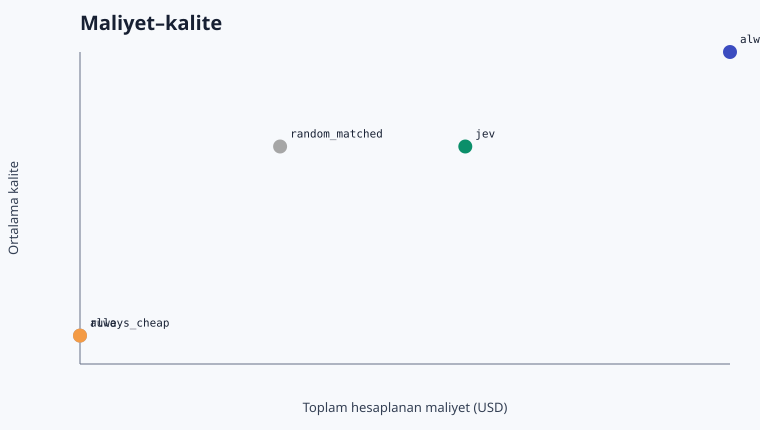
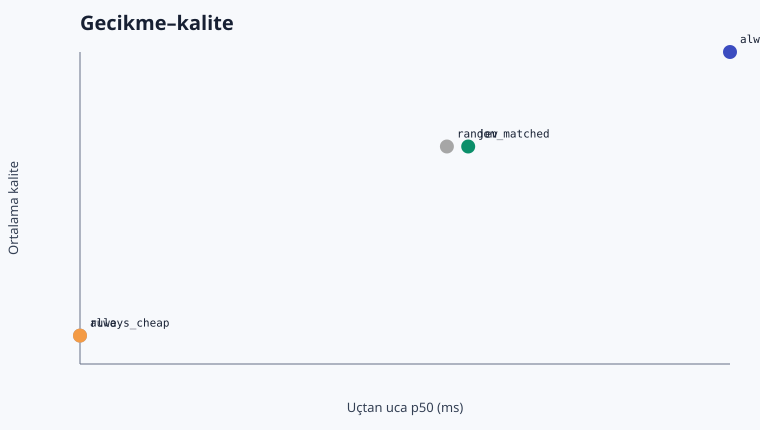

# Jev LLM Router Benchmark — Türkçe Sonuç Raporu

> Kanıt durumu: **canlı OpenRouter usage/cost verisi; sağlayıcı faturasıyla ayrıca mutabakat gerekir**. Bu rapor tasarrufu kanıtlanmış üretim sonucu olarak sunmaz.

## Koşu özeti

- Koşu: `20260919T171750Z`
- Mod: `live`
- Örnek sayısı: 10
- Jev eşiği: 0.580
- Jev güçlü model seçim oranı: %40.0
- Maliyet türü: `provider_reported_when_available_else_calculated_from_usage`
- Gerçek benzersiz çağrı harcaması (ledger): `$0.009566`
- Benzersiz hedef/Jev çağrısı: 20 / 10

## Ana karşılaştırma

| Politika | Kalite | Güçlüye fark | %95 eşleştirilmiş GA | Güçlü kullanım | Toplam USD | Tasarruf | E2E p50 / p95 ms | TTFT p50 / p95 ms |
|---|---:|---:|---:|---:|---:|---:|---:|---:|
| always_strong | 1.000 | +0.00 yp | [+0.00, +0.00] | %100.0 | $0.008318 | %0.0 | 2065.8 / 3856.6 | 1361.2 / 3533.6 |
| always_cheap | 0.700 | -30.00 yp | [-60.00, -9.75] | %0.0 | $0.000954 | %88.5 | 1097.8 / 2042.5 | 772.2 / 985.9 |
| rule | 0.700 | -30.00 yp | [-60.00, -9.75] | %0.0 | $0.000954 | %88.5 | 1097.8 / 2042.5 | 772.2 / 985.9 |
| random_matched | 0.900 | -10.00 yp | [-30.00, +0.00] | %50.0 | $0.003220 | %61.3 | 1644.2 / 3362.2 | 973.7 / 2930.0 |
| jev | 0.900 | -10.00 yp | [-30.00, +0.00] | %40.0 | $0.005319 | %36.1 | 1675.9 / 4021.2 | 844.8 / 2689.8 |

## Önceden tanımlı hedef

Hedef, güçlü baseline'a göre toplam başarı/kalite kaybını en fazla 2 yüzde puanında tutarken maliyeti azaltmaktı. Bu koşuda ölçülen kayıp **10.00 yüzde puanı**. Küçük sentetik görev kümesi kalite korumasını kanıtlamak için yeterli değildir; güven aralığı ve alt gruplar kararın parçasıdır.

## Hata analizi

- Jev ucuz modeli seçtiği halde tam başarı sağlanamayan örnek: 1
- Ucuz model aynı kaliteyi sağlayabilecekken güçlü model seçilen örnek: 2
- Fallback oranı: %0.0
- Hata oranı: %0.0
- Bu iş yükünde Jev ek maliyetini karşılamak için gereken asgari ucuz-model oranı: %4.0

## Görev bazında canlı tam matris ve Jev yolu

Her Luna/Sol hücresi bir canlı çağrıdır. Jev politikasının seçtiği hedef yanıt tam matristen yeniden kullanılmıştır; böylece yönlendirilmiş yolun kalite ve hedef gecikmesi aynı canlı yanıta dayanırken gereksiz ikinci ücret oluşmamıştır.

| Görev | Dil / grup | Luna kalite · USD · ms · TTFT | Sol kalite · USD · ms · TTFT | Jev ham seçim · P(strong) · güven → uygulanan yol | Jev ms · USD | Yönlendirilmiş E2E ms |
|---|---|---:|---:|---|---:|---:|
| `live-001` | tr / multi_step_reasoning | 0.00 · $0.000042 · 933 · 723 | 1.00 · $0.000332 · 1526 · 1431 | cheap · 0.16 · 0.69 → cheap | 680 · $0.000031 | 1613 |
| `live-002` | en / multi_step_reasoning | 0.00 · $0.000021 · 1010 · 1009 | 1.00 · $0.000202 · 4097 · 3847 | cheap · 0.46 · 0.08 → strong | 493 · $0.000028 | 4590 |
| `live-003` | en / constraint_reasoning | 0.00 · $0.000026 · 996 · 771 | 1.00 · $0.000248 · 1479 · 1276 | strong · 0.59 · 0.17 → strong | 522 · $0.000029 | 2000 |
| `live-004` | tr / combinatorics | 1.00 · $0.000020 · 1048 · 894 | 1.00 · $0.000188 · 1668 · 1496 | cheap · 0.26 · 0.49 → cheap | 526 · $0.000028 | 1574 |
| `live-005` | en / coding | 1.00 · $0.000251 · 2145 · 958 | 1.00 · $0.002064 · 2890 · 1244 | strong · 0.70 · 0.39 → strong | 387 · $0.000029 | 3277 |
| `live-006` | tr / coding | 1.00 · $0.000143 · 1316 · 663 | 1.00 · $0.001186 · 2464 · 1810 | cheap · 0.28 · 0.44 → cheap | 378 · $0.000030 | 1694 |
| `live-007` | en / coding | 1.00 · $0.000224 · 1917 · 769 | 1.00 · $0.002080 · 2723 · 959 | strong · 0.74 · 0.48 → strong | 603 · $0.000028 | 3326 |
| `live-008` | tr / structured_extraction | 1.00 · $0.000088 · 1147 · 796 | 1.00 · $0.000784 · 3563 · 3151 | cheap · 0.11 · 0.79 → cheap | 383 · $0.000033 | 1531 |
| `live-009` | en / instruction_following | 1.00 · $0.000083 · 1215 · 774 | 1.00 · $0.000736 · 1621 · 989 | cheap · 0.23 · 0.54 → cheap | 443 · $0.000031 | 1658 |
| `live-010` | tr / translation_summary | 1.00 · $0.000056 · 926 · 671 | 1.00 · $0.000498 · 1501 · 1291 | cheap · 0.01 · 0.97 → cheap | 569 · $0.000029 | 1495 |

### Ucuz modelde başarısız seçilmiş örnekler

- `live-001` — multi_step_reasoning / tr, kalite 0.00, kural `strong_probability_lt_0.580`

## Alt gruplar

### Dil

| Grup | always_strong | always_cheap | rule | random_matched | jev |
|---|---:|---:|---:|---:|---:|
| en | 1.000 | 0.600 | 0.600 | 1.000 | 1.000 |
| tr | 1.000 | 0.800 | 0.800 | 0.800 | 0.800 |

### Görev grubu

| Grup | always_strong | always_cheap | rule | random_matched | jev |
|---|---:|---:|---:|---:|---:|
| coding | 1.000 | 1.000 | 1.000 | 1.000 | 1.000 |
| combinatorics | 1.000 | 1.000 | 1.000 | 1.000 | 1.000 |
| constraint_reasoning | 1.000 | 0.000 | 0.000 | 1.000 | 1.000 |
| instruction_following | 1.000 | 1.000 | 1.000 | 1.000 | 1.000 |
| multi_step_reasoning | 1.000 | 0.000 | 0.000 | 0.500 | 0.500 |
| structured_extraction | 1.000 | 1.000 | 1.000 | 1.000 | 1.000 |
| translation_summary | 1.000 | 1.000 | 1.000 | 1.000 | 1.000 |

## Grafikler

## Yorum sınırları

Bu 10 görevlik kontrollü smoke istatistiksel güç veya üretim garantisi sağlamaz. OpenRouter tarafından usage.cost döndürülen çağrılarda bu değer, aksi halde doğrulanmış katalog fiyatı ile token hesabı kullanılmıştır. TTFT ilk boş olmayan streaming metin parçasına kadar istemci duvar saatidir.
