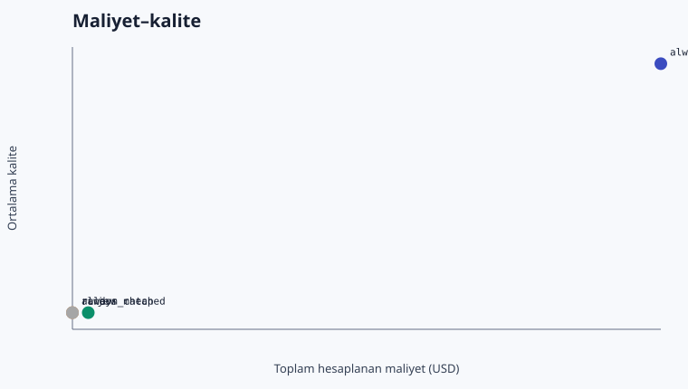
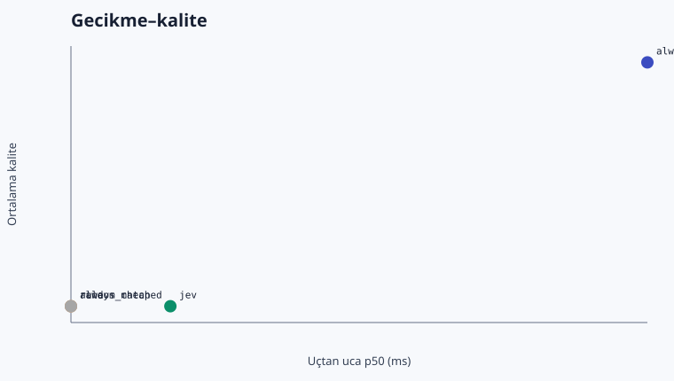

# Jev LLM Router Benchmark — Türkçe Sonuç Raporu

> Kanıt durumu: **fixture/simülasyon; gerçek sağlayıcı sonucu değildir**. Bu rapor tasarrufu kanıtlanmış üretim sonucu olarak sunmaz.

## Koşu özeti

- Koşu: `20260919T165352Z`
- Mod: `fixture`
- Örnek sayısı: 5
- Jev eşiği: 0.680
- Jev güçlü model seçim oranı: %0.0
- Maliyet türü: `calculated_from_fixture_usage`

## Ana karşılaştırma

| Politika | Kalite | Güçlüye fark | %95 eşleştirilmiş GA | Güçlü kullanım | Toplam USD | Tasarruf | p50 / p95 ms |
|---|---:|---:|---:|---:|---:|---:|---:|
| always_strong | 0.950 | +0.00 yp | [+0.00, +0.00] | %100.0 | $0.001924 | %0.0 | 306.0 / 324.6 |
| always_cheap | 0.500 | -45.00 yp | [-90.00, +0.00] | %0.0 | $0.000092 | %95.2 | 161.0 / 179.6 |
| rule | 0.500 | -45.00 yp | [-90.00, +0.00] | %0.0 | $0.000092 | %95.2 | 161.0 / 179.6 |
| random_matched | 0.500 | -45.00 yp | [-90.00, +0.00] | %0.0 | $0.000092 | %95.2 | 161.0 / 179.6 |
| jev | 0.500 | -45.00 yp | [-90.00, +0.00] | %0.0 | $0.000141 | %92.7 | 186.0 / 207.4 |

## Önceden tanımlı hedef

Hedef, güçlü baseline'a göre toplam başarı/kalite kaybını en fazla 2 yüzde puanında tutarken maliyeti azaltmaktı. Bu koşuda ölçülen kayıp **45.00 yüzde puanı**. Küçük ve sentetik fixture kümesi kalite korumasını kanıtlamak için yeterli değildir; güven aralığı ve alt gruplar kararın parçasıdır.

## Hata analizi

- Jev ucuz modeli seçtiği halde tam başarı sağlanamayan örnek: 3
- Ucuz model aynı kaliteyi sağlayabilecekken güçlü model seçilen örnek: 0
- Fallback oranı: %0.0
- Hata oranı: %0.0
- Fixture iş yükünde Jev ek maliyetini karşılamak için gereken asgari ucuz-model oranı: %2.7

### Ucuz modelde başarısız seçilmiş örnekler

- `demo-003` — extraction_classification / en, kalite 0.50, kural `strong_probability_lt_0.680`
- `demo-004` — extraction_classification / en, kalite 0.00, kural `strong_probability_lt_0.680`
- `demo-011` — general_qa / en, kalite 0.00, kural `strong_probability_lt_0.680`

## Eşik duyarlılığı — yalnız dev

Bu tablo test sonucuna bakmadan üretilen tüm kalibrasyon eğrisidir; yalnız en iyi görünen tek nokta seçilip saklanmamıştır.

| Eşik | Dev kalite | Güçlüye kayıp | Güçlü kullanım |
|---:|---:|---:|---:|
| 0.000 | 1.000 | 0.00 yp | %100.0 |
| 0.100 | 1.000 | 0.00 yp | %100.0 |
| 0.120 | 1.000 | 0.00 yp | %95.0 |
| 0.140 | 1.000 | 0.00 yp | %85.0 |
| 0.150 | 1.000 | 0.00 yp | %80.0 |
| 0.160 | 1.000 | 0.00 yp | %75.0 |
| 0.170 | 1.000 | 0.00 yp | %65.0 |
| 0.180 | 1.000 | 0.00 yp | %60.0 |
| 0.200 | 1.000 | 0.00 yp | %50.0 |
| 0.210 | 1.000 | 0.00 yp | %45.0 |
| 0.420 | 1.000 | 0.00 yp | %40.0 |
| 0.460 | 1.000 | 0.00 yp | %35.0 |
| 0.610 | 1.000 | 0.00 yp | %30.0 |
| 0.640 | 1.000 | 0.00 yp | %25.0 |
| 0.680 | 1.000 | 0.00 yp | %20.0 |
| 0.720 | 0.950 | 5.00 yp | %15.0 |
| 0.750 | 0.850 | 15.00 yp | %5.0 |
| 1.000 | 0.800 | 20.00 yp | %0.0 |

## Alt gruplar

### Dil

| Grup | always_strong | always_cheap | rule | random_matched | jev |
|---|---:|---:|---:|---:|---:|
| en | 0.950 | 0.500 | 0.500 | 0.500 | 0.500 |

### Görev grubu

| Grup | always_strong | always_cheap | rule | random_matched | jev |
|---|---:|---:|---:|---:|---:|
| extraction_classification | 1.000 | 0.250 | 0.250 | 0.250 | 0.250 |
| general_qa | 1.000 | 0.000 | 0.000 | 0.000 | 0.000 |
| translation_summary | 0.875 | 1.000 | 1.000 | 1.000 | 1.000 |

## Grafikler

## Yorum sınırları

Fixture gecikmeleri ölçülmüş canlı routing gecikmesi değildir. USD değerleri fixture usage alanlarından, sabitlenmiş fiyat tablosuyla hesaplanmıştır ve fatura değildir. Canlı koşuda provider usage kaydı kullanılır; fiyatlar koşudan hemen önce yeniden doğrulanmalıdır. Demo görevleri resmî benchmark sonucu değildir.
